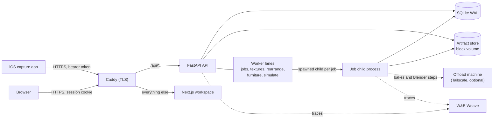

# Architecture

Standard Physics measures a shop with an iPhone and checks the measured room against accessibility rules. The owner sees what to fix in a web workspace. This file describes the running system. [RESILIENCE.md](RESILIENCE.md) covers how it fails and recovers, and [SECURITY.md](SECURITY.md) covers who can reach what.

## Components

| Component | What it does | Where it lives |
| --- | --- | --- |
| iOS capture app | SwiftUI and RoomPlan capture of the room, the LiDAR mesh and photo frames. Each artifact is uploaded with its SHA-256, and the upload resumes against the same scan after a lost connection. | [`apps/ios`](apps/ios) |
| Web workspace | Next.js 16 and React 19. It shows the scan list, the 3D scene, the findings report and the team tools. | [`apps/web`](apps/web) |
| API | FastAPI on uvicorn, one process per database. It owns accounts, uploads, the job queue and every read of a scan. | [`services/api/standardphysics_api`](services/api/standardphysics_api) |
| Database | SQLite in WAL mode with one short-lived connection per unit of work. Writes take the lock up front with `BEGIN IMMEDIATE`, and the schema grows through numbered additive migrations. | [`db.py`](services/api/standardphysics_api/db.py) |
| Artifact store | Uploaded files and everything derived from them, on a DigitalOcean Block Storage volume mounted at `/data`. | [`store.py`](services/api/standardphysics_api/store.py) |
| Worker | Five threads inside the API process, one per lane, that claim queued jobs and run each heavy stage in a child process. | [`worker.py`](services/api/standardphysics_api/worker.py) |
| Offload machine | An optional box with more memory that runs photo bakes and Blender steps for the droplet over Tailscale. | [`offload.py`](services/api/standardphysics_api/offload.py) |



## Request path

Caddy is the only container with a public port ([`Caddyfile`](deploy/digitalocean/Caddyfile)). It terminates TLS with a Let's Encrypt certificate and sends every `/api/*` request straight to the API container, on both the app domain and the API domain. Every other path goes to the Next.js container. The API publishes no port, so Caddy is the only thing that can reach it. Every scan route sits under `/api/scans`, where one middleware settles ownership before any handler runs ([`auth.py`](services/api/standardphysics_api/auth.py)).

## Job lifecycle

A walk becomes results through a chain of jobs. Each job is a row in the `jobs` table, and each kind has a handler in [`worker_handlers.py`](services/api/standardphysics_api/worker_handlers.py).

| Step | What happens | Code |
| --- | --- | --- |
| Upload | The phone creates a scan with `POST /api/scans` and streams each artifact to `PUT /api/scans/{id}/artifacts/{artifact_id}` with an `X-Checksum-SHA256` header. The file is validated off the event loop and stored once. | [`upload_routes.py`](services/api/standardphysics_api/upload_routes.py) |
| `process` | Ingests the RoomPlan room, the photo frames, the poses and the LiDAR mesh into a scene graph. It runs photo discovery, measures floor coverage, saves the ingest revision and checks it in the same job. | `JobHandlers._process` |
| `assess` | Runs the rule checks on one revision, saves the assessment, marks the scan ready and queues the display job. An owner edit or a deploy that changed the checks queues one. | `JobHandlers._assess` |
| `display` | Builds the scene GLB with Blender if the revision has none, then draws a still for each finding. It draws again if a re-check replaced the findings while it ran. | `JobHandlers._display` |
| `texture` | Bakes the walk's photos onto the mesh as an immutable photo build, then queues furniture refinement. | [`textures.py`](services/api/standardphysics_api/textures.py) |
| `furniture` | Fits measured chairs, sofas, tables, beds and stools with SPAR3D on a server configured for it. | [`furniture.py`](services/api/standardphysics_api/furniture.py) |
| `rearrange` | Asks a model for a layout that fixes a finding. The measured checker scores each answer and decides whether to accept it. | [`rearrangement.py`](services/api/standardphysics_api/rearrangement.py) |
| `simulate` | Runs a simulation, started from the team's developer-mode panel, against the graph saved on its own row. The panel asks for the TypeSafe router, which the server refuses without `TYPESAFE_API_KEY`. | [`simulations.py`](services/api/standardphysics_api/simulations.py) |

## Worker lanes

`LOOP_NAMES` in [`worker.py`](services/api/standardphysics_api/worker.py) defines five lanes, each a thread that claims only its own kinds ([`repository_jobs.py`](services/api/standardphysics_api/repository_jobs.py)).

| Lane | Kinds | Why it is separate |
| --- | --- | --- |
| `jobs` | `process`, `assess` | A new walk's measuring never waits behind a render or a simulation. |
| `textures` | `texture`, `display` | Both run Blender, and one lane keeps a 4 GB droplet to one Blender at a time. |
| `rearrange` | `rearrange` | Provider calls can wait minutes on a cold deployment. |
| `furniture` | `furniture` | Model trials run long after the render is ready. |
| `simulate` | `simulate` | A deep simulation may run for hours. |

A claim is one `UPDATE ... RETURNING` statement inside `BEGIN IMMEDIATE`, so two loops never take the same job. Within a lane the claim takes a `process` job first and otherwise the job queued longest ago, ordered by `queued_at` rather than row id. A render re-queued on last week's row therefore waits behind a shop uploaded a minute ago ([`test_job_order.py`](services/api/tests/test_job_order.py)).

On the server every job's heavy stage runs in a spawned child process ([`worker_child.py`](services/api/standardphysics_api/worker_child.py)). The child receives the settings, opens its own database connections and store, and leads its own process group. A child still running at its kind's deadline is killed along with everything it started, such as a Blender run, and the job fails with the deadline in its error. `Settings.job_deadline_seconds` gives every kind a deadline, and an unknown kind gets the shortest one ([`settings.py`](services/api/standardphysics_api/settings.py), [`test_worker_jobs_in_own_process.py`](services/api/tests/test_worker_jobs_in_own_process.py)).

## Scene-graph revisions

A scan's geometry is a sequence of numbered revisions ([`repository_revisions.py`](services/api/standardphysics_api/repository_revisions.py)). An ingest revision is derived entirely from the uploads, so running ingest again replaces it. Every owner decision is saved on a revision of its own, and a late process job never writes over it. An assessment records the revision it was made from, and the API answers 404 rather than serve findings made from an older revision than the latest one ([`test_review_safety.py`](services/api/tests/test_review_safety.py)). A review replayed on the same base revision is refused as a conflict rather than applied twice.

## Package layering

The Python code is five packages whose imports point one way.

```text
standardphysics_contracts
  -> standardphysics_fixtures, standardphysics_pipeline
    -> standardphysics_agents
      -> standardphysics_api
```

[`tests/test_layering.py`](tests/test_layering.py) parses every import in every package module, including imports inside functions. It fails on any import the `ALLOWED_DEPENDENCIES` table does not list and on any cycle. It also checks that each package's `pyproject.toml` declares every sibling it imports.

## Contracts

Every shape that crosses the wire is a Pydantic model in [`packages/contracts`](packages/contracts/standardphysics_contracts). [`generate-contracts.mjs`](apps/web/scripts/generate-contracts.mjs) exports their JSON Schema and compiles it to [`apps/web/src/types/contracts.ts`](apps/web/src/types/contracts.ts). The `contracts` job in [`ci.yml`](.github/workflows/ci.yml) regenerates the file and fails when `git diff` shows it changed, so the web client cannot drift from the API.

The same script writes [`apps/web/src/types/geometry-rules.ts`](apps/web/src/types/geometry-rules.ts), the tolerances and limits the workspace checks a dragged piece against before the server sees it: the overlap tolerance, the floor margin, the travel cap, the resting and riding gaps, the band of heights that blocks the floor and the door keep-clear sizing. [`geometry_rules.py`](packages/agents/standardphysics_agents/fix/geometry_rules.py) reads each one from the module that defines it. The same CI job diffs that file too, and [`tests/test_geometry_rules.py`](tests/test_geometry_rules.py) fails when a constant changes without it.

## Deployment

Production is one DigitalOcean droplet with 2 vCPUs and 4 GB of memory, running three containers from [`deploy/digitalocean/docker-compose.yml`](deploy/digitalocean/docker-compose.yml).

| Container | Image | Limits |
| --- | --- | --- |
| `caddy` | `caddy:2-alpine`, pinned by digest | none |
| `api` | `standardphysics:<sha>` | 3.2 GB memory, 1.75 CPUs |
| `web` | `standardphysics:<sha>` | 512 MB memory, 1 CPU |

The API and the workspace run the same image, built from the root [`Dockerfile`](Dockerfile). CI builds it, runs the image smoke test and the Blender regressions against it, scans it, and only after every job passes retags that exact digest as `ghcr.io/imhaohao/standardphysics:<sha>`. [`scripts/deploy.sh`](scripts/deploy.sh) pulls that tag and refuses a commit without one ([`scripts/tests/test_deploy.py`](scripts/tests/test_deploy.py)). Scans live on the block volume bind-mounted at `/data`, so the droplet can be rebuilt without losing a shop.

When `SP_OFFLOAD_URL` is set, photo bakes and the Blender steps go to the offload machine over Tailscale. That machine takes the work only when it runs the same commit and the same Blender version. When it refuses, cannot be reached or stalls, the stage runs on the droplet instead ([`test_offload.py`](services/api/tests/test_offload.py)).

## Observability

| Signal | What it reports | Code |
| --- | --- | --- |
| Weave tracing | The API starts Weave at startup, and every job child starts it again from the settings and flushes before it exits. Neither waits on a W&B that stops answering. | [`tracing.py`](packages/agents/standardphysics_agents/tracing.py), [`test_tracing.py`](services/api/tests/test_tracing.py) |
| `/health` | Liveness. It reads the database and fails when a worker loop has died. | [`health_routes.py`](services/api/standardphysics_api/health_routes.py) |
| `/health/ready` | Returns 503 while any loop has died, stalled outside a job, or run a job past its deadline, and while a job's outcome could not be written. | [`test_worker_resilience.py`](services/api/tests/test_worker_resilience.py) |
| `/health/details` | Each loop's state, the oldest queued job's age, the commit the image was built from, tracing status, the drain flag and furniture availability. | [`test_release.py`](services/api/tests/test_release.py) |
| `monitor.sh` | A five-minute systemd timer that alerts on readiness, queue age, both disks, backup age and tracing. | [`monitor.sh`](deploy/digitalocean/monitor.sh) |

The design of the reasoning layer (substrate, interpretation and composition) is in [docs/ARCHITECTURE.md](docs/ARCHITECTURE.md).
