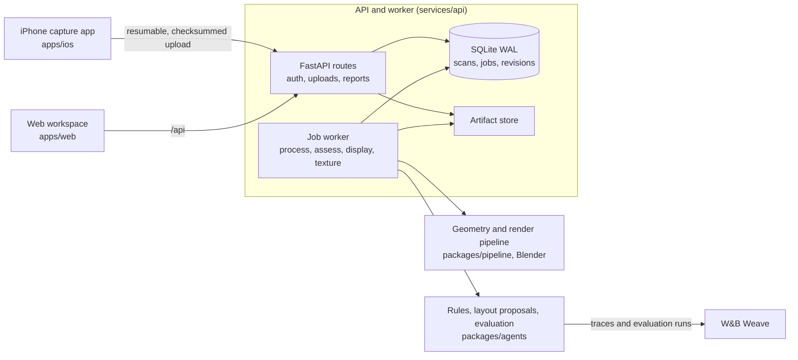

# Standard Physics

[](https://github.com/Imhaohao/standardphysics/actions/workflows/ci.yml)
[](https://github.com/Imhaohao/standardphysics/actions/workflows/web.yml)
[](https://github.com/Imhaohao/standardphysics/actions/workflows/ios.yml)

Standard Physics turns an iPhone LiDAR walk into a room model, checks measured features against selected accessibility rules, and shows where the evidence is incomplete. It can suggest furniture moves and re-check a proposed layout. It is an accessibility screening and planning tool; it does not certify a building or establish that a site complies with the ADA.

The product is live at [standardphysics.app](https://standardphysics.app), with an iPhone app on TestFlight. Follow [Standard Physics on Instagram](https://www.instagram.com/standardphysics/). The screenshots below show the shipped sample shop, not a customer capture.

| Room model and checks | Findings report |
|---|---|
|  |  |

The model view keeps measured geometry selectable while the side panel lists findings and review questions. The report connects a measured value to a cited section and a proposed next step. The sample shop makes these screens reproducible without publishing private field imagery.

## How the product grew

The project began as a hackathon-scale traced loop: scan a room, measure it, check the constraints, propose a change, then check the result again. [`tools/loopforge`](tools/loopforge) preserves the small agent-loop starter. The early plan called for an iPhone LiDAR capture, a Blender-backed scene pipeline, and a reviewable result by the end of the weekend ([original build plan](docs/PLAN.md)).

That first loop exposed the important split in the product. Room dimensions must come from geometry, while a model can help interpret a request or rank a layout proposal. The system therefore keeps the measurement pipeline, cited checks, and model proposal path separate. Proposals are measured again under the same hard constraints before they can be accepted.

### Rendering and 3D reconstruction

The first room representation was a scene graph of measured walls, openings, and furniture. Blender became the bridge from that graph to a model a person could inspect: it exports the 3D scene and renders each finding from a useful viewpoint. The web workspace now lets a reviewer move between the model, findings, a floor view, and furniture planning.

The public sample-shop fixture includes downloadable [GLB](packages/fixtures/standardphysics_fixtures/data/shop.glb) and [USDZ](packages/fixtures/standardphysics_fixtures/data/shop.usdz) models. They let a reviewer inspect demo geometry without access to private captures.

The reconstruction work grew beyond the demo shop. A Moffitt Library capture was assembled from four regions into a published revision with 284 nodes; its reconstruction report records 164 display reconstructions and checks on the saved graph ([report](runs/moffett/a102-aligned-proposal/report.json)). This establishes that a larger multi-region capture can pass through reconstruction and publication. It is not an independent measurement study.

We also tested photo-supported surface rendering on held-out Moffitt views. A completed candidate was rejected: mean masked SSIM was 0.025 versus 0.329 for the Brush control, with a 5.42 dB versus 11.90 dB mean masked PSNR. The renderer checkpoint records failed quality gates ([experiment record](runs/moffett/render-efficiency/r003/checkpoint.json)). The experiment matters because it prevents a visually plausible render from being called an improvement without passing a held-out comparison. The current product keeps the measured room model useful while this photo-mesh path remains experimental.


The [marimo notebook](notebooks/scenario_sweep.py) makes the checks inspectable. Sliders change a shop's aisle, counter, door, and seating; the same evaluator used by the service recalculates findings and draws the settings where outcomes change. A second section reviews real RoomPlan captures with their confidence and unanswered questions visible. Those captures are not scored for accuracy because they do not have independent hand-measured labels ([notebook notes](docs/marimo.md)).

### Post-training experiments

We tried supervised fine-tuning (SFT) followed by reinforcement learning (RL) for furniture rearrangement. The comparison below uses the same 65 held-out layout variants and four attempts per checkpoint. Each checkpoint therefore has 260 attempts. Hard-rule pass rate counts proposals that obey the geometric constraints; gate acceptance asks whether a proposal meets the stricter acceptance gate; complete-clear rate counts attempts that cleared every fixable finding.


Training raised the hard-rule pass rate from 42.3% for the base model to 69.2% for run 1 RL, then to 71.9% for run 2 SFT. Gate acceptance peaked at 31.5% in run 1 RL and fell to 29.2% after run 2 SFT and 28.1% after run 2 RL. The share of attempts clearing every fixable finding also fell across those trained checkpoints. Better constraint-following did not produce more accepted or fully clear layouts in these runs ([aggregated run notes](runs/finetune/synthetic/STATUS.txt)).

Solver capacity is a separate measurement from model training. A bounded search found an accepted fix for 36 of 65 held-out variants and fully cleared all fixable findings for 27 of 65. The other 29 are unresolved under that search budget; this is a lower bound, not proof that no possible layout exists. These solver results do not show a fine-tuned model improved.

### Field testing

We have run the capture and assessment workflow on actual spaces, including Share Tea, Moffitt Library, and several smaller rooms captured on iPhone. These runs test whether the pipeline can ingest and represent real rooms. They do not establish broad ADA accuracy or independent physical measurement accuracy.

| Physical space | Evidence in the current product record | What it establishes |
|---|---|---|
| Share Tea | One unique shop capture with an assessment and saved layout proposals. The reviewed assessments still contain open questions. | A real shop can be captured, assessed, and used for layout review. The questions remain unresolved evidence requests; a saved proposal is not proof that furniture moved or that the shop passed. |
| Moffitt Library | Four capture regions were reconstructed into one 284-node published model revision. | Multi-region reconstruction and publication work on a real library capture. The assessment currently carries an “Order a drink” scenario label, so its route findings are not valid library-specific test results yet. |
| Smaller phone scans | Several additional real room captures have been processed through the same import, model, and review steps. | The workflow has been exercised beyond the sample shop. These captures lack a matched set of independent control measurements and are not a statistical accuracy benchmark. |

We have not established an independently tape-measured field accuracy result or a whole-site ADA pass. A LiDAR estimate, a model-rendered dimension, an accepted software proposal, and a physically verified change are different kinds of evidence. The product keeps missing views and uncertain checks open as questions instead of counting them as passes.

## The product today

The owner can capture a room with the iPhone app, upload its scan, review a 3D workspace and cited findings, answer or defer evidence questions, and explore a furniture layout. The web product is live, scan processing runs on the production service, and job state and scene revisions persist across worker restarts. The live app is at [standardphysics.app](https://standardphysics.app); W&B traces and evaluation runs are available in the [project](https://wandb.ai/imhaohao-university-of-california-berkeley/physics/weave).

The product still has important limits. The current rule set is partial, photo reconstruction is experimental, a textured scan takes about ten minutes per walk on the production droplet, and a real field accuracy study with independent controls remains to be done. Screenshots show the sample shop because private field captures are not included in this public README.

## How it's built



An upload queues a `process` job. The worker builds a scene graph from the RoomPlan export and LiDAR mesh, runs the selected assessments, renders each locatable finding, and can bake surface textures from photos. Edits and re-assessments create new graph revisions rather than overwriting the starting scene.

| Path | Responsibility |
|---|---|
| [`packages/contracts`](packages/contracts) | Shared Pydantic models and generated TypeScript contracts |
| [`packages/pipeline`](packages/pipeline) | Scan ingest, measured geometry, object discovery, exports, and textures |
| [`packages/agents`](packages/agents) | Cited rule checks, constrained layout proposals, evaluation, and Weave tracing |
| [`services/api`](services/api) | Accounts, resumable uploads, durable jobs, and worker |
| [`apps/web`](apps/web) | Model workspace and findings report |
| [`apps/ios`](apps/ios) | Room capture and resumable uploads |
| [`deploy/digitalocean`](deploy/digitalocean) | Production compose stack |

Dependencies point one way: contracts are shared below the pipeline and agents, the API sits above them, and the apps talk to the API over HTTP. [`tests/test_layering.py`](tests/test_layering.py) checks those boundaries.

## Evaluation

The regular held-out rule-check suite contains 39 labelled cases built from the sample shop and synthetic variants that change walls, fixtures, and doors. In the latest recorded evaluation, the measured pipeline with fixes on scored 0.986 finding precision, 0.924 recall, 1.000 fix-resolves-finding, and 0.0008 in mean measurement error. Replacing measured geometry with simplified stand-in boxes reduced precision to 0.384 while recall stayed at 0.924. This is a synthetic geometry benchmark; it does not measure accuracy on field scans. Per-case runs are in the [W&B Evals tab](https://wandb.ai/imhaohao-university-of-california-berkeley/physics/weave/evaluations).

Model proposals and rule-check results answer different questions, so the README reports them separately. The training chart above is based on held-out layout variants; the 39-case suite evaluates the measured pipeline and checks. Neither is a physical-site certification.

## Running it

You need Python 3.11+ and Node 20.9+.

```bash
./start.sh                          # installs into .venv and apps/web, runs API on :8787 and web on :3000
SP_SEED_SAMPLE_SHOP=1 ./start.sh    # also seeds a sample shop and prints a demo account to the log
docker compose up --build           # production image, API, and web containers
```

The main checks are:

```bash
.venv/bin/python -m ruff check .
.venv/bin/python -m pytest
cd apps/web && npm run lint && npm run typecheck && npm run test
```

## Production operations

The production stack runs on one DigitalOcean droplet with 2 vCPU and 4 GB of memory. SQLite WAL transactions make job claims atomic; jobs left running at restart are re-queued, bounded retries settle transient failures, and per-job deadlines stop hung work. Uploads are resumable, checksummed, and written atomically. Scan ownership is checked on each route, sign-in attempts are throttled, and backups have a verified restore path. See the [deployment runbook](docs/DEPLOY.md).

Every CI push runs Python lint and tests, API and contracts type checks, web lint/types/tests, and a production-image smoke test. The reasoning and model calls can be traced to W&B Weave when the deployment has its project credentials configured.

## More

- [`docs/CONTRIBUTING.md`](docs/CONTRIBUTING.md): local development and phone build
- [`docs/DEPLOY.md`](docs/DEPLOY.md): production deployment, backup, and restore
- [`docs/MISSION.md`](docs/MISSION.md) and [`docs/ARCHITECTURE.md`](docs/ARCHITECTURE.md): product requirements and system design
- [`docs/UX.md`](docs/UX.md): owner experience
- [`docs/marimo.md`](docs/marimo.md): interactive notebook and capture review
