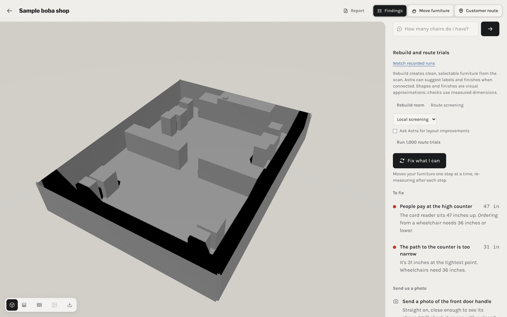
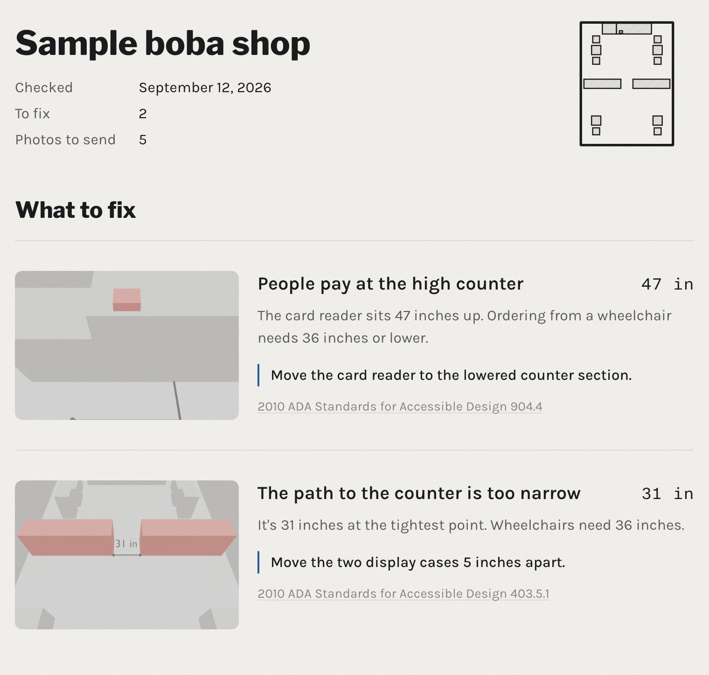
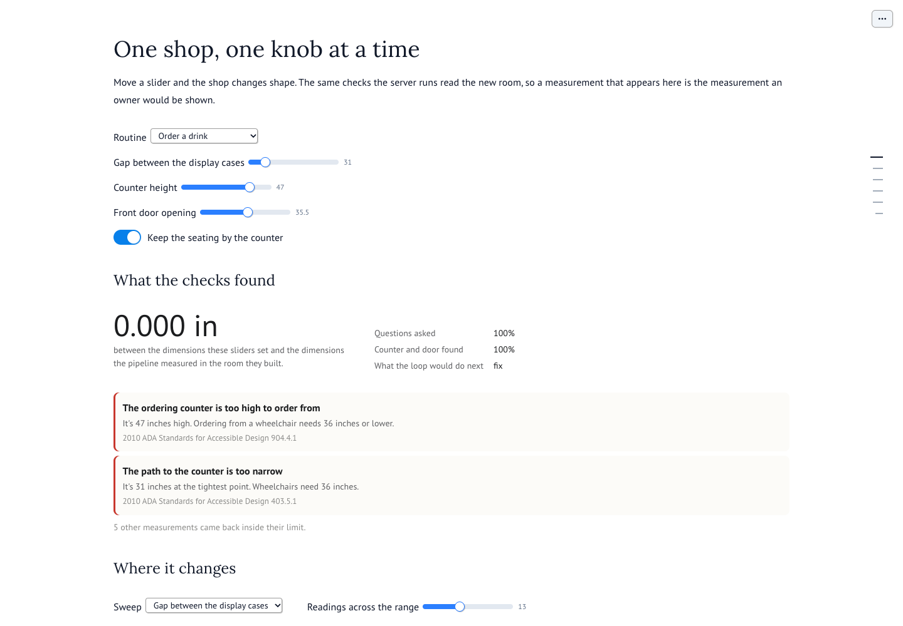
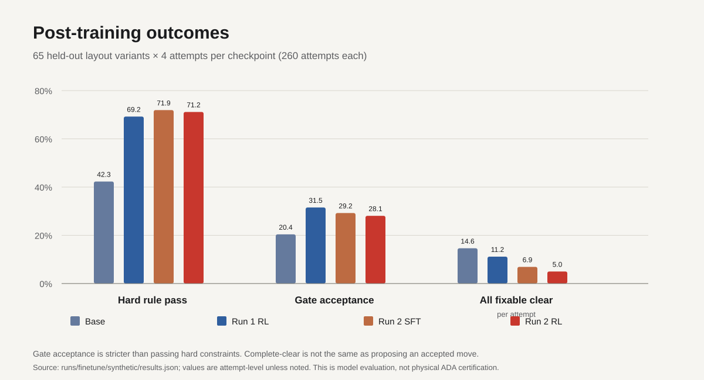
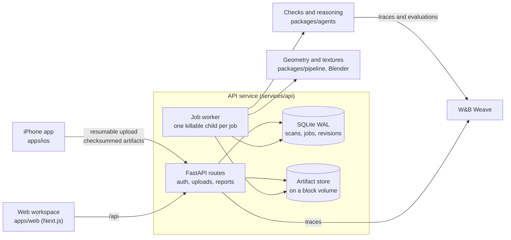

# Standard Physics

[](https://github.com/Imhaohao/standardphysics/actions/workflows/ci.yml)
[](https://github.com/Imhaohao/standardphysics/actions/workflows/ios.yml)

Standard Physics turns an iPhone LiDAR walk into a room model, checks measured features against selected accessibility rules, and shows where the evidence is incomplete. It can suggest furniture moves and re-check a proposed layout. It is an accessibility screening and planning tool; it does not certify a building or establish that a site complies with the ADA.

The product is live at [standardphysics.app](https://standardphysics.app), with an iPhone app on TestFlight. Follow [Standard Physics on Instagram](https://www.instagram.com/standardphysics/). The screenshots below show the shipped sample shop, not a customer capture.

| Room model and checks | Findings report |
|---|---|
|  |  |

The model view keeps measured geometry selectable while the side panel lists findings and review questions. The report connects a measured value to a cited section and a proposed next step. The sample shop makes these screens reproducible without publishing private field imagery.

## How the product grew

The project began as a hackathon-scale traced loop: scan a room, measure it, check the constraints, propose a change, then check the result again. [`tools/loopforge`](tools/loopforge) preserves the small agent-loop starter. The early plan called for an iPhone LiDAR capture, a Blender-backed scene pipeline, and a reviewable result by the end of the weekend ([original build plan](docs/PLAN.md)).

That first loop exposed the important split in the product. Room dimensions must come from geometry, while a model can help interpret a request or rank a layout proposal. The system therefore keeps the measurement pipeline, cited checks, and model proposal path separate. Proposals are measured again under the same hard constraints before they can be accepted.

### Rendering and 3D reconstruction

The first room representation was a scene graph of measured walls, openings, and furniture. Blender became the bridge from that graph to a model a person could inspect: it exports the 3D scene and renders each finding from a useful viewpoint. The web workspace now lets a reviewer move between the model, findings, a floor view, and furniture planning.

The public sample-shop fixture includes downloadable [GLB](packages/fixtures/standardphysics_fixtures/data/shop.glb) and [USDZ](packages/fixtures/standardphysics_fixtures/data/shop.usdz) models. They let a reviewer inspect demo geometry without access to private captures.

The reconstruction work grew beyond the demo shop. Four Moffitt Library captures were aligned into a published floor revision ([progress record](docs/progress/PROGRESS_MOFFETT.json)). A later read-only audit counted 284 nodes in a subsequent A-102 revision ([implementation audit](docs/research/moffett-outlet-implementation-audit.txt)). This establishes that a larger multi-region capture can pass through reconstruction and publication. It is not an independent measurement study.

We also tested photo-supported rendering on Moffitt views. One center-room pilot was rejected after eight validation images scored 5.42 dB masked PSNR and 0.025 masked SSIM, with visible gaps. A historical Brush control scored 11.90 dB and 0.329, but the masks were not matched, so this is not a controlled comparison. The [rendering audit](docs/research/deepseek-render-r003-audit.txt) records both the failure and its limits. The measured room model remains useful while photographic reconstruction stays experimental.



The [marimo notebook](notebooks/scenario_sweep.py) makes the checks inspectable. Sliders change a shop's aisle, counter, door, and seating; the same evaluator used by the service recalculates findings and draws the settings where outcomes change. A second section reviews real RoomPlan captures with their confidence and unanswered questions visible. Those captures are not scored for accuracy because they do not have independent hand-measured labels ([notebook notes](docs/marimo.md)).

### Post-training experiments

We tried supervised fine-tuning (SFT) followed by reinforcement learning (RL) for furniture rearrangement. The comparison below uses the same 65 held-out layout variants and four attempts per checkpoint. Each checkpoint therefore has 260 attempts. Hard-rule pass rate counts proposals that obey the geometric constraints; gate acceptance asks whether a proposal meets the stricter acceptance gate; complete-clear rate counts attempts that cleared every fixable finding.



Training raised the hard-rule pass rate from 42.3% for the base model to 69.2% for run 1 RL, then to 71.9% for run 2 SFT. Gate acceptance peaked at 31.5% in run 1 RL and fell to 29.2% after run 2 SFT and 28.1% after run 2 RL. The share of attempts clearing every fixable finding also fell across those trained checkpoints. Better constraint-following did not produce more accepted or fully clear layouts in these runs ([aggregated run notes](runs/finetune/synthetic/STATUS.txt)).

Solver capacity is a separate measurement from model training. A bounded search found an accepted fix for 36 of 65 held-out variants and fully cleared all fixable findings for 27 of 65. The other 29 are unresolved under that search budget; this is a lower bound, not proof that no possible layout exists. These solver results do not show a fine-tuned model improved.

### Field testing

We have run the capture and assessment workflow on actual spaces, including Share Tea, Moffitt Library, and several smaller rooms captured on iPhone. These runs test whether the pipeline can ingest and represent real rooms. They do not establish broad ADA accuracy or independent physical measurement accuracy.

| Physical space | Evidence in the current product record | What it establishes |
|---|---|---|
| Share Tea | One unique shop capture with an assessment and saved layout proposals. The reviewed assessments still contain open questions. | A real shop can be captured, assessed, and used for layout review. The questions remain unresolved evidence requests; a saved proposal is not proof that furniture moved or that the shop passed. |
| Moffitt Library | Four capture regions were reconstructed into one 284-node published model revision. | Multi-region reconstruction and publication work on a real library capture. The assessment currently carries an “Order a drink” scenario label, so its route findings are not valid library-specific test results yet. |
| Smaller phone scans | Several additional real room captures have been processed through the same import, model, and review steps. | The workflow has been exercised beyond the sample shop. These captures lack a matched set of independent control measurements and are not a statistical accuracy benchmark. |

We have not established an independently tape-measured field accuracy result or a whole-site ADA pass. A LiDAR estimate, a model-rendered dimension, an accepted software proposal, and a physically verified change are different kinds of evidence. The product keeps missing views and uncertain checks open as questions instead of counting them as passes.

## The product today

The owner can capture a room with the iPhone app, upload its scan, review a 3D workspace and cited findings, answer or defer evidence questions, and explore a furniture layout. The web product is live, scan processing runs on the production service, and job state and scene revisions persist across worker restarts. The live app is at [standardphysics.app](https://standardphysics.app); W&B traces and evaluation runs are available in the [project](https://wandb.ai/imhaohao-university-of-california-berkeley/physics/weave).

The product still has important limits. The current rule set is partial, photo reconstruction is experimental, a textured scan takes about ten minutes per walk on the production droplet, and a real field accuracy study with independent controls remains to be done. Screenshots show the sample shop because private field captures are not included in this public README.

## Running it

You need Python 3.11+ and Node 20.9+.

```bash
./start.sh                          # installs into .venv and apps/web, runs the API on :8787 and the web on :3000
SP_SEED_SAMPLE_SHOP=1 ./start.sh    # same, with a sample shop; the log says where the demo account's password is
docker compose up --build           # the production image, API and web as two containers
```

The same checks CI runs:

```bash
.venv/bin/python -m ruff check .
.venv/bin/python -m mypy                       # after .venv/bin/python -m pip install mypy==2.3.1
.venv/bin/python -m pytest                     # every package, the scripts and the tools
.venv/bin/python -m pytest services/api/tests   # the API, run on its own because its test helpers share names with the agents'
cd apps/web && npm run lint && npm run typecheck && npm run test && npm run e2e
```

## Production readiness at a glance

| What a reviewer asks | What is in the repo |
|---|---|
| Does it survive failures? | A crash-safe job queue, hard deadlines on every job, bounded retries, admission control on every input, and a test that injects each failure. See [failure modes](#failure-modes-and-what-happens). |
| Is the code held to a standard? | ruff with a cyclomatic complexity ceiling and mypy across the contracts, pipeline, agents and API packages, strict TypeScript with an ESLint complexity ceiling, and a test that fails the build if a package imports upward. |
| How is the repo built? | Six packages with one-way dependencies, contracts generated from one source of truth, pinned dependencies everywhere, and one CI workflow in which every check on code that ships gates the release image. |
| Can it be operated? | Commit-tagged images, deploys that verify the new commit is serving before they record it, one-command rollback, tested backup and restore, alerting, log rotation and resource limits. |
| Can you see what it does? | W&B Weave traces from the API and from every worker process, a live health endpoint, and a Weave Evaluation of the checks tagged by commit. |
| Is it secure? | scrypt passwords, hashed sessions, ownership checks on every scan route, granted team roles, throttled sign-in, capped request bodies, and secret and vulnerability scanning in CI. |

## Failure modes and what happens

Each row names what goes wrong, what the system does about it, and the test that proves it.

| When this happens | Standard Physics | Proof |
|---|---|---|
| The server dies mid-job | Every job left running is queued again at startup, except a simulation, which is failed so its paid model calls never run twice, and a job three restarts in a row have cut short (`SP_MAX_JOB_INTERRUPTIONS`), which is failed until someone retries the scan; a claimed job always ends settled or back in the queue | [`test_job_lifecycle.py`](services/api/tests/test_job_lifecycle.py), [`test_worker_resilience.py`](services/api/tests/test_worker_resilience.py) |
| A second server starts on the same database | An exclusive lock lets only one process run jobs; the other serves requests and takes over the jobs once the first exits | [`worker_lock.py`](services/api/standardphysics_api/worker_lock.py), [`test_worker_resilience.py`](services/api/tests/test_worker_resilience.py) |
| A job hangs forever | Every job runs in a child process that is killed, with anything it started, at its deadline; the next job runs | [`test_worker_jobs_in_own_process.py`](services/api/tests/test_worker_jobs_in_own_process.py), [`test_worker_bakes.py`](services/api/tests/test_worker_bakes.py) |
| The database is locked or broken | Lock contention is retried with backoff for a bounded time; a permanent error stops retrying and marks the worker degraded | [`test_worker_resilience.py`](services/api/tests/test_worker_resilience.py) |
| A worker loop stalls | `/health/ready` reports it degraded while `/health` stays green through legitimate long bakes | [`test_worker_resilience.py`](services/api/tests/test_worker_resilience.py) |
| The phone loses signal mid-upload | The upload resumes where it stopped, against the same scan | [`ResumableUploadStore.swift`](apps/ios/StandardPhysics/Upload/ResumableUploadStore.swift), [`UploadViewModelTests.swift`](apps/ios/StandardPhysicsTests/UploadViewModelTests.swift) |
| An upload arrives corrupted | Every artifact carries a SHA-256 the server checks before storing it atomically; a repeat upload is idempotent | [`store.py`](services/api/standardphysics_api/store.py), [`test_upload_contract.py`](services/api/tests/test_upload_contract.py) |
| A client uploads slowly on purpose | Idle and total receive deadlines cancel it, delete the staged file and release its reservation | [`test_slow_uploads.py`](services/api/tests/test_slow_uploads.py) |
| Many large uploads arrive at once | Each upload reserves its declared size; concurrency is capped per owner and globally | [`budgets.py`](services/api/standardphysics_api/budgets.py), [`test_budgets.py`](services/api/tests/test_budgets.py) |
| The disk fills up | New uploads are refused with a 507 before the volume runs out; abandoned staging files are swept | [`test_budgets.py`](services/api/tests/test_budgets.py) |
| The job queue floods | Every path that enqueues work checks the queue limit in the same transaction and answers 503 with Retry-After | [`test_queue_admission.py`](services/api/tests/test_queue_admission.py) |
| A 640 MB mesh is uploaded | It is validated off the event loop, one part at a time, a bounded number at once; peak memory stays in single megabytes | [`test_mesh_validation_load.py`](services/api/tests/test_mesh_validation_load.py) |
| A model provider stalls or sends garbage | Replies are capped at 64 KB, checked against the expected shape and timed out as a whole; model runs are limited per owner and server-wide; a bad reply ends the loop with a message to the owner | [`test_model_provider.py`](services/api/tests/test_model_provider.py), [`test_model_loop.py`](services/api/tests/test_model_loop.py) |
| A zip bomb is uploaded | `room.usdz` is refused past a declared expansion size or entry count | [`test_usdz_validation.py`](services/api/tests/test_usdz_validation.py) |
| A JSON request is huge | Bodies over 1 MiB are refused with a 413 before they are read, chunked or not | [`test_request_size.py`](services/api/tests/test_request_size.py) |
| Someone guesses passwords | Sign-in is throttled per address and per account before any password work, atomically, with bounded memory, inside the one API process that serves every request | [`attempt_limiter.py`](services/api/standardphysics_api/attempt_limiter.py), [`test_auth.py`](services/api/tests/test_auth.py) |
| Someone asks for another owner's scan | Ownership is checked for every spelling of a scan id; the answer is the same 404 as a scan that does not exist | [`test_auth.py`](services/api/tests/test_auth.py) |
| A share link would land in a log | The API's access log writes `<token>` in place of the token in every share path, since the token alone opens the report | [`access_log.py`](services/api/standardphysics_api/access_log.py), [`test_access_log.py`](services/api/tests/test_access_log.py) |
| Someone pre-registers a victim's email | When Apple proves the email, the squatter's password and sessions are revoked | [`test_guests.py`](services/api/tests/test_guests.py) |
| A deploy goes wrong | The deploy stops the worker taking new jobs, waits up to 20 minutes for running ones and refuses if they are still going, then waits until the new commit is serving and prints the rollback command if it never is | [`test_deploy.py`](scripts/tests/test_deploy.py) |
| Data is lost | Nightly snapshots of the database and artifacts; a restore checks every uploaded artifact against the sha256 recorded at upload | [`test_backup_restore.py`](scripts/tests/test_backup_restore.py) |
| Production goes down at night | A monitor checks readiness, queue age, disk, backup age (a box with no backup destination fails too) and tracing every five minutes and alerts once per outage and once on recovery | [`test_monitor.py`](scripts/tests/test_monitor.py) |

## How it's built



An upload lands in the artifact store and queues a `process` job. The worker turns the RoomPlan export and the LiDAR mesh into a scene graph, `assess` runs the ADA checks over it, `display` renders the picture beside each finding, and `texture` paints the scan from the photos. The scene graph is versioned: an owner's edit, a rebuild or a re-run of discovery saves a new revision on top of the one it started from, so an owner's work is never overwritten.

| Path | What it is | Tests |
|---|---|---|
| [`packages/contracts`](packages/contracts) | Pydantic models every other part shares, and the TypeScript generated from them | `packages/contracts/tests` |
| [`packages/pipeline`](packages/pipeline) | Scan ingest, measurement, object discovery, texture baking | `packages/pipeline/tests` |
| [`packages/agents`](packages/agents) | The ADA checks, the layout fixer, the evaluation suite, Weave tracing | `packages/agents/tests` |
| [`services/api`](services/api) | FastAPI service: accounts, uploads, the job queue and worker | `services/api/tests` |
| [`apps/web`](apps/web) | Next.js workspace and the owner's report | `*.test.ts` beside the code, `apps/web/e2e` |
| [`apps/ios`](apps/ios) | SwiftUI capture app with resumable uploads | `apps/ios/StandardPhysicsTests` |
| [`deploy/digitalocean`](deploy/digitalocean) | Production compose stack, deploy verification, backups, monitoring | `scripts/tests` |
| [`tests`](tests), [`scripts`](scripts) | Cross-package regressions, the layering check, deploy and backup scripts | `tests`, `scripts/tests`, `scripts/*/tests`, `scripts/finetune` |
| [`tools/loopforge`](tools/loopforge) | The traced agent-loop starter the project began from, kept as a standalone CLI | `tools/loopforge/tests` |

Dependencies point one way: `contracts` at the bottom, `pipeline` and `agents` above it, `services/api` above those, and the two apps talk to the API over HTTP only. [`tests/test_layering.py`](tests/test_layering.py) fails the build if a package imports upward or imports a sibling its `pyproject.toml` does not declare, and [`tests/test_test_names.py`](tests/test_test_names.py) fails it if any test file sits outside a collected directory.

The API is one service with one SQLite database, which is the right size for a 2 vCPU droplet: WAL mode, `BEGIN IMMEDIATE` transactions and atomic job claims make it safe. Scans, artifacts, revisions and the job queue are written through [`repository.py`](services/api/standardphysics_api/repository.py).

## What CI enforces on every push

One workflow, [`ci.yml`](.github/workflows/ci.yml), runs everything below. The release image is published only when every check on code that ships passes, security scans included, and production deploys only published images.

- **Python:** ruff (with a complexity ceiling), mypy over the contracts, pipeline, agents and API packages, and every test suite, installed from [`requirements.lock`](requirements.lock).
- **Web:** ESLint (with a complexity ceiling), strict TypeScript, unit tests, the production build, and a check that the TypeScript contracts match the Python ones.
- **Reels:** ESLint and strict TypeScript over the promotional video app in `apps/reels`, which runs on every push but doesn't hold up a release because nothing in it ships.
- **Browser:** Playwright against the real API: the owner's report, sharing, deleting a shop, an expired session, an API failure, and a second account refused another owner's shop.
- **Production image:** built from digest-pinned base images, then made to process a real room end to end, render with Blender, and pass every Blender-dependent test inside the image.
- **Supply chain:** secret scanning over the full history, `pip-audit`, `npm audit`, a vulnerability scan of the image, and every GitHub Action pinned to a commit SHA.
- **iOS:** [`ios.yml`](.github/workflows/ios.yml) builds the app, runs its tests on a simulator, and runs the live owner flow and a shared-report render against a freshly started API and web app.

## Releases, recovery and monitoring

1. CI tests the image and publishes it to GHCR as `standardphysics:<commit>`.
2. [`scripts/deploy.sh`](scripts/deploy.sh) refuses while jobs are running, pulls that exact image, restarts, and waits until `/health/ready` is green, `/health/details` reports the new commit and the web app answers. Only then does it record the deploy.
3. Rolling back is `git checkout <sha>` and a restart with the image already tagged for it; the deploy prints the command if the new commit never becomes healthy.
4. [`backup.sh`](deploy/digitalocean/backup.sh) takes a consistent SQLite online backup and incremental artifact snapshots every night; [`restore.sh`](deploy/digitalocean/restore.sh) restores into a fresh directory and verifies SQLite's integrity check, the row counts, and every uploaded artifact's sha256.
5. [`monitor.sh`](deploy/digitalocean/monitor.sh) runs every five minutes and alerts a webhook or an ntfy topic on an outage and on recovery.

The containers run as a non-root user with memory and CPU limits and rotated logs. The runbook is [`docs/DEPLOY.md`](docs/DEPLOY.md).

## Observability with W&B Weave

Everything in this section lives in one public W&B project, [imhaohao-university-of-california-berkeley/physics](https://wandb.ai/imhaohao-university-of-california-berkeley/physics/weave), and every link opens without a W&B account. On 28 September 2026 at 10:42pm PT the project held 8,350 traced calls recorded since 13 September, and none of them raised an error. It also holds one Weave Evaluation with its 39-case dataset, the model that evaluation scores, and six evaluation runs. The project has no classic W&B training runs; the post-training results above are recorded in [`runs/finetune`](runs/finetune/synthetic/STATUS.txt).

`@traced` in [`tracing.py`](packages/agents/standardphysics_agents/tracing.py) makes a function a Weave op. The API traces the checks it runs for a request, and every worker child process starts its own tracing and flushes it before it exits, so a scan's processing appears in Weave end to end. `/health/details` reports whether the API process's tracing started, why not when it did not, and how many of its sends to W&B have failed. The hosted model calls the Fix room makes through [`fireworks.py`](services/api/standardphysics_api/fireworks.py) are not traced yet, so they do not appear in the project.

### Traced operations

| Operation | What one call is | Calls | Example |
|---|---|---|---|
| `assess` | One assessment of a scene graph; every check below runs inside it | 546 | [Latest](https://wandb.ai/imhaohao-university-of-california-berkeley/physics/weave/calls/01a0eba2-a789-70bc-b324-16f1174d4777) |
| `checks.run` and `checks.<rule>` | One accessibility rule measured against the scene graph; 17 rules, counted below | 1 to 545 per rule | Inside any `assess` call |
| `router.local_policy` | The router choosing the loop's next action: `FIX`, `RESCAN_AREA`, `ASK_OWNER`, `ESCALATE` or `DONE` | 238 | [An `ASK_OWNER` decision](https://wandb.ai/imhaohao-university-of-california-berkeley/physics/weave/calls/01a0e709-7332-71fd-bf7f-e497d0f0d2e8) |
| `loop.pass` | One pass of the agent loop, which measures, lets the router decide, and then does only the action it chose | 4 | [The pass that ends a run](https://wandb.ai/imhaohao-university-of-california-berkeley/physics/weave/calls/01a0e521-98a4-76af-8d93-5bc4a4b11ef9) |
| `loop.rescan`, `loop.ask`, `loop.escalate`, `loop.done` | The action a pass carried out | 1 each | [Rescan](https://wandb.ai/imhaohao-university-of-california-berkeley/physics/weave/calls/01a0e520-f214-782a-8452-b26c22c4d1d8), [ask](https://wandb.ai/imhaohao-university-of-california-berkeley/physics/weave/calls/01a0e521-40ad-7ca6-a893-a811a242a60b), [escalate](https://wandb.ai/imhaohao-university-of-california-berkeley/physics/weave/calls/01a0e521-8c7a-7e6a-99ba-4996e7eb3237), [done](https://wandb.ai/imhaohao-university-of-california-berkeley/physics/weave/calls/01a0e521-dd51-71b2-9696-a6e498083319) |
| `fix.propose` | A search for a furniture rearrangement that clears the targeted findings | 45 | [Latest](https://wandb.ai/imhaohao-university-of-california-berkeley/physics/weave/calls/01a0eb86-8de9-7d51-9f26-b5d44fd2b829) |
| `evaluation.case`, `ShopReview.predict` | One labelled case run through one configuration of the system | 234 each | [A case from the fixes-off run](https://wandb.ai/imhaohao-university-of-california-berkeley/physics/weave/calls/01a0e709-4b7f-75b9-bf91-0b2f0e76e429) |
| `Evaluation.evaluate`, `Evaluation.predict_and_score`, `Evaluation.summarize` and the seven scorers | Weave's evaluation harness | 6, 234, 6, and 234 per scorer | The runs are listed below |

<details>
<summary>Calls per check</summary>

| Check | Calls |
|---|---|
| `checks.run` (the parent of the rules below) | 546 |
| `door_clear_width`, `service_counter_height`, `service_counter_approach`, `point_of_sale_height`, `scan_cannot_see` | 545 each |
| `route_clear_width`, `passing_space`, `turning_space` | 530 each |
| `restroom_turning_space`, `ramps`, `kiosks`, `self_service_reach` | 47 each |
| `door_maneuvering_clearance`, `protruding_objects` | 37 each |
| `dining_surface_height` | 36 |
| `turn_clear_width`, `exit_path` | 1 each, the first traces on 13 September |

</details>

### Evaluation

The checks are scored as a [Weave Evaluation](packages/agents/standardphysics_agents/evaluation/weave_eval.py) over 39 labelled cases: the sample shop as shipped, and variants that move its walls, fixtures and doors so the right answer changes.

| Weave object | What it holds |
|---|---|
| [`shop-review`](https://wandb.ai/imhaohao-university-of-california-berkeley/physics/weave/objects/shop-review/versions/ZHLZ0hlA4XxRioekC5syJ4YMbsfQhI4XXUXft9RQECs) (Evaluation) | The dataset below and the seven scorers |
| [`shop-review-cases`](https://wandb.ai/imhaohao-university-of-california-berkeley/physics/weave/objects/shop-review-cases/versions/ElXNXBRd5Ul77c9Np2AxQVZJm7g6nDgKX3yaOowqTpY) (Dataset, 39 rows) | Per case: its name and description, the problems it expects and forbids, the owner questions it expects, the router action it expects, whether it expects a fix, and its tier |
| [`ShopReview`](https://wandb.ai/imhaohao-university-of-california-berkeley/physics/weave/objects/ShopReview/versions/7xS5OkSSeP7YvbnJPvJzAPYV4WNF7Nw2H0CVSeUlAME) (Model) | The system under test. Its fields are the configuration: where measurements come from (`pipeline` or `stub`), whether fixes run, the router, the number of fix candidates, and the grid cell size |

<details>
<summary>The 39 cases</summary>

`aisle_31`, `aisle_24`, `aisle_36`, `aisle_35_9`, `aisle_33_long_run`, `aisle_60`, `door_30`, `door_32`, `no_door`, `street_approach`, `counter_43`, `counter_36`, `counter_blocked`, `counter_mislabelled`, `counter_labelled_bar`, `lawsuit_counter`, `thin_case_east`, `thin_counter`, `thin_and_narrow`, `confirmed_by_hand`, `dead_end_tight`, `dead_end_roomy`, `no_dead_end`, `tight_alcove`, `passing_space_absent`, `blocked_solid`, `blocked_but_movable`, `clean_shop`, `clean_shop_already_asked`, `empty_room`, `fixture_as_shipped`, `tables_crowd_the_aisle`, `one_chair_out`, `door_clearance_clear`, `door_clearance_blocked`, `protrusion_sticks_out`, `protrusion_tucked_in`, `tables_are_a_usable_height`, `tables_are_bar_height`

</details>

| Scorer | What it measures |
|---|---|
| `finding_precision` | Of the problems reported, the share the case expected |
| `finding_recall` | Of the problems the case expected, the share reported |
| `question_recall` | Of the owner questions the case expected, the share asked |
| `measurement_error_in` | Mean inches between what was measured and what the case says is there |
| `label_accuracy` | Whether each check attached to the object its rule is about |
| `router_action_match` | Whether the router picked the action the case calls for |
| `fix_resolves_finding` | Whether a rearrangement cleared the findings it targeted |

Each configuration of the system is one run. The three runs on 28 September are tagged with commit `5ce8e53`; the three on 27 September came before runs carried a commit, so the code they scored is not recorded. Latency is the mean seconds per case.

| Run (UTC) | Configuration | Precision | Recall | Question recall | Measurement error | Label accuracy | Router match | Fix resolves | Latency |
|---|---|---|---|---|---|---|---|---|---|
| [28 Sep 07:58](https://wandb.ai/imhaohao-university-of-california-berkeley/physics/weave/calls/01a0e705-edda-7723-b498-6e7dbd09b111) | Measured pipeline, fixes on | 0.972 | 0.924 | 1.000 | 0.0008 in | 1.000 | 1.000 | 1.000 | 28.2 s |
| [28 Sep 07:59](https://wandb.ai/imhaohao-university-of-california-berkeley/physics/weave/calls/01a0e707-23af-7205-91be-c9e9c1f1e0d8) | Stand-in measurements, fixes on | 0.380 | 0.924 | 0.997 | 8.57 in | 1.000 | 0.923 | 0.800 | 27.8 s |
| [28 Sep 08:01](https://wandb.ai/imhaohao-university-of-california-berkeley/physics/weave/calls/01a0e708-c957-76ce-8422-dbab54f22ed8) | Measured pipeline, fixes off | 0.972 | 0.924 | 1.000 | 0.0008 in | 1.000 | 1.000 | not scored | 16.8 s |
| [27 Sep 22:03](https://wandb.ai/imhaohao-university-of-california-berkeley/physics/weave/calls/01a0e4e5-29ca-7354-bc03-6f71e8500d41) | Measured pipeline, fixes on | 0.986 | 0.924 | 1.000 | 0.0008 in | 1.000 | 1.000 | 1.000 | 31.5 s |
| [27 Sep 22:05](https://wandb.ai/imhaohao-university-of-california-berkeley/physics/weave/calls/01a0e4e6-7ee1-73fe-9526-fbc2304fd925) | Stand-in measurements, fixes on | 0.384 | 0.924 | 0.997 | 8.57 in | 1.000 | 0.923 | 0.800 | 13.6 s |
| [27 Sep 22:06](https://wandb.ai/imhaohao-university-of-california-berkeley/physics/weave/calls/01a0e4e7-a314-7c0a-92bb-6335acf40564) | Measured pipeline, fixes off | 0.986 | 0.924 | 1.000 | 0.0008 in | 1.000 | 1.000 | not scored | 13.9 s |

The stand-in rows are the control. Swapping the measured geometry for merged boxes keeps recall but loses most of the precision and adds about 8.6 inches of measurement error. These 39 cases are synthetic variants of one modeled shop, not a measure of accuracy on independent field captures. Reproduce them with `standardphysics-agents weave-eval`.

## More

- [`docs/DEPLOY.md`](docs/DEPLOY.md): the production runbook, including rollback, backups and alerting
- [`docs/CONTRIBUTING.md`](docs/CONTRIBUTING.md): running each part, the phone build, and how the team works
- [`docs/MISSION.md`](docs/MISSION.md) and [`docs/ARCHITECTURE.md`](docs/ARCHITECTURE.md): what the reasoning layer is for and how it is designed
- [`docs/UX.md`](docs/UX.md): the owner's experience, screen by screen
