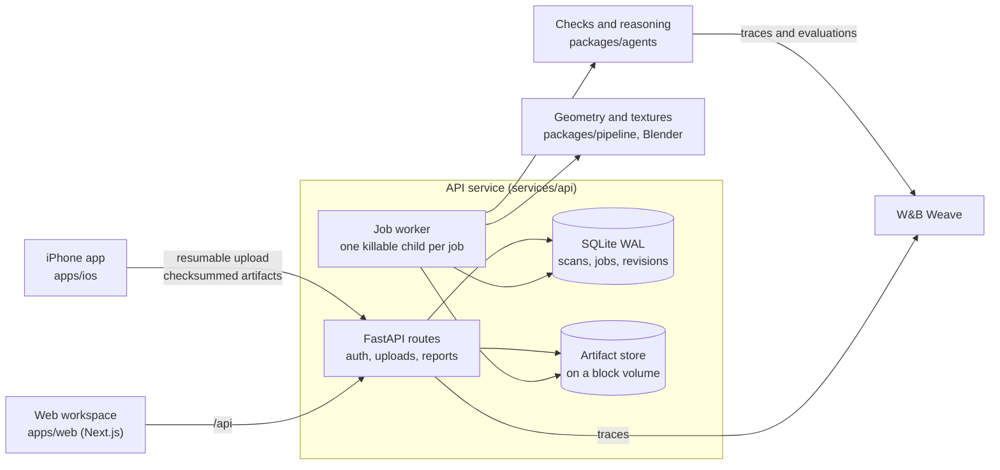

# Standard Physics

[](https://github.com/Imhaohao/standardphysics/actions/workflows/ci.yml)
[](https://github.com/Imhaohao/standardphysics/actions/workflows/ios.yml)

Standard Physics turns an iPhone scan of a small business into a 3D model. It checks that model against the 2010 ADA Standards and highlights every violation, with the measurement and the rule it breaks. An agent loop then finds a rearrangement of the owner's own furniture that fixes the violations, and every proposal is measured again before it is accepted.

It is already deployed and in production use. We partnered with Sharetea in Berkeley, California, and used Standard Physics to find two violations: the payment processor was too high, and one of the walkways wasn't wide enough when chairs weren't pushed in.

| | |
|---|---|
| Live app | [standardphysics.app](https://standardphysics.app), with the iPhone app in TestFlight beta |
| W&B Weave traces | [imhaohao-university-of-california-berkeley/physics](https://wandb.ai/imhaohao-university-of-california-berkeley/physics/weave): each assessment with every rule inside it, the agent loop's passes and router decisions, and every evaluation run |
| Weave evaluations | [Evals tab](https://wandb.ai/imhaohao-university-of-california-berkeley/physics/weave/evaluations): six runs over 39 labelled cases, the latest three tagged with the commit they scored |
| Production | A DigitalOcean droplet running the compose stack in [`deploy/digitalocean`](deploy/digitalocean), deployed only from images CI has tested |
| Health, live | [`/health/details`](https://api.standardphysics.app/health/details): deployed commit, worker heartbeats, queue age, tracing status |
| How it is built | [ARCHITECTURE.md](ARCHITECTURE.md), [RESILIENCE.md](RESILIENCE.md), [SECURITY.md](SECURITY.md) |
| Since Part 1 | [What changed since the Part 1 submission](#what-changed-since-part-1) |

| Room model and checks | Findings report |
|---|---|
|  |  |

The model view keeps measured geometry selectable while the side panel lists findings and review questions. The report connects a measured value to a cited section and a proposed next step. The sample shop makes these screens reproducible without publishing private field imagery.

## What changed since Part 1

Our CoreWeave Hacks Part 1 submission is commit [`3cfd248`](https://github.com/Imhaohao/standardphysics/tree/3cfd2482), from 13 September. We've made more than 1,100 commits to master since then, and these are the ones that took the project toward production.

| Area | At the end of Part 1 | Now | Started in |
|---|---|---|---|
| Accounts | No sign-in, so any scan was open to anyone who had its id | Owners sign in, sessions are stored hashed, and every scan route checks ownership | [`4061b9f`](https://github.com/Imhaohao/standardphysics/commit/4061b9fd) |
| Container | No Dockerfile | A production image built from digest-pinned bases and run as a non-root user | [`c048608`](https://github.com/Imhaohao/standardphysics/commit/c0486081) |
| Dependencies | Unpinned installs | Lockfiles that CI, the image and `start.sh` all install from | [`7f07890`](https://github.com/Imhaohao/standardphysics/commit/7f078906) |
| Job worker | One loop with no queue lock and no deadlines | One process holds the queue lock, and every job runs in a child process that is killed at its deadline | [`689a02f`](https://github.com/Imhaohao/standardphysics/commit/689a02fa), [`a21d1de`](https://github.com/Imhaohao/standardphysics/commit/a21d1de7) |
| Admission control | No budgets | Budgets for each owner, the job queue and the disk, answered with 429, 503 or 507 | [`4438d14`](https://github.com/Imhaohao/standardphysics/commit/4438d14a) |
| Deploys | No deploy tooling | CI publishes the tested image, and `scripts/deploy.sh` waits for running jobs, then confirms the new commit is serving | [`b55740c`](https://github.com/Imhaohao/standardphysics/commit/b55740c1), [`afdf1c1`](https://github.com/Imhaohao/standardphysics/commit/afdf1c17) |
| Backups and alerts | None | Nightly backups, a restore that checks every artifact's SHA-256, and a monitor that alerts on an outage | [`c186d79`](https://github.com/Imhaohao/standardphysics/commit/c186d799), [`f0ed86f`](https://github.com/Imhaohao/standardphysics/commit/f0ed86f2) |
| CI | One job that installed the packages and ran pytest | Lint, types, tests, coverage floors, contract drift, a browser flow, an image smoke test and security scans, all gating the release image | [`ci.yml`](.github/workflows/ci.yml) |
| Tests | 471 Python tests | About 2,000 Python tests, plus the web and iOS suites | |
| Failure model | Not written down | 23 failure modes below, each with the test that proves it, and [RESILIENCE.md](RESILIENCE.md) for the long form | |

## Production readiness at a glance

The long form lives in three documents at the root: [ARCHITECTURE.md](ARCHITECTURE.md) for how the running system fits together, [RESILIENCE.md](RESILIENCE.md) for every failure it is built to survive, and [SECURITY.md](SECURITY.md) for how accounts, data and the supply chain are protected.

| What a reviewer asks | What is in the repo |
|---|---|
| Is it in production? | Yes. The web app, the API and the scan pipeline serve real owners at [standardphysics.app](https://standardphysics.app), the iPhone app is in TestFlight, and every deploy ships an image CI has already tested. |
| Does it survive failures? | A crash-safe job queue, hard deadlines on every job, bounded retries, admission control on every input, and a test that injects each failure. See [failure modes](#failure-modes-and-what-happens). |
| Is the code held to a standard? | ruff with a cyclomatic complexity ceiling and mypy across the contracts, pipeline, agents and API packages, strict TypeScript with an ESLint complexity ceiling, a test that fails the build if a package imports upward, and one that fails it if any hand-written source file in any language passes 800 lines. |
| How is the repo built? | Six packages with one-way dependencies, contracts generated from one source of truth, lockfile-pinned dependencies and digest-pinned base images, and one CI workflow in which every check on code that ships gates the release image. |
| Can it be operated? | Commit-tagged images, deploys that verify the new commit is serving before they record it, one-command rollback, tested backup and restore, alerting, log rotation and resource limits. |
| Can you see what it does? | W&B Weave traces from the API and from every worker process, a live health endpoint, and a Weave Evaluation of the checks tagged by commit. |
| Is it secure? | scrypt passwords, hashed sessions, ownership checks on every scan route, granted team roles, throttled sign-in, capped request bodies, and secret and vulnerability scanning in CI. |

## Failure modes and what happens

Each row names what goes wrong, what the system does about it, and the test that proves it.

| When this happens | Standard Physics | Proof |
|---|---|---|
| The server dies mid-job | Every job left running is queued again at startup, except a simulation, which is failed so its paid model calls never run twice, and a job three restarts in a row have cut short (`SP_MAX_JOB_INTERRUPTIONS`), which is failed until someone retries the scan; a claimed job always ends settled or back in the queue | [`test_job_recovery.py`](services/api/tests/test_job_recovery.py), [`test_worker_resilience.py`](services/api/tests/test_worker_resilience.py) |
| A second server starts on the same database | An exclusive lock lets only one process run jobs; the other serves requests and takes over the jobs once the first exits | [`worker_lock.py`](services/api/standardphysics_api/worker_lock.py), [`test_worker_resilience.py`](services/api/tests/test_worker_resilience.py) |
| A job hangs forever | Every job runs in a child process that is killed, with anything it started, at its deadline; the next job runs | [`test_worker_jobs_in_own_process.py`](services/api/tests/test_worker_jobs_in_own_process.py), [`test_worker_bakes.py`](services/api/tests/test_worker_bakes.py) |
| The database is locked or broken | Lock contention is retried with backoff for a bounded time; a permanent error stops retrying and marks the worker degraded | [`test_worker_resilience.py`](services/api/tests/test_worker_resilience.py) |
| A worker loop stalls | `/health/ready` reports it degraded while `/health` stays green through legitimate long bakes | [`test_worker_resilience.py`](services/api/tests/test_worker_resilience.py) |
| The phone loses signal mid-upload | The upload resumes where it stopped, against the same scan | [`ResumableUploadStore.swift`](apps/ios/StandardPhysics/Upload/ResumableUploadStore.swift), [`UploadViewModelTests.swift`](apps/ios/StandardPhysicsTests/UploadViewModelTests.swift) |
| An upload arrives corrupted | Every artifact carries a SHA-256 the server checks before storing it atomically; a repeat upload is idempotent | [`store.py`](services/api/standardphysics_api/store.py), [`test_upload_contract.py`](services/api/tests/test_upload_contract.py) |
| A client uploads slowly on purpose | Idle and total receive deadlines cancel it, delete the staged file and release its reservation | [`test_slow_uploads.py`](services/api/tests/test_slow_uploads.py) |
| Many large uploads arrive at once | Each upload reserves its declared size; concurrency is capped per owner and globally | [`budgets.py`](services/api/standardphysics_api/budgets.py), [`test_budgets.py`](services/api/tests/test_budgets.py) |
| The disk fills up | New uploads are refused with a 507 before the volume runs out; abandoned staging files are swept | [`test_budgets.py`](services/api/tests/test_budgets.py) |
| The job queue floods | Every path that enqueues work checks the queue limit in the same transaction and answers 503 with Retry-After | [`test_queue_admission.py`](services/api/tests/test_queue_admission.py) |
| A 640 MB mesh is uploaded | It is validated off the event loop, one part at a time, a bounded number at once; peak memory stays in single megabytes | [`test_mesh_validation_load.py`](services/api/tests/test_mesh_validation_load.py) |
| A model provider stalls or sends garbage | Replies are capped at 64 KB, checked against the expected shape and timed out as a whole; model runs are limited per owner and server-wide; a bad reply ends the loop with a message to the owner | [`test_model_provider.py`](services/api/tests/test_model_provider.py), [`test_model_loop.py`](services/api/tests/test_model_loop.py) |
| A zip bomb is uploaded | `room.usdz` is refused past a declared expansion size or entry count | [`test_usdz_validation.py`](services/api/tests/test_usdz_validation.py) |
| A JSON request is huge | Bodies over 1 MiB are refused with a 413 before they are read, chunked or not | [`test_request_size.py`](services/api/tests/test_request_size.py) |
| Someone guesses passwords | Sign-in is throttled per address and per account before any password work, atomically, with bounded memory, inside the one API process that serves every request | [`attempt_limiter.py`](services/api/standardphysics_api/attempt_limiter.py), [`test_auth.py`](services/api/tests/test_auth.py) |
| A script fills the beta waitlist | One network address gets 30 signups an hour, then a 429 | [`waitlist.py`](services/api/standardphysics_api/waitlist.py), [`test_waitlist.py`](services/api/tests/test_waitlist.py) |
| Someone asks for another owner's scan | Ownership is checked for every spelling of a scan id; the answer is the same 404 as a scan that does not exist | [`test_auth.py`](services/api/tests/test_auth.py) |
| A share link would land in a log | The API's access log writes `<token>` in place of the token in every share path, since the token alone opens the report | [`access_log.py`](services/api/standardphysics_api/access_log.py), [`test_access_log.py`](services/api/tests/test_access_log.py) |
| Someone pre-registers a victim's email | When Apple proves the email, the squatter's password and sessions are revoked | [`test_guests.py`](services/api/tests/test_guests.py) |
| A deploy goes wrong | The deploy stops the worker taking new jobs, waits up to 20 minutes for running ones and refuses if they are still going, then waits until the new commit is serving and prints the rollback command if it never is | [`test_deploy.py`](scripts/tests/test_deploy.py) |
| Data is lost | Nightly snapshots of the database and artifacts; a restore checks every uploaded artifact against the sha256 recorded at upload | [`test_backup_restore.py`](scripts/tests/test_backup_restore.py) |
| Production goes down at night | A monitor checks readiness, queue age, disk, backup age (a box with no backup destination fails too) and tracing every five minutes and alerts once per outage and once on recovery | [`test_monitor.py`](scripts/tests/test_monitor.py) |

## Field testing

Standard Physics has scanned over 40,000 square feet of campus buildings, residential units, and restaurants across the Bay Area and Los Angeles. It is currently in TestFlight beta access—sign up at standardphysics.app.

Every capture runs through the same pipeline as the sample shop in this repository. At Sharetea, a full shop went from a phone walk to a measured model, cited findings and saved layout proposals. At Moffitt Library, four separate walks of one floor were aligned and joined into a single photo-textured model covering more than 20,000 square feet. The public sample shop ships as downloadable [GLB](packages/fixtures/standardphysics_fixtures/data/shop.glb) and [USDZ](packages/fixtures/standardphysics_fixtures/data/shop.usdz) models, so a reviewer can open the same kind of model without a private capture.

## How it's built



An upload lands in the artifact store and queues a `process` job. The worker turns the RoomPlan export and the LiDAR mesh into a scene graph, `assess` runs the ADA checks over it, `display` renders the picture beside each finding, and `texture` paints the scan from the photos. The scene graph is versioned: an owner's edit, a rebuild or a re-run of discovery saves a new revision on top of the one it started from, so an owner's work is never overwritten.

| Path | What it is | Tests |
|---|---|---|
| [`packages/contracts`](packages/contracts) | Pydantic models every other part shares, and the TypeScript generated from them | `packages/contracts/tests` |
| [`packages/pipeline`](packages/pipeline) | Scan ingest, measurement, object discovery, texture baking | `packages/pipeline/tests` |
| [`packages/agents`](packages/agents) | The ADA checks, the layout fixer, the evaluation suite, Weave tracing | `packages/agents/tests` |
| [`services/api`](services/api) | FastAPI service: accounts, uploads, the job queue and worker | `services/api/tests` |
| [`apps/web`](apps/web) | Next.js workspace and the owner's report | `*.test.ts` beside the code, `apps/web/e2e` |
| [`apps/ios`](apps/ios) | SwiftUI capture app with resumable uploads | `apps/ios/StandardPhysicsTests` |
| [`deploy/digitalocean`](deploy/digitalocean) | Production compose stack, deploy verification, backups, monitoring | `scripts/tests` |
| [`tests`](tests), [`scripts`](scripts) | Cross-package regressions, the layering check, deploy and backup scripts | `tests`, `scripts/tests`, `scripts/*/tests`, `scripts/finetune` |
| [`tools/loopforge`](tools/loopforge) | The traced agent-loop starter the project began from, kept as a standalone CLI | `tools/loopforge/tests` |

Dependencies point one way: `contracts` at the bottom, `pipeline` and `agents` above it, `services/api` above those, and the two apps talk to the API over HTTP only. [`tests/test_layering.py`](tests/test_layering.py) fails the build if a package imports upward or imports a sibling its `pyproject.toml` does not declare, and [`tests/test_test_names.py`](tests/test_test_names.py) fails it if any test file sits outside a collected directory.

The API is one service with one SQLite database, which is the right size for a 2 vCPU droplet: WAL mode, `BEGIN IMMEDIATE` transactions and atomic job claims make it safe. Scans and artifacts are written through [`repository.py`](services/api/standardphysics_api/repository.py), the job queue through [`repository_jobs.py`](services/api/standardphysics_api/repository_jobs.py), and revisions and assessments through [`repository_revisions.py`](services/api/standardphysics_api/repository_revisions.py).

## What CI enforces on every push

One workflow, [`ci.yml`](.github/workflows/ci.yml), runs everything below. The release image is published only when every check on code that ships passes, security scans included, and production deploys only published images.

- **Python:** ruff (with a complexity ceiling), mypy over the contracts, pipeline, agents and API packages, and every test suite, installed from [`requirements.lock`](requirements.lock). [`tests/test_file_length.py`](tests/test_file_length.py) holds every hand-written Python, TypeScript, Swift and shell file to 800 lines.
- **Web:** ESLint (with a complexity ceiling), strict TypeScript, unit tests, the production build, and a check that the TypeScript contracts match the Python ones.
- **Reels:** ESLint and strict TypeScript over the promotional video app in `apps/reels`, which runs on every push but doesn't hold up a release because nothing in it ships.
- **Browser:** Playwright against the real API: the owner's report, sharing, deleting a shop, an expired session, an API failure, and a second account refused another owner's shop.
- **Production image:** built from digest-pinned base images, then made to process a real room end to end, render with Blender, and pass every Blender-dependent test inside the image.
- **Supply chain:** secret scanning over the full history, `pip-audit`, `npm audit`, a vulnerability scan of the image, and every GitHub Action pinned to a commit SHA.
- **iOS:** [`ios.yml`](.github/workflows/ios.yml) builds the app, runs its tests on a simulator, and runs the live owner flow and a shared-report render against a freshly started API and web app.

## Releases, recovery and monitoring

1. CI tests the image and publishes it to GHCR as `standardphysics:<commit>`.
2. [`scripts/deploy.sh`](scripts/deploy.sh) refuses while jobs are running, pulls that exact image, restarts, and waits until `/health/ready` is green, `/health/details` reports the new commit and the web app answers. Only then does it record the deploy.
3. Rolling back is `git checkout <sha>` and a restart with the image already tagged for it; the deploy prints the command if the new commit never becomes healthy.
4. [`backup.sh`](deploy/digitalocean/backup.sh) takes a consistent SQLite online backup and incremental artifact snapshots every night; [`restore.sh`](deploy/digitalocean/restore.sh) restores into a fresh directory and verifies SQLite's integrity check, the row counts, and every uploaded artifact's sha256.
5. [`monitor.sh`](deploy/digitalocean/monitor.sh) runs every five minutes and alerts a webhook or an ntfy topic on an outage and on recovery.

The containers run as a non-root user with memory and CPU limits and rotated logs. The runbook is [`docs/DEPLOY.md`](docs/DEPLOY.md).

## Observability with W&B Weave

Everything in this section lives in one public W&B project, [imhaohao-university-of-california-berkeley/physics](https://wandb.ai/imhaohao-university-of-california-berkeley/physics/weave), and every link opens without a W&B account. On 28 September 2026 at 10:42pm PT the project held 8,350 traced calls recorded since 13 September, and none of them raised an error. It also holds one Weave Evaluation with its 39-case dataset, the model that evaluation scores, and six evaluation runs.

`@traced` in [`tracing.py`](packages/agents/standardphysics_agents/tracing.py) makes a function a Weave op. The API traces the checks it runs for a request. Every worker child process starts its own tracing and flushes it before it exits, so the checks a job runs appear in Weave too. `/health/details` reports whether the API process's tracing started, why not when it did not, and how many of its sends to W&B have failed.

### Traced operations

| Operation | What one call is | Calls | Example |
|---|---|---|---|
| `assess` | One assessment of a scene graph; every check below runs inside it | 546 | [Latest](https://wandb.ai/imhaohao-university-of-california-berkeley/physics/weave/calls/01a0eba2-a789-70bc-b324-16f1174d4777) |
| `checks.run` and `checks.<rule>` | One accessibility rule measured against the scene graph; 17 rules, counted below | 1 to 545 per rule | Inside any `assess` call |
| `router.local_policy` | The router choosing the loop's next action: `FIX`, `RESCAN_AREA`, `ASK_OWNER`, `ESCALATE` or `DONE`. Every routing decision in the project so far came from this local policy. With `TYPESAFE_API_KEY` set, the loop asks TypeSafe System One instead and traces it as `router.typesafe` | 238 | [An `ASK_OWNER` decision](https://wandb.ai/imhaohao-university-of-california-berkeley/physics/weave/calls/01a0e709-7332-71fd-bf7f-e497d0f0d2e8) |
| `loop.pass` | One pass of the agent loop, which measures, lets the router decide, and then does only the action it chose | 4 | [The pass that ends a run](https://wandb.ai/imhaohao-university-of-california-berkeley/physics/weave/calls/01a0e521-98a4-76af-8d93-5bc4a4b11ef9) |
| `loop.rescan`, `loop.ask`, `loop.escalate`, `loop.done` | The action a pass carried out | 1 each | [Rescan](https://wandb.ai/imhaohao-university-of-california-berkeley/physics/weave/calls/01a0e520-f214-782a-8452-b26c22c4d1d8), [ask](https://wandb.ai/imhaohao-university-of-california-berkeley/physics/weave/calls/01a0e521-40ad-7ca6-a893-a811a242a60b), [escalate](https://wandb.ai/imhaohao-university-of-california-berkeley/physics/weave/calls/01a0e521-8c7a-7e6a-99ba-4996e7eb3237), [done](https://wandb.ai/imhaohao-university-of-california-berkeley/physics/weave/calls/01a0e521-dd51-71b2-9696-a6e498083319) |
| `fix.propose` | A search for a furniture rearrangement that clears the targeted findings | 45 | [Latest](https://wandb.ai/imhaohao-university-of-california-berkeley/physics/weave/calls/01a0eb86-8de9-7d51-9f26-b5d44fd2b829) |
| `evaluation.case`, `ShopReview.predict` | One labelled case run through one configuration of the system | 234 each | [A case from the fixes-off run](https://wandb.ai/imhaohao-university-of-california-berkeley/physics/weave/calls/01a0e709-4b7f-75b9-bf91-0b2f0e76e429) |
| `Evaluation.evaluate`, `Evaluation.predict_and_score`, `Evaluation.summarize` and the seven scorers | Weave's evaluation harness | 6, 234, 6, and 234 per scorer | The runs are listed below |

<details>
<summary>Calls per check</summary>

| Check | Calls |
|---|---|
| `checks.run` (the parent of the rules below) | 546 |
| `door_clear_width`, `service_counter_height`, `service_counter_approach`, `point_of_sale_height`, `scan_cannot_see` | 545 each |
| `route_clear_width`, `passing_space`, `turning_space` | 530 each |
| `restroom_turning_space`, `ramps`, `kiosks`, `self_service_reach` | 47 each |
| `door_maneuvering_clearance`, `protruding_objects` | 37 each |
| `dining_surface_height` | 36 |
| `turn_clear_width`, `exit_path` | 1 each, the first traces on 13 September |

</details>

### Evaluation

The checks are scored as a [Weave Evaluation](packages/agents/standardphysics_agents/evaluation/weave_eval.py) over 39 labelled cases: the sample shop as shipped, and variants that move its walls, fixtures and doors so the right answer changes.

| Weave object | What it holds |
|---|---|
| [`shop-review`](https://wandb.ai/imhaohao-university-of-california-berkeley/physics/weave/objects/shop-review/versions/ZHLZ0hlA4XxRioekC5syJ4YMbsfQhI4XXUXft9RQECs) (Evaluation) | The dataset below and the seven scorers |
| [`shop-review-cases`](https://wandb.ai/imhaohao-university-of-california-berkeley/physics/weave/objects/shop-review-cases/versions/ElXNXBRd5Ul77c9Np2AxQVZJm7g6nDgKX3yaOowqTpY) (Dataset, 39 rows) | Per case: its name and description, the problems it expects and forbids, the owner questions it expects, the router action it expects, whether it expects a fix, and its tier |
| [`ShopReview`](https://wandb.ai/imhaohao-university-of-california-berkeley/physics/weave/objects/ShopReview/versions/7xS5OkSSeP7YvbnJPvJzAPYV4WNF7Nw2H0CVSeUlAME) (Model) | The system under test. Its fields are the configuration: where measurements come from (`pipeline` or `stub`), whether fixes run, the router, the number of fix candidates, and the grid cell size |

<details>
<summary>The 39 cases</summary>

`aisle_31`, `aisle_24`, `aisle_36`, `aisle_35_9`, `aisle_33_long_run`, `aisle_60`, `door_30`, `door_32`, `no_door`, `street_approach`, `counter_43`, `counter_36`, `counter_blocked`, `counter_mislabelled`, `counter_labelled_bar`, `lawsuit_counter`, `thin_case_east`, `thin_counter`, `thin_and_narrow`, `confirmed_by_hand`, `dead_end_tight`, `dead_end_roomy`, `no_dead_end`, `tight_alcove`, `passing_space_absent`, `blocked_solid`, `blocked_but_movable`, `clean_shop`, `clean_shop_already_asked`, `empty_room`, `fixture_as_shipped`, `tables_crowd_the_aisle`, `one_chair_out`, `door_clearance_clear`, `door_clearance_blocked`, `protrusion_sticks_out`, `protrusion_tucked_in`, `tables_are_a_usable_height`, `tables_are_bar_height`

</details>

| Scorer | What it measures |
|---|---|
| `finding_precision` | Of the problems reported, the share the case expected |
| `finding_recall` | Of the problems the case expected, the share reported |
| `question_recall` | Of the owner questions the case expected, the share asked |
| `measurement_error_in` | Mean inches between what was measured and what the case says is there |
| `label_accuracy` | Whether each check attached to the object its rule is about |
| `router_action_match` | Whether the router picked the action the case calls for |
| `fix_resolves_finding` | Whether a rearrangement cleared the findings it targeted |

Each configuration of the system is one run. The three runs on 28 September are tagged with commit `5ce8e53`; the three on 27 September came before runs carried a commit, so the code they scored is not recorded. Latency is the mean seconds per case.

| Run (UTC) | Configuration | Precision | Recall | Question recall | Measurement error | Label accuracy | Router match | Fix resolves | Latency |
|---|---|---|---|---|---|---|---|---|---|
| [28 Sep 07:58](https://wandb.ai/imhaohao-university-of-california-berkeley/physics/weave/calls/01a0e705-edda-7723-b498-6e7dbd09b111) | Measured pipeline, fixes on | 0.972 | 0.924 | 1.000 | 0.0008 in | 1.000 | 1.000 | 1.000 | 28.2 s |
| [28 Sep 07:59](https://wandb.ai/imhaohao-university-of-california-berkeley/physics/weave/calls/01a0e707-23af-7205-91be-c9e9c1f1e0d8) | Stand-in measurements, fixes on | 0.380 | 0.924 | 0.997 | 8.57 in | 1.000 | 0.923 | 0.800 | 27.8 s |
| [28 Sep 08:01](https://wandb.ai/imhaohao-university-of-california-berkeley/physics/weave/calls/01a0e708-c957-76ce-8422-dbab54f22ed8) | Measured pipeline, fixes off | 0.972 | 0.924 | 1.000 | 0.0008 in | 1.000 | 1.000 | not scored | 16.8 s |
| [27 Sep 22:03](https://wandb.ai/imhaohao-university-of-california-berkeley/physics/weave/calls/01a0e4e5-29ca-7354-bc03-6f71e8500d41) | Measured pipeline, fixes on | 0.986 | 0.924 | 1.000 | 0.0008 in | 1.000 | 1.000 | 1.000 | 31.5 s |
| [27 Sep 22:05](https://wandb.ai/imhaohao-university-of-california-berkeley/physics/weave/calls/01a0e4e6-7ee1-73fe-9526-fbc2304fd925) | Stand-in measurements, fixes on | 0.384 | 0.924 | 0.997 | 8.57 in | 1.000 | 0.923 | 0.800 | 13.6 s |
| [27 Sep 22:06](https://wandb.ai/imhaohao-university-of-california-berkeley/physics/weave/calls/01a0e4e7-a314-7c0a-92bb-6335acf40564) | Measured pipeline, fixes off | 0.986 | 0.924 | 1.000 | 0.0008 in | 1.000 | 1.000 | not scored | 13.9 s |

The stand-in rows are the control. Swapping the measured geometry for merged boxes keeps recall but loses most of the precision and adds about 8.6 inches of measurement error. Reproduce them with `standardphysics-agents weave-eval`.

## Post-training

We fine-tuned an open model with supervised fine-tuning followed by reinforcement learning on Fireworks to propose furniture rearrangements. On the same 65 held-out layout variants, with four attempts each, training raised the share of proposals that obey every geometric constraint from 42.3% for the base model to 71.9% ([results](runs/finetune/synthetic/results.json), [run notes](runs/finetune/synthetic/STATUS.txt)). A bounded search over those variants finds an accepted fix for 36 of the 65 and clears every fixable finding in 27. A second fine-tuned model, Qwen3.8-27B served from Fireworks, backs up Gemini 3.8 Flash for naming the objects in a scan.


## Scenario notebook


The [marimo notebook](notebooks/scenario_sweep.py) puts a shop's aisle, counter, door and seating on sliders and runs the same evaluator the service uses, so a finding that appears mid-drag is the finding the server would report. Its second half points the same checks at real RoomPlan captures ([notebook notes](docs/marimo.md)).

## Running it

You need Python 3.11+ and Node 20.9+.

```bash
./start.sh                          # installs into .venv and apps/web, runs the API on :8787 and the web on :3000
SP_SEED_SAMPLE_SHOP=1 ./start.sh    # same, with a sample shop; the log says where the demo account's password is
docker compose up --build           # the production image, API and web as two containers
```

The same checks CI runs:

```bash
.venv/bin/python -m ruff check .
.venv/bin/python -m mypy                       # after .venv/bin/python -m pip install mypy==2.3.1
.venv/bin/python -m pytest                     # every package, the scripts and the tools
.venv/bin/python -m pytest services/api/tests   # the API, run on its own because its test helpers share names with the agents'
cd apps/web && npm run lint && npm run typecheck && npm run test && npm run e2e
```

## More

- [ARCHITECTURE.md](ARCHITECTURE.md), [RESILIENCE.md](RESILIENCE.md) and [SECURITY.md](SECURITY.md): the running system, its failure model and its security model
- [`docs/DEPLOY.md`](docs/DEPLOY.md): the production runbook, including rollback, backups and alerting
- [`docs/CONTRIBUTING.md`](docs/CONTRIBUTING.md): running each part, the phone build, and how the team works
- [`docs/MISSION.md`](docs/MISSION.md) and [`docs/ARCHITECTURE.md`](docs/ARCHITECTURE.md): what the reasoning layer is for and how it is designed
- [`docs/UX.md`](docs/UX.md): the owner's experience, screen by screen
- [`docs/archive/`](docs/archive): the hackathon build record, with the original plan, lane documents, handoffs, progress logs and research notes
