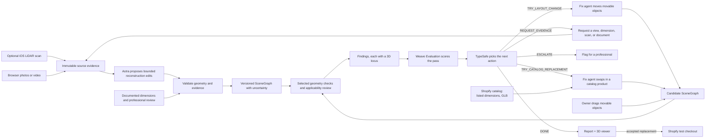

# Standard Physics

Capture a space with phone photos, a walkthrough video, or an iPhone LiDAR scan. Get back an editable 3D model, accessibility and building findings pinned to the relevant locations, and proposed changes that address supported findings. The model shows which dimensions are estimated and which are supported by measurements. Owners can drag furniture themselves and try a catalog replacement before opening a Shopify test checkout.

Built for CoreWeave Hacks: Agent Loops. Four people, four computers, submission due Sunday 1:00 PM.

---

## 1. The product

A shop owner uploads existing photos or a walkthrough video through a mobile browser on iPhone or Android. An optional iOS app captures RoomPlan data on supported LiDAR devices. Both inputs reach the same platform: Astra helps reconstruct or interpret the room, measurement checks establish what the evidence supports, and agents propose changes to movable furniture. Deterministic checks evaluate selected accessible routes, applicable dimensional criteria, and identified exit paths. The system tests modeled conditions, not every route or every wheelchair user.

Confirmed team inputs are existing boba-shop photos/video, no immediate access to measure the shop, and an available accessibility/building professional. Photo/video upload is therefore the first working capture path. Use any newly available LiDAR venue scan as a separate, explicitly named demonstration space. Person C schedules the professional early to identify useful checks and the dimensions needed to support them.

The owner opens the website and sees their shop in 3D with a findings list. Clicking a supported clearance finding flies the camera to that gap, dims the rest of the room, highlights the objects, and draws its dimension line and evidence status. An uncertain gap instead shows "Confirm this width" with the relevant source image. A finding turns green only after a current evaluation establishes that the candidate meets that checked criterion.

The owner can switch to rearrange mode and drag permitted furniture across the floor. Each drop previews the affected checks; target a response within a second and display progress when it takes longer. If the bounded move search finds no acceptable proposal, the fix agent can try a smaller replacement from our Shopify catalog. A current accepted candidate can expose a Buy button opening test checkout. Report predictions based on seller-listed dimensions as such; neither a search failure nor a catalog match establishes a complete legal conclusion.

### Three capture paths and their measurement limits

Apple's RoomPlan API supplies a parametric room with estimated dimensions in meters, transforms, identifiers, categories, and confidence labels. `CapturedRoom` can be serialized to JSON. This is useful metric input, but it can miss thin obstacles, merge furniture, misidentify boundaries, or drift. Its confidence label is not a documented numeric error bound.

| Input | What the pipeline creates | What enables measured screening |
|---|---|---|
| LiDAR plus optional images/video | Parametric metric estimate with linked visual evidence | Verify the dimensions and coverage relevant to each finding; resolve borderline or occluded regions |
| Walkthrough video without LiDAR | Selected frames and an approximate reconstructed layout | Add documented dimensions or measurements; validate local geometry rather than assuming one scale anchor fixes all distortion |
| One or more photos without LiDAR | Partial approximate layout with unknown or occluded regions preserved | Add views and measurements for the area being assessed; one photo does not establish hidden geometry |

Photos and videos can supplement a LiDAR capture or replace it. Preserve provenance when combining them; a photo does not silently overwrite a scan dimension. Never infer scale from an assumed standard door, chair, or person. A supplied known length can establish a scale hypothesis, but independent dimensions and coverage are needed for the particular clearance being checked.

Each dimension or geometric region records its source and verification state. Store numeric uncertainty bounds only when supported by the capture method or supplied measurement. If bounds are missing, relevant geometry is unverified, or a supported range crosses the applicable threshold, return `REVIEW` and request evidence. Checking one doorway validates that doorway, not the whole room. Models with no scale remain useful for visualization and relative rearrangement, with numeric compliance results unavailable.

### The demo

1. Show the actual boba-shop images/video entering through the browser. If available, demonstrate a LiDAR venue capture as a separately labeled space.
2. Open the resulting model with estimated and confirmed dimensions visible. Benchmark processing time before promising a live turnaround; a labeled preprocessed reconstruction is acceptable for the presentation.
3. Click a finding or measurement request; the camera frames its location and source evidence.
4. Drag a chair into the route in rearrange mode. The finding turns red, then clears when the chair goes back.
5. TypeSafe routes the loop to a layout trial. The fix agent proposes a move.
6. Weave evaluation runs on the candidate. Before/after replay. The finding clears.
7. If time permits, show a catalog replacement after the bounded move attempts failed to produce an acceptable layout; evaluate it and open Shopify test checkout.
8. Export the report with the actual professional review scope and any unresolved findings.

By Saturday 16:00 choose the demonstration evidence: use the real shop if enough dimensions are supported, restrict checks to its measured area if coverage is partial, or demonstrate repair on a labeled dimensioned fixture while the real shop shows measurement requests. Do not claim fixture results belong to the shop. The core presentation is findings → fix → evaluation; checkout is a removable final segment.

---

## 2. The loop



Each assessed candidate is one live Weave evaluation run with retrievable per-check results. Automatic repair consumes the current completed assessment. The loop stops on: all targeted supported findings cleared, three total proposal attempts, no improvement between passes, missing evidence, or a service error. A request for evidence pauses dependent repairs and resumes only after new evidence is ingested and evaluated.

**Invariants the loop cannot break.** Raw evidence and its derived baseline are immutable. Astra may propose reconstruction changes through `GeometryPatch` under section 6; it cannot promote its estimates to verified measurements. Design changes use `Proposal` and can only move approved movable objects or replace them with dimensioned catalog variants. Neither agent nor owner can alter rule thresholds, remove checks, lower evidence requirements, or unlock fixtures through those interfaces. Catalog dimensions are loaded from a versioned listing by the backend, never supplied by the model. Any changed input invalidates the old assessment and review. A Buy button exists only for a current accepted replacement with sufficient evidence for its targeted checks.

---

## 3. Architecture

| Layer | Stack | Owner |
|---|---|---|
| Capture | Mobile browser photo/video upload; optional SwiftUI + RoomPlan + ARKit on supported iOS devices | A |
| Ingest & 3D | Python, Blender 4.x headless (`bpy`), Astra agent | B |
| Agents & rules | Python, Pydantic, TypeSafe, Weave | C |
| API & persistence | FastAPI, SQLite, local artifact store | D |
| Commerce | Shopify development store, Storefront API called from the server only | D commerce agent; producer/A handles store setup |
| Web | Next.js + TypeScript + Tailwind + React Three Fiber | D frontend agent; A owns the capture feature |

Repository layout, frozen in the first hour:

```
apps/ios/            Swift package + Xcode project
apps/web/            Next.js app
  src/features/capture/  A's browser upload and evidence-entry UI
services/api/        FastAPI app, SQLite, artifact store, Shopify client
packages/pipeline/   Blender scripts, Astra driver, GLB export
packages/agents/     rule packs, checks, router, evaluations
packages/contracts/  Pydantic models + generated TypeScript types
docs/
src/loopforge/       existing example, left alone
```

`packages/contracts` is the single source of truth. Export JSON Schema from Pydantic and use the separate `json-schema-to-typescript` package to generate `apps/web/src/types/contracts.ts`. Nobody hand-writes a TypeScript interface that mirrors a Python model. B and C start against shared synthetic fixtures immediately; neither waits for mobile provisioning or a real capture.

---

## 4. Contracts

Person D freezes these versioned contracts in hour one and owns schema changes. Every lane receives an example for LiDAR, unscaled media, calibrated media, and a dimensioned synthetic fixture.

**`Scan`** — a capture/evidence collection with `mode` (`lidar`, `video`, `images`, or `mixed`), media manifests and hashes, source timestamps, and optional device metadata. USDZ, `CapturedRoom` JSON, export metadata, camera poses, and intrinsics are optional and present only when actually captured. Existing photos need neither an Apple device nor invented camera poses. New evidence creates a new version rather than replacing originals.

**`MeasurementEvidence`** — a supplied length, pose constraint, or uncertainty bound tied to named geometry and its source image, drawing, or instrument reading. Records units, who supplied/checked it, and verification scope. Model estimates are a distinct source, never a human measurement.

**`SceneGraph`** — canonical geometry with `revision`, source hashes, `coordinate_space` (`relative` or `metric`), and evidence references. LiDAR input starts from `CapturedRoom`; media input starts from a provisional Astra reconstruction and any supplied measurements. Meshes are display artifacts. A graph's metric units do not imply that every dimension is verified.

```python
class SceneNode(BaseModel):
    id: UUID                        # preserve RoomPlan ID, or assign a stable ingest ID
    kind: Literal["wall", "door", "window", "opening", "floor", "object"]
    label: str                      # "service counter", refined from RoomPlan's category
    raw_category: str | None        # absent if the source supplies no category
    dimensions: Vec3                # graph units; meters only in metric graphs
    transform: Mat4                 # +Z up, right-handed; graph units
    confidence: Literal["low", "medium", "high"] | None
    geometry_source: Literal["roomplan", "media_estimate", "documented", "catalog"]
    evidence_ids: list[UUID]
    measurement_state: Literal["estimated", "partially_verified", "verified"]
    bounds_ref: UUID | None         # supported per-property bounds; not inferred from confidence
    movable: bool
    relabeled_by: Literal["roomplan", "astra", "human"] | None
    catalog_variant_id: str | None  # set when a catalog product replaced the scanned object
```

Metric graphs use meters and Z up; relative graphs do not expose physical measurement labels. RoomPlan Y-up converts once on ingest in `packages/pipeline/coords.py`; the viewer explicitly converts canonical Z-up to renderer Y-up. Test positions, rotations, handedness, and round trips. Individual measured properties keep their own evidence even when a node is only partially verified.

**`RulePack`** — authority, edition, source URL, section, source-unit parameters, applicability conditions, exceptions, required geometry/evidence, and reviewer status. `ProjectFacts` supplies parcel/use/permit information and explicit unknowns. Applicability cannot be inferred from a node category alone.

**`Finding`** — outcome (`PASS_SCREEN`, `FAIL_SCREEN`, `REVIEW`, `NOT_ASSESSED`), reason code, measured value/range or null, required criterion, evidence, node IDs, citation, and optional `Locus`. Search/resource limits return `REVIEW` with `SEARCH_LIMIT`; service errors remain assessment execution errors. Missing-document and unlocated-geometry findings do not receive fabricated coordinates. Estimated previews are labeled predictions and do not become `PASS_SCREEN` or confirmed violations.

**`GeometryPatch`** — base graph hash, operation, affected/parent node IDs, proposed geometry, evidence references, and requested review status. Permitted operations and occupancy restrictions are in section 6. It is separate from a furniture-design `Proposal`.

**`Scenario`** — the versioned customer journey the checks walk: ordered stops, the mobility profiles tested on each leg, door-state assumptions, and the needs this build does not assess, each with a reason. `Assessment` already records its hash. The report prints the not-assessed list so that silence never reads as a pass.

```python
class Stop(BaseModel):
    kind: Literal["entrance", "order_counter", "pickup", "accessible_seat", "self_serve", "restroom", "exit"]
    node_id: UUID | None            # door, counter, or table marking the stop; None until located
    required: bool                  # self_serve and restroom are optional when the shop has none

class MobilityProfile(BaseModel):
    kind: Literal["wheelchair", "walker", "cane_user", "seated_reach"]
    rule_refs: list[str]            # RulePack sections supplying its dimensions; never hand-typed numbers

class NotAssessed(BaseModel):
    need: str                       # "communication at the counter for deaf or hard-of-hearing customers"
    reason: str                     # "not a layout check"

class Scenario(BaseModel):
    id: UUID
    version: int
    stops: list[Stop]               # walked in order; each consecutive pair is one route leg
    profiles: list[MobilityProfile]
    door_states: dict[UUID, Literal["open", "closed_pull", "closed_push", "unknown"]]
    not_assessed: list[NotAssessed]
```

The default boba-shop scenario walks entrance → order counter → pickup → accessible seat → exit, adding self-serve and restroom stops when the shop has them. Its not-assessed list starts with the approach from the sidewalk or parking, communication at the counter, and signage. The professional confirms the stops and the list at kickoff. Changing either creates a new scenario version, which invalidates earlier assessments and reviews.

**`Proposal`** — a list of `{node_id, delta_translation, delta_rotation}` moves and `{node_id, catalog_variant_id}` replacements for movable nodes only, plus the base graph hash, the findings it targets, and its author (`fix_agent` or `owner`).

**`Assessment`** — graph, evidence, rule-pack, project-fact, scenario, catalog-snapshot, and evaluator-version hashes; completion status; findings; decision provenance; actual Weave evaluation reference and row-result references; pass number. Preview results cannot stand in for completed live evaluations.

**`CatalogProduct`** — Shopify product and variant IDs, listed footprint and height in meters, the GLB source, price, availability, and when it was fetched. Listed dimensions come from the seller, so the report labels them as listed rather than measured.

**`Purchase`** — the accepted proposal and assessment hashes, the variant lines, the Shopify cart ID, the `checkoutUrl`, and status.

**`Review`** — reviewer name, qualifications, reviewed scope and input hashes, notes, unresolved issues, and timestamp. Authenticated human action records review; an agent cannot sign it. Changed relevant inputs mark it stale.

---

## 5. Capture with or without LiDAR

Person A owns `apps/ios/` and the isolated browser capture feature. Browser upload is required and works on mobile Safari, Chrome/Android, and desktop. LiDAR is optional; all downstream work starts with contract fixtures while capture is implemented.

### Browser photos and video

Provide file inputs for multiple images or one walkthrough video, an optional measured plan, and an evidence form for known dimensions. Camera capture is an enhancement where supported; selecting an existing file always works. Accept JPEG/PNG/HEIC images and MP4/MOV video, validate actual content, and normalize HEIC/HEVC using a tested server decoder. Return an actionable conversion error if decoding is unsupported. Do not assume browser playback support equals server decoding support.

For the demo, cap a collection at 20 images or one video of up to four minutes, and 250 MB total. Preserve originals privately and use reduced-resolution previews. Reject over-limit or malformed input before expensive work. FFmpeg extracts a capped set of up to 40 timestamped frames; select non-blurry, nonduplicate views, and retain their links to the source video. Arbitrary media normally has no camera poses: do not invent them.

Astra builds a coarse parametric draft from visible walls, openings, furniture, and supplied measurements, optionally using available reconstructed camera geometry. Preserve occluded/unknown regions. Show source images beside the draft so the owner/professional can confirm geometry. A robust general photogrammetry/SLAM engine is outside the weekend scope. If no usable reconstruction can be made, provide a partial editable draft and evidence requests rather than an invented complete room.

Calibration binds supplied dimensions to actual endpoints/surfaces. A scale anchor is not proof of perspective correctness throughout a room. Require independent evidence for the dimensions supporting each selected clearance, and leave unsupported areas at `REVIEW`. Photos can also be attached to LiDAR objects for relabeling and coverage checks.

### Optional iOS LiDAR app

**Screens.** Start → capability check → RoomPlan capture on supported devices, or photo/video upload otherwise → review → name and upload → history/status. A non-LiDAR iPhone must reach the media path rather than a dead end.

**Capture.** Use `RoomCaptureView` for the guided interface: its view delegate receives raw data through `captureView(shouldPresent:error:)` and the processed `CapturedRoom` through `captureView(didPresent:error:)`. The distinct custom-session path uses `RoomCaptureSessionDelegate.captureSession(_:didEndWith:error:)`, which returns `CapturedRoomData`, then `RoomBuilder.capturedRoom(from:)` to produce the processed room. Choose the guided-view flow for v1. Capture keyframes from the AR session used by RoomPlan through a supported sharing/integration path; do not start a second competing camera session or replace framework-owned delegates blindly. Save actual intrinsics, camera transforms, orientation, and timestamps when available. Verify this path with the target SDK; use separately uploaded visual media if session-frame integration is not ready.

**Export.** Three artifacts per scan:

| Artifact | How | Why |
|---|---|---|
| `room.usdz` + export metadata | Documented `CapturedRoom` export for the target SDK | Visualization import and mapping back to source elements |
| `room.json` | `JSONEncoder().encode(capturedRoom)` | Parametric metric estimate, parsed server-side |
| `frames/*.jpg` + optional `poses.json` | Supported capture-session frame integration | Visual evidence for relabeling and report |

Persist the export metadata and verify its element-to-visual mapping on an actual fixture. If the SDK/importer cannot preserve it, generate the display geometry directly from canonical node IDs. Photo-derived models use ingest-assigned stable IDs. Both paths must support reliable finding-to-object highlighting.

**Upload.** Create a session with `POST /api/scans`; upload each manifest artifact with an idempotent `PUT /api/scans/{id}/artifacts/{artifact_id}` including its checksum; finalize with `POST /api/scans/{id}/complete`. Persist completed artifact IDs, show progress, and retry an interrupted artifact without duplicating it. This is artifact-level resume, not byte-range resume. Local captures remain available after failure. Restrict paths and decoder resources; stored filenames come from validated IDs, not arbitrary user paths. Separate project credentials from publicly shareable sanitized artifacts.

**Provisioning.** Verify a development build and compatible device in the first 45 minutes of the optional native work. Use supported local development signing; do not make App Store distribution or push-notification entitlement a dependency. If provisioning/capture stalls, continue browser uploads and use an existing compatible capture app for any LiDAR sample. Evidence requests appear in the app/browser status view through polling.

### A gotcha worth planning around

RoomPlan's categories are oriented toward familiar furniture and appliances. The exact enum depends on the SDK; preserve the raw value. A shop counter or display case may be classified as storage/table, merged with nearby objects, or missed. Do not assume the classification or confidence for a particular capture.

Astra proposes more useful labels from the visual and spatial evidence. Both geometry and labels can be wrong; ambiguous classifications stay reviewable. The owner confirms movability before an object can be rearranged automatically.

---

## 6. The 3D pipeline: Astra and Blender

Person B owns this. Blender 4.1.1 was found at `/Applications/Blender.app/Contents/MacOS/Blender` on the current machine. Check each teammate's machine first; install only where missing and pin a tested version rather than assuming a new installation remains on 4.x:

```bash
/Applications/Blender.app/Contents/MacOS/Blender --version
```

**Import.** For LiDAR, verify USDZ import and metadata mapping with the installed Blender build; canonical geometry comes from `room.json`. For photos/video, ingest selected frames and `MeasurementEvidence`, build a provisional parametric scene, then generate its display mesh. Run the fixed conversion scripts headlessly. Neither source requires a generated mesh to become measurement authority.

**Blender's role.** It supplies reconstruction/visual inspection, finding images, and GLB export. Canonical geometry and independent Python measurement functions drive the checker. Render detail and generated meshes do not silently change assessed geometry. Use one checker implementation in live previews, Weave evaluations, and the benchmark.

**What Astra does.** Astra interprets source media, proposes structured edits, and drives bounded Blender operations. Generated scripts run without provider credentials or access to authoritative stores; the backend alone validates and commits geometry patches. Fixed trusted scripts serialize evaluated geometry. Three jobs:

1. **Relabel.** Use actual categories, spatial context, and linked images to propose labels. Camera-frustum selection is available only for real camera poses; otherwise use explicit image associations. Treat fixture and movability classifications as suggestions. An owner-approved allowlist controls design edits.
2. **Reconstruct and refine.** Build approximate nodes from media; refine estimated poses and dimensions within supported constraints; partition merged nodes; add suspected obstacles or unknown regions. Changes that alter assessed free space follow the restrictions below and may require new evidence or review.
3. **Compose views.** For each finding, position a camera that frames the problem legibly and render a PNG at 1200×800.

### Astra's geometric permissions

| Operation | Allowed behavior | Required restriction |
|---|---|---|
| Relabel or change camera/material | Improve semantics or presentation | Preserve source category/evidence; relabeling cannot remove a node from collision occupancy or unlock a fixture |
| Create a provisional media node | Approximate visible geometry for an editable draft | Mark estimated; link source media; unknown scale remains relative; hidden geometry stays unknown |
| Refine estimated shape/pose | Change supported estimated properties within the supplied reconstruction bounds | Preserve confirmed anchors and fixed-property locks; outside-bounds changes require new evidence/review; absent bounds means draft-only |
| Split a merged object | Create stable child IDs with parent lineage | Automatically assessed splits must preserve the parent's conservative occupied envelope; removing inter-object space requires evidence/review |
| Suspected obstacle or missing wall | Add a hypothesis and request confirmation | Keep a review flag; hypotheses must not be presented as observed code violations |
| Hide/drop a dubious detection | Hide it from the presentation or propose removing it | Preserve its conservative occupancy until removal is supported and approved; low confidence alone never authorizes clearing space |
| Move furniture | Translate/rotate an approved movable node through `Proposal` | No resize, fixture movement, floor escape, or violated owner constraint |
| Replace furniture | Load a current dimensioned catalog variant through `Proposal` | Backend uses listing geometry and provenance; model cannot alter listed dimensions |

All geometry edits create a candidate revision against a base hash. Validate finite positive extents, valid transforms, floor bounds, evidence references, immutable properties, and operation-specific restrictions. No unconstrained epsilon or global percentage allowance permits shrinking an obstacle until a check passes. Numerical tolerances used by geometric equality tests are not measurement-error claims.

Evidence-driven corrections and hypothetical design changes are separate history events. A supported correction may reveal more failures and must be kept as corrected evidence rather than rejected to preserve a good score. It creates a fresh baseline and invalidates previous assessments/reviews. A design proposal must improve the evaluation without hiding geometry or reducing assessed coverage. Before approval, an occupancy-reducing reconstruction edit remains a draft; dependent checks return `REVIEW` using the unresolved region, not a green result.

Preserve the raw capture and every revision. A professional can approve a reconstruction correction within their documented review scope; the agent cannot approve itself. This allows Astra to do useful geometry work while keeping source evidence, corrections, and proposed shop changes distinguishable.

**If Astra access doesn't materialize,** use an available authorized model through the same patch validator and isolated rendering boundary. Do not give a fallback model broader permissions. Resolve runtime access during the first working hour and drop unavailable model claims.

**Exports per assessed revision.** `scene.glb` with stable node IDs, `scene_graph.json`, evidence/revision metadata, and a `finding_<id>.png` for each locatable finding. Target GLB under 8 MB using a tested codec; compression must not break node selection. Reuse unchanged renders rather than blocking every preview on Blender.

---

## 7. Rules, checks, and the router

Person C owns this.

### The rule pack

Build in tiers. Tier 1 is the original seven checks. Tier 2 adds door maneuvering clearance and protruding objects once the route measurement works. Tier 3 adds reach range and dining surfaces only after the loop runs end to end, and only before the Sunday feature freeze. A short list that is correct and cited beats a long one that is approximately right, and a judge will ask where a number came from. Every check runs against the active `Scenario`, and any need it does not cover appears in the report as `NOT_ASSESSED` with its reason.

| Check | Threshold | Source |
|---|---|---|
| Accessible route clear width | 36 in minimum; reduction to 32 in for no more than 24 in only with reduced segments separated by sections at least 48 in long and 36 in wide | ADA 2010 §403.5.1 |
| Clear width at 180° turn | Applies when turning 180° around an element less than 48 in wide: 42 in approaching, 48 in at turn, 42 in leaving; special condition does not apply with at least 60 in at the turn | ADA 2010 §403.5.2 |
| Passing space | On routes narrower than 60 in, at intervals no greater than 200 ft: 60 × 60 in or the specified T intersection with its required extensions | ADA 2010 §403.5.3 |
| Turning space | Where required by the applicable provision: 60 in circle or the specified T shape; do not require one arbitrarily in every room | ADA 2010 §304.3 |
| Door clear width | At least 32 in between door face and stop at 90° opening; review deeper openings and other applicable conditions | ADA 2010 §404.2.3 |
| Sales/service counter | Parallel approach: 36 in accessible length, 36 in maximum height, adjacent clear floor space. Forward approach: 30 in length, 36 in maximum height, required knee/toe and clear floor space; review depth and alteration exceptions | ADA 2010 §904.4.1–.2 |
| Egress path obstruction | Path from each occupied area to an exit, unobstructed | CBC Chapter 10, flagged for review |
| Door maneuvering clearance (tier 2) | Pull- and push-side clear floor space, including latch-side clearance, by approach direction and door type per the section; an `unknown` door state or approach returns `REVIEW` | ADA 2010 §404.2.4 |
| Protruding objects (tier 2) | Wall-mounted leading edges between 27 in and 80 in high project 4 in maximum (4½ in for handrails); post-mounted objects in that band project 12 in maximum | ADA 2010 §307 |
| Reach range at self-serve stations (tier 3) | Forward and side reach limits with their obstruction conditions, verified from the section before enabling | ADA 2010 §308 |
| Dining surfaces (tier 3) | Accessible seating share, surface height, and knee/toe clearance, verified from the sections before enabling | ADA 2010 §226.1, §902 |

This table is a bounded implementation index, not the complete legal text. Person C and the available professional verify the source, applicability, dimensions, exceptions, and omitted conditions before enabling a check. Keep original legal-unit values and apply one documented unit conversion; rounded display labels must not change acceptance thresholds. Do not substitute doorway opening estimates for door-face/stop measurements when those surfaces are missing.

Protruding objects need extra care because RoomPlan and photo reconstruction both miss thin wall-mounted objects. A leg can pass §307 only when evidence shows its walls were covered in the relevant height band; otherwise the finding is `REVIEW`.

### Evidence checks

A scan or photo set cannot establish these. Each starts as `REVIEW` with reason `EVIDENCE_REQUIRED`, and the router sends it to `REQUEST_EVIDENCE` with a specific ask. None can pass from scan data alone.

| Check | What to ask for | Source |
|---|---|---|
| Changes in level at the entrance and along each leg | A close photo of each threshold beside a ruler, or a measured height | ADA 2010 §303; §405 if a ramp exists |
| Door hardware on the route | A photo of each handle | ADA 2010 §404.2.7: one-hand operation without tight grasping, pinching, or twisting, 34 in to 48 in above the floor |
| Door opening force | A door force gauge reading from the owner or professional | ADA 2010 §404.2.9: 5 lbf maximum; fire doors and exterior hinged doors are excepted |
| Floor surface | Photos of mats and floor transitions on each leg | ADA 2010 §302 |
| Restroom | A separate capture or measured drawing, when customers use it | ADA 2010 §603, §604 |

Use the [U.S. Access Board's ADA Standards](https://www.access-board.gov/ada/), the [Palo Alto Building Division](https://www.paloalto.gov/Departments/Planning-Development-Services/Development-Services/Building-Division), the [official Municipal Code](https://codelibrary.amlegal.com/codes/paloalto/latest/overview), and [Permit View](https://www.paloalto.gov/Departments/Planning-Development-Services/Development-Services/Palo-Alto-Permit-View). Palo Alto adopted the 2025 California codes effective January 1, 2026; applicability to an existing shop still requires project/permit history and relevant California/local provisions. Keep federal screening separate from a full state/local compliance determination.

Zoning uses a parcel/use/document review checklist, not a dimensional scan algorithm. Request actual address/APN, declared use, permit history, and relevant approvals; preserve explicit unknowns if documents cannot be obtained. The professional confirms only matters within their qualifications. A building/accessibility reviewer does not automatically resolve zoning questions. Numeric pass/fail requires applicable rules and sufficient measurement evidence; other results remain `REVIEW` or `NOT_ASSESSED`.

### The route measurement

Given the `SceneGraph` and the active `Scenario`, screen each leg between consecutive stops, for example entrance to ordering/payment, to pickup, to an accessible seat, and to the exit. This algorithm estimates spatial clearance; it does not simulate wheelchair orientation, user ability, door operation, or a full evacuation. Unscaled or insufficiently measured regions cannot produce a verified clearance result.

1. Rasterize the known floor boundary to a 25 mm grid. Mark outside/unknown regions as unavailable. Conservatively rasterize walls and obstacles in the relevant vertical envelope, including overhangs where the profile intersects them, rather than only objects touching the floor. Unobserved door states remain review items.
2. Compute a distance transform on free cells. Account conservatively for cell size, boundary rasterization, and supported measurement bounds. Never invent a sensor bound or let diagonal neighbors cut an occupied corner.
3. Use a deterministic maximum-bottleneck path search: a cell's path capacity is the minimum of its own clearance and its predecessor's capacity; process greatest capacity first and retain predecessor pointers. Bound explored cells and runtime. Return `REVIEW` with reason `SEARCH_LIMIT` on a limit; "no path found in this grid" is not a proof that all real maneuvers are impossible.
4. Recover the actual path and its minimum-capacity location. Use canonical obstacle boundaries and their IDs to locate the nearest limiting geometry. Validate connecting segments against the conservative occupancy. Do not invent a unique "failing cell" from a failed flood fill.
5. Report the computed bottleneck as modeled clearance. Draw a direct gap dimension only when a separately verified boundary-to-boundary measurement supports that label; twice a nearest-obstacle radius is not universally a legal corridor-width measurement. Retain all limiting objects and identify ambiguous cases as review items.
6. Apply cited route-width/length exceptions with separate dimensional checks. Perform door, passing-space, and turning-template checks independently where applicable; successful disk-clearance routing does not establish those checks.

Use NumPy/SciPy and Shapely where appropriate. Benchmark on the actual demo layout before claiming subsecond execution. Do not build an orientation-aware planner for this submission; describe its absence plainly. The 180° clause is a particular geometric requirement, not a general wheelchair turn-radius simulation. Required fixtures cover a known gap, two alternative routes, blocked diagonal corners, unknown floor, bounded-search timeout, cell-size sensitivity, and a circular path that must not be advertised as proof of an oriented-device maneuver.

### TypeSafe as the router

TypeSafe picks the next action from a closed set, and its structured output drives real control flow:

| Action | Effect |
|---|---|
| `TRY_LAYOUT_CHANGE` | Run the fix agent against the named findings |
| `REQUEST_EVIDENCE` | Return the needed dimension, additional image/video view, optional LiDAR rescan, or document with its region/reference; display through app/browser polling |
| `TRY_CATALOG_REPLACEMENT` | Bounded move attempts found no acceptable result; test catalog candidates with sourced dimensions |
| `ESCALATE_TO_PROFESSIONAL` | Queue the finding for human review |
| `ACCEPT_AND_REPORT` | Stop and report the assessment, preserving unresolved items; does not mean whole-shop compliance |

Get the event credentials and the real quickstart in the first working hour. Test malformed, contradictory, and truncated outputs; an invalid action must fail closed and never authorize a change. If TypeSafe is unavailable after the first two working hours, run a labeled local policy and drop the claim.

TypeSafe returns action suggestions through the provider's actual supported contract. Independent backend checks enforce movability, current evidence, and valid assessment references. It cannot authorize a pass over a geometric failure or make an unsupported measurement sufficient. Record provider/model identity and replay status. Confirm API access and billing before integration; do not infer runtime API access from a coding-agent subscription.

### Weave

Use tracing, a labeled benchmark, and live candidate evaluations for their distinct purposes.

**Tracing:** initialize the configured Weave project at API startup; trace agent calls, bounded Blender operations, evidence versions, and named check operations. Raw shop media stays private; public demonstration traces use approved anonymized/fixture data and contain no credentials. A cached replay is marked replay throughout and never presented as a fresh sponsor call.

**Labeled benchmark:** build about 25 expert-annotated media/scan examples and synthetic graphs, including missing scale, ambiguous objects, poor coverage, geometric failures, catalog trials, a blocked pull-side latch clearance, a wall shelf protruding past the §307 limit, an out-of-reach self-serve station, and an unknown door swing that must return `REVIEW`. On cases with the relevant ground truth, measure `finding_precision`, `finding_recall`, `measurement_error_mm`, `relabel_accuracy`, and `router_action_match`. Explicitly skip unavailable labels; the same model's own answer is not ground truth. Keep a held-out subset and report counts and coverage. Run the benchmark at integration checkpoints, not in full on every customer drag or repair.

**Live evaluation:** each assessed graph uses a `weave.Evaluation` over its versioned checks/scenarios with named outputs such as `criterion_outcome`, `evidence_sufficient`, `owner_constraints_held`, and `regression_free`. These do not require a labeled answer for a new shop. Use the same deterministic checker as the preview and benchmark. Store actual completed evaluation references and individual row outputs; do not mistake an aggregate score for failure evidence.

**Gate:** a model repair must cite the current completed assessment and consume its per-check results. Validate the graph, evidence, rule, scenario, project-fact, evaluator, and relevant catalog hashes. Missing, stale, mismatched, failed, or unfinished evaluations block automatic repair. A candidate is accepted only if at least one targeted supported failure becomes a supported pass, or a declared geometric deficit strictly decreases, with no new failure, lost coverage, new uncertainty, or owner-constraint violation. Unmeasured visual rearrangements may be saved as drafts but cannot be accepted as verified repairs. Reject all pass-by-deleting-obstacles or pass-by-dropping-checks attempts.

Owner-created arrangements can be saved as versioned drafts even if they worsen findings; saving triggers a complete assessment rather than falsifying improvement. "Assessed" and "accepted repair" are distinct states. Compare automatic improvements only against the current baseline. A source correction produces a new baseline, not a spurious layout-improvement score. Test the gate against missing, stale, cross-graph, and incomplete evaluation references.

---

## 8. Findings pinned to the model

Spatial findings use this contract. Evidence/document requests may have no defensible 3D location; show them in the list with source references rather than assigning an invented point.

```python
class Locus(BaseModel):
    point: Vec3                      # modeled location; precision follows source geometry
    bbox: tuple[Vec3, Vec3]          # region to frame
    node_ids: list[UUID]             # objects responsible
    annotation: Annotation           # what to draw
    camera: CameraPose               # position, target, fov for the flythrough
    render_url: str | None           # Blender's still, for the printed report
```

`Annotation` is one of three shapes, and each one draws differently:

| Kind | Drawn as | Used by |
|---|---|---|
| `dimension_line` | Arrowed line between two points with the measured value in a label | Width, clearance, height, protrusion, and reach checks |
| `region` | Translucent filled polygon on the floor, red where it fails | Turning space, passing space, door maneuvering clearance |
| `path` | Polyline along the floor, colored by local clearance | Route checks, before/after replay |

In the viewer, selecting a finding does five things at once: the camera tweens to `camera` over 700 ms with an ease-out curve, every node not in `node_ids` drops to 15% opacity, the responsible nodes get an outline, the annotation draws with its measurement label facing the camera, and the finding's card in the list expands to show the citation.

Render a supported dimension as an HTML overlay at the projected midpoint, with source and uncertainty available in the finding. Round labels consistently, for example `31 in / 787 mm`, while retaining full internal precision. Relative graphs display no inches/mm; approximate metric dimensions say "estimated." When geometry only supports a region, show a region rather than a falsely precise dimension line. Expose keyboard focus and text status as well as color.

The before/after replay tweens proposed transforms and cross-fades catalog models. Color changes follow the completed assessment, not animation completion. Keep pending/unknown states distinct from a pass. Use reduced-motion preferences and an equivalent static before/after control.

---

## 9. The website

Person D's dedicated frontend agent owns the main website, while Person A owns the isolated browser capture/evidence-entry feature. D's backend and commerce agents work in separate modules. Four main screens plus capture, rearrange mode, and test checkout consume the shared contracts.

**Scans.** Spaces with preview, source type, measurement status, date, and findings counts. Empty state offers "Upload photos or video" immediately and optional LiDAR capture guidance. Missing scale and unresolved evidence are visible before opening a space.

**Scan detail.** R3F canvas with findings and source-media panels, orbit/pan/zoom, and a top-down toggle. Findings distinguish supported criteria, estimated previews, and evidence requests. A measurement form binds a submitted dimension to named endpoints and a source. Reviewers can inspect the geometry and source together; the screen never calls the entire shop compliant.

**Rearrange mode.** Movable nodes drag on the floor and rotate about Z; fixed nodes stay locked. Dimensions do not change. Each drop sends the base revision and monotonically increasing edit sequence with a draft proposal; discard late preview responses so older results cannot recolor newer geometry. Previews use the same checker, with unevaluated checks visibly pending. Saving persists a draft and runs the full live Weave assessment. Failed owner drafts remain editable; they are not accepted repairs. Apply the same object locks and collision validation to mouse and keyboard controls.

**Proposal.** Before/after with a scrub control, the list of what moved or was replaced, and the evaluation delta. Each accepted replacement shows its product photo, price, listed dimensions, and a Buy button.

**Report.** Print-ready finding blocks with available renders, source measurements or ranges, citations, proposed changes, and unresolved questions, followed by open evidence requests and the scenario's not-assessed list. Include capture mode, checked area, limitations, actual professional qualifications/scope, reviewed hashes, and review date. Unreviewed or changed versions say pending/stale. A contractor can follow the evidence; a model cannot issue the professional's signature.

Design follows the repo `CLAUDE.md`. Neutral surfaces, one calm accent, failures in a red reserved for exactly that. The 3D viewer is the subject on the detail screen and everything else defers to it.

### Buying a replacement

The catalog is a Shopify development store labeled as a demo, stocked with 8 to 12 café tables, chairs, and stools that each have listed dimensions and a price. Every payment runs through Bogus Gateway, Shopify's test payment method, so no real money moves.

- The API reads products through the Storefront API with a private access token sent in the `Shopify-Storefront-Private-Token` header. The token lives only on the server.
- Footprint and height live in product metafields. Their definitions need `access.storefront: PUBLIC_READ`, or the Storefront API won't return them.
- Product 3D models come from Shopify `Model3d` media with a GLB source. When a product has none, Person B builds a simple model in Blender sized to the listed dimensions. Checks always use the listed dimensions, never the mesh.
- Clicking Buy calls the API, which confirms the proposal is still accepted and current, runs `cartCreate` with the replacement's variants, stores a `Purchase`, and returns the `checkoutUrl`. The browser then opens Shopify's hosted checkout.

- Store the listing/variant snapshot used by evaluation, including dimensions, price, and availability. Recheck those facts before cart creation; changed dimensions require reevaluation, and changed price/availability requires an updated user-visible offer. Relative/unsupported geometry cannot authorize a fit-verified Buy action. Use a request idempotency key to avoid duplicate cart creation on retry.
- Keep checkout in test mode. A generated `checkoutUrl` is a created cart, not a completed purchase; only verified checkout completion may change purchase status. The real product would still require confirmation of seller dimensions and physical fit.

Development stores can't remove their password page, and developers report `checkoutUrl` redirecting to it. Place a test order through `checkoutUrl` by 4:00 PM Saturday so this surfaces early.

---

## 10. Prize strategy

The event lists these tracks. Prioritize the working Weave and TypeSafe loop; secondary submissions require actual integration evidence.

| Prize | Our claim | Cost to secure |
|---|---|---|
| **Best Loop Design** | Scan → model → check → fix → re-check, with evaluation gating each pass | Core build |
| **Best Use of Weave** | Tracing plus evaluations that actually gate the loop, on a labeled dataset | Person C, ~4 h |
| **Best Use of TypeSafe** | Structured router actions driving real control flow, tested against bad output | Person C, ~3 h |
| **Most Production-Ready** | Evidence provenance, bounded edits, professional review, CI, and a working browser capture path | Requires explicit verification |
| **Best Use of ARIA** | Point ARIA at the evaluation experiments; ship one improvement it found | Timeboxed after core integration, before feature freeze |
| **Best Use of marimo** | Reactive notebook: vary scenario inputs and inspect the same evaluator's results | Timeboxed after the core works |
| **Best Social Media demo** | Film the scan-to-fix loop in one continuous take | ~1 h, Sunday morning |

ARIA and marimo are optional and their setup time depends on access. The supplied event lists ARIA at $1,000 and marimo at $500; confirm current awards with organizers. Keep any hypothetical threshold experiment separate from the locked legal rule pack. Do not assume low competition or guaranteed prizes, and do not defer several unbuilt integrations to Sunday morning.

**Astra is not a prize track.** It stays because it is genuinely the right tool for the relabeling job, not because a judge is scoring it.

---

## 11. Who owns what

Roughly three agents per person: two writing in separate file trees, one researching or reviewing. Every agent assignment names its owner, its deliverable, the contract version it builds against, its acceptance test, and when to stop.

### Person A — capture and evidence collection

Owns `apps/ios/` and `apps/web/src/features/capture/`. Nobody else touches Swift or the capture feature without coordination. The main frontend agent imports A's feature through a frozen interface.

Agents: A1 (medium) builds browser upload, evidence forms, progress/retry, and non-LiDAR usability. A2 (medium) handles optional iOS provisioning, capability routing, RoomPlan processing/export, and actual frame metadata. A3 (low) tests media formats, mobile browsers, upload interruptions, and unsupported-device fallbacks. Run browser work independently of native work.

Manual work: collect existing shop media with permission, ask for measured plans or documented dimensions, and coordinate critical evidence requests with C and the professional. No real-shop visit is assumed. If a compatible phone and venue access exist, collect a separately labeled venue scan and measure several relevant dimensions there. The producer handles Shopify store setup; if there is no producer, A handles it while capture agents run.

Hard checkpoint: existing photos/video upload to the server within the first two working hours, independent of iOS. Stop native provisioning after 45 minutes without a working device build; use an existing supported scanning app if available. Do not schedule a custom-client rescue overnight. Lack of a LiDAR phone must not block the demo.

### Person B — 3D pipeline

Owns `packages/pipeline/`. B1 (medium) handles media/scan normalization, frame extraction, source mapping, provisional reconstruction, GLB export, and catalog visualization. B2 (high) owns bounded `GeometryPatch` validation, canonical measurements, conservative occupancy, per-leg widest-path recovery for the active `Scenario`, door maneuvering clearance, protrusion and reach-height measurements, and location evidence. B3 (medium) independently tests geometry, scale, unknown regions, prohibited clearance creation, coordinate conversion, and performance. Use existing Blender where installed.

Manual work: compare each critical demo measurement with documented or physical evidence where available; identify which local regions remain unsupported. Work with the professional to confirm geometry and owner movability. A single sample match is a limited accuracy observation. Decide the real-shop/partial-shop/labeled-fixture repair path by 16:00 Saturday, or immediately if that checkpoint has passed.

### Person C — agents, rules, evaluation

Owns `packages/agents/`. C1 (medium) builds cited rule packs, the `Scenario` contract with its default boba-shop version, tiered geometry checks, evidence checks, and reviewer inputs. C2 (high) builds the TypeSafe action adapter, restricted fix-agent and catalog-search flow, owner-constraint enforcement, and acceptance logic. C3 (medium) owns Weave tracing, separate benchmark/live evaluations, result retrieval, and gate tests. Queue a low-effort dataset/source reviewer when one slot is free; do not duplicate B's geometry algorithms.

Manual work: get TypeSafe credentials and official documentation in the first working hour; verify thresholds and applicability with the available professional; help label the dataset; obtain private parcel/use evidence where possible. Schedule professional sessions at kickoff (checks, scenario stops, not-assessed list, and missing dimensions), after the first findings (geometry/applicability critique), and before feature freeze (review the actual report version). Confirm their expertise and record the scope; unresolved zoning goes to an appropriately qualified reviewer rather than being silently approved.

### Person D — integration with dedicated backend, frontend, and commerce agents

Owns shared contracts, backend coordination, the main website outside A's capture feature, and CI. D1 (high) freezes contracts in the first working hour, then owns API/persistence, assessment hashes, authenticated review recording, and integration tests. D2 (medium) owns the main frontend, R3F callouts, rearrange previews, and report presentation. D3 (medium) owns only the commerce module and matching product-card/checkout component; it consumes frozen APIs without editing D1/D2 files. After first-hour architecture, D1 can run at medium effort for settled implementation.

Manual work: confirm deadline, coordinate contracts and merges, configure team credentials/spending limits, keep the demo machine stable, and submit by noon Sunday. The producer or A creates the Shopify development store, enables test payment, and loads products; D is not also responsible for catalog administration. Prioritize a complete assessment/repair path over optional commerce or additional sponsor work.

If a fifth person exists, they own sponsor liaison, shop/professional logistics, Shopify administration, recording, pitch, and rehearsals. All writing agents use separate worktrees/branches and narrow module ownership, preserve existing edits, and checkpoint their lane's `PROGRESS.json`. Changes to shared contracts go through D. Effort tiers are provider-independent: low/Luna-like for bounded tasks, medium/Opus-like for implementation, high/Fable-like for correctness and architecture.

---

## 12. Schedule

Confirm the venue hours and Sunday 13:00 submission deadline with organizers. The supplied schedule has a Saturday 21:00 closure and Sunday 09:00 reopening. Work against remaining wall-clock time. If a checkpoint below has already passed, assess it immediately and take its fallback; do not restart the clock or assume earlier work is complete.

| When | Outcome |
|---|---|
| First working hour | Contracts/fixtures frozen; actual provider access checked; professional kickoff; existing media collected; Blender detected; optional device provisioning timeboxed; producer/A begins test-store setup |
| First two working hours, latest Sat 16:00 | **Photos/video uploaded and provisional graph in viewer.** Evidence requests visible; optional LiDAR import independently tested; real-shop/partial-shop/fixture choice made; Shopify test-order smoke test if available |
| Sat 16:00–18:00 | Recovered route with defensible clearance evidence; two supported checks and one missing-measurement case; professional reviews first findings; separate benchmark/live evaluation paths run |
| Sat 18:00–21:00 | Complete upload → findings → TypeSafe action → bounded fix → live evaluation; rearrange preview/save and basic report work; catalog replacement/test checkout integrated if its smoke test passed |
| Overnight, only with an assigned owner | Regression tests, benchmark labels/results, performance, and visual polish. No new capture technology or major features. ARIA/marimo only if core is stable and access is already verified |
| Sun 09:00–10:00 | Final professional review of report version; final benchmark; fix remaining integration defects. Unfinished commerce/sponsor extras leave the live demo |
| Sun 10:00–12:00 | **Feature freeze.** Clean-clone startup; evidence/privacy checks; three timed rehearsals; final recording. No new native app, checkout, or evaluation system |
| Sun 12:00–12:30 | Submit a working version. |
| Sun 12:30–13:00 | Buffer. Verified fixes only. |

Integrate after the contract freeze, at 16:00, 18:00, 21:00, and at Sunday release checkpoints. Before each merge, verify module acceptance tests and contract compatibility. D owns dependency/contract changes; no agent overwrites another lane's work. The UI and API run against fixtures before real evidence arrives.

---

## 13. Risks

| Risk | When we know | What we do |
|---|---|---|
| No LiDAR phone or iOS provisioning fails | First 45 minutes of native work | Browser photos/video remain the complete capture path; optional existing-app scan only if a supported device becomes available |
| Existing media cannot establish scale/coverage | First reconstruction, latest Sat 16:00 | Preserve partial/relative graph and request evidence; use labeled dimensioned fixture for verified repair if necessary |
| Video/image decoder unavailable | First upload tests | Return clear conversion instructions and accept supported still images; never label failed extraction as successful |
| Blender USDZ import misbehaves | First LiDAR fixture | Derive canonical geometry from JSON and build display primitives with stable IDs; benchmark GLB export separately |
| Astra access unavailable | First working hour | Same bounded patch interface with an authorized model; drop Astra claim |
| TypeSafe unavailable | First two working hours | Labeled local policy; remove TypeSafe prize claim rather than fabricate live output |
| Mislabeling or uncertain obstacle | First reconstruction | Request owner/professional confirmation; retain uncertain occupancy; no AI deletion to improve score |
| Route measurement wrong or too slow | Sat 18:00 | Use independently checked direct-gap findings; label routing unverified and remove general path/turn claims |
| Shopify checkout fails | Sat 16:00 smoke test | Show evaluated catalog recommendation without claiming completed purchase; omit checkout from live demo if unresolved by Sat 21:00 |
| Rearrange recheck feels slow | Sat 21:00 | Rerun only the route checks on drop and leave the full evaluation to Save |
| Professional unavailable at final checkpoint | Sun 09:00 | Retain earlier scoped review and mark changed/unreviewed findings pending; never auto-sign |
| Conference wifi/provider failure | Continuously | Keep app/data local; model/sponsor services and Shopify may require cloud access. Use explicitly labeled recorded/replay evidence. Cached output cannot mint a fresh provider result or authorize a new live repair |

Submit a working version by noon and make no accuracy claim beyond measured evidence. Report observed errors and sample counts for tested dimensions; do not invent a RoomPlan tolerance or generalize one doorway to the entire shop. Professional availability improves review, but does not fill missing source data automatically.

---

## 14. Definition of done

| Area | Passes when |
|---|---|
| Capture | Browser images and video each produce a source-linked draft or actionable error on non-LiDAR phones; upload retry does not duplicate evidence; optional LiDAR works independently; observed processing latency is reported |
| Measurement evidence | Missing scale, missing bounds, occlusion, and borderline measurements request evidence; one confirmed length cannot verify unrelated dimensions; raw inputs remain immutable |
| Geometry | Axis/scale/rotation round trips pass; supported measured fixtures retain their dimensions; tested reconstruction errors are reported without a universal sensor tolerance |
| Astra edits | In-bounds provisional refinements work; changing confirmed anchors, unauthorized obstacle shrink/drop, occupied-envelope loss on split, stale patches, and fixture unlocks are rejected or held for evidence review |
| Checks | Exact citations and conditions are reviewed; counter approach variants and route exceptions are tested; unresolved applicability cannot pass; a dimensioned known-gap fixture yields its supported finding; every scenario leg yields a finding or `NOT_ASSESSED` with a reason; blocked latch-side and over-limit protrusion fixtures yield their findings |
| Evidence checks | Changes in level, door hardware, opening force, floor surface, and restroom stay `REVIEW` until evidence arrives and never pass from scan data alone |
| Route | Actual path and bottleneck evidence recovered; diagonal corners/unknown floor cannot be crossed; timeout is not a violation; grid clearance is not advertised as device-maneuver proof |
| Localization | Locatable findings frame the supported region/objects; uncertain locations show uncertainty; unlocated document requests do not fabricate coordinates |
| Router | Real TypeSafe output changes behavior; malformed output authorizes nothing |
| Fix | Fixtures and thresholds stay locked; regression/lost coverage rejected; supported correction establishes a new baseline; accepted layout trial improves its declared target without hiding uncertainty |
| Rearrange | Preview uses latest edit sequence and marks pending checks; keyboard/mouse obey locks; saving assesses a draft; failing drafts never become accepted repairs |
| Purchase | If included: current supported replacement and unchanged listing facts required; lines match evaluated variants; retry is idempotent; server-only token; real test checkout completion is verified |
| Weave | Benchmark metrics require actual labels; live checks run without fictitious ground truth; per-row results retrievable; missing/stale/mismatched/unfinished refs and cached replay block new automatic repair |
| Review | Real professional scope and reviewed hashes recorded; subsequent relevant change invalidates review; missing review stays pending |
| Web | Keyboard flow, visible evidence states, printable report, and measured viewer performance meet the demo target; no raw private shop media or secrets in public traces |
| Release | Clean clone starts with one command; three rehearsals under three minutes |

### Source references for capture and evaluation

- [Apple RoomPlan overview](https://developer.apple.com/augmented-reality/roomplan/)
- [CapturedRoomData](https://developer.apple.com/documentation/roomplan/capturedroomdata)
- [RoomBuilder](https://developer.apple.com/documentation/roomplan/roombuilder)
- [RoomCaptureSession AR session](https://developer.apple.com/documentation/roomplan/roomcapturesession/arsession)
- [Weave evaluations](https://docs.wandb.ai/weave/guides/core-types/evaluations)
- [Weave evaluation result export](https://docs.wandb.ai/weave/guides/evaluation/export_eval)

### Agent allocation summary

| Person | Low effort | Medium effort | High effort | Human responsibility |
|---|---|---|---|---|
| A | A3 capture/browser QA | A1 browser capture; A2 optional iOS | — | Media collection, evidence requests, store setup if no producer |
| B | — | B1 ingestion/reconstruction/export; B3 geometry QA | B2 geometry boundaries and routing | Measurement validation and demo evidence choice |
| C | Queued dataset/source reviewer | C1 rules/reviewer inputs; C3 Weave | C2 router, proposals, and acceptance | Sponsor access, professional sessions, source verification |
| D | — | D2 frontend; D3 commerce; D1 after contract freeze | D1 contracts/API correctness | Integration, credentials/budget, release/submission |
