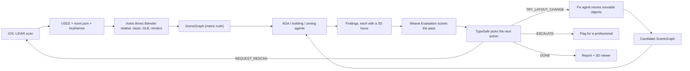

# Standard Physics

Scan a space with an iPhone. Get back a measured 3D model, a list of code violations pinned to the exact spot in the model where each one lives, and a proposed rearrangement that fixes them.

Built for CoreWeave Hacks: Agent Loops. Four people, four computers, submission due Sunday 1:00 PM.

---

## 1. The product

A shop owner walks their space with our iOS app for four minutes. The phone's LiDAR builds a dimensioned model of the room as they walk. That model goes to our server, where a team of agents pulls it apart: one labels what the objects actually are, one measures every route a wheelchair would take, one checks those measurements against the ADA standards, one checks exit paths against building code, one proposes moving three tables 40 cm and re-runs the whole check to prove the fix works.

The owner opens the website and sees their shop in 3D. A list of findings sits beside it. Clicking "Path to counter is 31 in, needs 36 in" flies the camera to that gap, dims the rest of the room, highlights the two objects forming the pinch, and draws the measured dimension line between them. Clicking "Apply proposed fix" plays the furniture moving and the finding turning green.

### Why LiDAR is the whole game

Apple's RoomPlan API doesn't return a point cloud or a mesh you have to interpret. It returns a **parametric, metric room**: walls, doors, windows, and openings as `Surface` objects, furniture as `Object` objects, each with a real-world `dimensions` vector in meters, a 4×4 `transform` placing it in the room, a semantic `category`, a stable `UUID`, and a `confidence` rating. `CapturedRoom` is `Codable`, so it serializes straight to JSON.

This means **measurement is solved before any AI touches it.** The hard problem in every other version of this idea — is that doorway really 32 inches, or does our reconstruction just think so — collapses into a bounded sensor error we can check against a tape measure, rather than an open question about what a model inferred. The agents spend their time on judgment (which rule applies, what should move, is this object really a service counter) instead of on guessing at geometry.

### The demo

1. Someone scans a corner of the venue live on stage, or we play back a 40-second capture of the boba shop.
2. The model appears on the website within ~30 seconds of the scan ending.
3. Findings populate. Click one, camera flies to it, dimension line draws.
4. TypeSafe routes the loop to a layout trial. The fix agent proposes a move.
5. Weave evaluation runs on the candidate. Before/after replay. The finding clears.
6. Feed the router a malformed action on purpose. It fails closed and authorizes nothing.
7. Move the real chairs to match the proposal, rescan, and watch the finding clear against new sensor evidence instead of against a prediction.
8. Export the report.

---

## 2. The loop



Each trip around the loop is one Weave evaluation run with retrievable per-check results. The loop stops on: all targeted findings cleared, three failed proposals, no improvement between passes, or a service error.

**Invariants the loop cannot break.** An agent may never edit a `SceneGraph` dimension — only the ingest pipeline writes geometry. An agent may never move an object whose `movable` flag is false (walls, doors, plumbing, the counter). An agent may never change a rule threshold or drop a check to improve its score. Violating any of these rejects the candidate before it reaches evaluation.

---

## 3. Architecture

| Layer | Stack | Owner |
|---|---|---|
| Capture | SwiftUI + RoomPlan + ARKit, iOS 17+ | A |
| Ingest & 3D | Python, Blender 4.x headless (`bpy`), Astra agent | B |
| Agents & rules | Python, Pydantic, TypeSafe, Weave | C |
| Inference | CoreWeave Inference (OpenAI-compatible), Astra for vision | C |
| API & persistence | FastAPI, SQLite, local artifact store | D |
| Web | Next.js + TypeScript + Tailwind + React Three Fiber | D |

Repository layout, frozen in the first hour:

```
apps/ios/            Swift package + Xcode project
apps/web/            Next.js app
services/api/        FastAPI app, SQLite, artifact store
packages/pipeline/   Blender scripts, Astra driver, GLB export
packages/agents/     rule packs, checks, router, evaluations
packages/contracts/  Pydantic models + generated TypeScript types
docs/
src/loopforge/       existing example, left alone
```

`packages/contracts` is the single source of truth. Pydantic models generate JSON Schema, and `datamodel-code-generator` in reverse (`json-schema-to-typescript`) produces `apps/web/src/types/contracts.ts`. Nobody hand-writes a TypeScript interface that mirrors a Python model.

---

## 4. Contracts

Six types. Person D freezes these in hour one and owns every change.

**`Scan`** — one capture session. Holds the raw USDZ, the `CapturedRoom` JSON, selected keyframes with their ARKit camera poses, device model, capture duration, and a content hash.

**`SceneGraph`** — the metric truth, derived from `CapturedRoom`, never from a mesh.

```python
class SceneNode(BaseModel):
    id: UUID                        # RoomPlan's identifier, preserved
    kind: Literal["wall", "door", "window", "opening", "floor", "object"]
    label: str                      # "service counter", refined from RoomPlan's category
    raw_category: str               # what RoomPlan actually said, e.g. "storage"
    dimensions: Vec3                # meters, x/y/z extent
    transform: Mat4                 # meters, +Z up, right-handed
    confidence: Literal["low", "medium", "high"]
    movable: bool
    relabeled_by: Literal["roomplan", "astra", "human"] | None
```

Units are meters. RoomPlan and three.js are both Y-up, so the `SceneGraph` stays Y-up and nothing converts on the path the demo depends on. Blender is the only Z-up consumer, so `packages/pipeline/coords.py` converts at the Blender boundary alone, with a test. Converting on ingest instead means converting back for the renderer, which is two chances to ship a transposed room.

**`RulePack`** — versioned checks with authority, edition, section number, the exact threshold, and which node kinds it applies to.

**`Finding`** — a check result with its `Locus` (below), the measured value, the required value, the nodes involved, and the citation.

**`Proposal`** — a list of `{node_id, delta_translation, delta_rotation}` for movable nodes only, plus the base graph hash and the findings it targets.

**`Assessment`** — input hashes, findings, router decision, Weave run reference, and pass number.

---

## 5. The iOS app

Person A owns this entirely. It is the critical path: nothing downstream exists until a scan lands on the server.

**Screens.** Start → live capture with RoomPlan's coaching overlay → review the captured room in 3D on-device → name it and upload → history list with upload status.

**Capture.** `RoomCaptureView` gives the guided scanning UI and the coaching hints for free. `RoomCaptureSessionDelegate.captureSession(_:didEndWith:error:)` yields the `CapturedRoom`. Run a parallel `ARSession` frame tap that saves a keyframe every ~1.5 seconds as JPEG alongside its `camera.transform` and `camera.intrinsics` — those frames are what lets the relabeling agent tell a service counter from a storage cabinet.

**Export.** Three artifacts per scan:

| Artifact | How | Why |
|---|---|---|
| `room.usdz` | `capturedRoom.export(to:metadataURL:exportOptions: .parametric)` | Blender imports this directly |
| `room.json` | `JSONEncoder().encode(capturedRoom)` | Metric truth, parsed server-side |
| `frames/*.jpg` + `poses.json` | ARKit frame tap | Visual evidence for relabeling and for the report |

The iOS 17+ `metadataURL` parameter writes a mapping from USDZ node names to `CapturedRoom` element UUIDs. **Capture it.** Without it there is no reliable way to connect a mesh node in Blender back to the object the checks are reasoning about, and the 3D callout feature depends on exactly that link.

**Upload.** One multipart POST to `/api/scans`, with resumable retry and a visible progress bar. Assume conference wifi is bad: chunk it, retry, and never lose a scan because the upload failed.

**Provisioning.** Free Apple ID provisioning gives a 7-day development build on a registered device, which covers the hackathon. No paid developer account needed. Do the device registration and a hello-world build **in the first 45 minutes** — provisioning is where iOS projects die, and finding out at hour 10 is fatal.

### A gotcha worth planning around

RoomPlan's object categories are residential: `storage`, `refrigerator`, `stove`, `bed`, `sink`, `washerDryer`, `toilet`, `bathtub`, `oven`, `dishwasher`, `table`, `sofa`, `chair`, `fireplace`, `television`, `stairs`. There is no "service counter," no "queue barrier," no "display case." A boba shop's ordering counter will come back as `storage` or `table` with medium confidence.

This is not a defect to work around — it is the job the AI layer does. RoomPlan gives us correct geometry with approximate semantics; Astra gives us correct semantics. Say that in the pitch.

---

## 6. The 3D pipeline: Astra and Blender

Person B owns this. First command of the hackathon, because Blender is not currently installed:

```bash
brew install --cask blender
blender --version   # expect 4.x
```

**Import.** Blender's USD importer handles `.usdz` natively (File → Import → USD, or `bpy.ops.wm.usd_import` headless). Run it with `blender --background --python packages/pipeline/import_scan.py -- --scan <id>`.

**What Blender is for, and what it isn't.** Measurements come from `room.json`, not from the mesh. Blender is three things: the workbench where agents run spatial queries (`bpy` raycasts, `mathutils` intersection tests, swept-volume checks for route clearance), the renderer that produces the issue callout images, and the exporter that produces the GLB the website loads.

**What Astra does.** Astra is the agent runtime driving Blender through generated Python. Three concrete jobs, in order:

1. **Relabel.** Given each node's `raw_category`, its dimensions, its position relative to walls and doors, and the two or three keyframes whose camera frustum contains it, decide what the object actually is and whether it is movable. A 3.2 m × 0.7 m × 1.1 m box against the back wall, visible in a frame showing a cash register, is a service counter and is not movable. A 0.6 m × 0.6 m × 0.75 m box in open floor is a café table and is movable.
2. **Repair geometry.** RoomPlan merges adjacent objects and misses thin ones. Astra splits obviously-merged nodes, drops nodes with low confidence and implausible dimensions, and flags gaps where a wall should close but doesn't.
3. **Compose views.** For each finding, position a camera that frames the problem legibly and render a PNG at 1200×800.

Every Astra action is a structured patch against the `SceneGraph` — a relabel, a split, a drop, a camera pose. Astra never emits free-form geometry, and every patch is validated against the contract before it applies. All of it is traced in Weave.

**If Astra access doesn't materialize,** the same three jobs run as direct Blender Python from any available model. The pipeline shape does not change; drop the Astra claim from the pitch and move on. Decide this by 2:00 PM Saturday.

**Exports per pass.** `scene.glb` (Draco-compressed, under 8 MB), `scene_graph.json`, and one `finding_<id>.png` per finding.

---

## 7. Rules, checks, and the router

Person C owns this.

### The rule pack

Start with seven checks. Seven that are correct and cited beats twenty that are approximately right, and a judge will ask where a number came from.

| Check | Threshold | Source |
|---|---|---|
| Accessible route clear width | 915 mm (36 in) min; may narrow to 815 mm (32 in) for ≤ 610 mm (24 in) | ADA 2010 §403.5.1 |
| Clear width at 180° turn | 1065 mm approaching, 1220 mm at turn, 1065 mm leaving; exempt if ≥ 1525 mm at turn | ADA 2010 §403.5.2 |
| Passing space | 1525 × 1525 mm, or T-shaped per the section | ADA 2010 §403.5.3 |
| Turning space | 1525 mm circle, or T-shaped | ADA 2010 §304.3 |
| Door clear width | 815 mm (32 in) min at 90° open | ADA 2010 §404.2.3 |
| Sales/service counter | 915 mm (36 in) max height, 915 mm min accessible length | ADA 2010 §904.4 |
| Egress path obstruction | Path from each occupied area to an exit, unobstructed | CBC Chapter 10, flagged for review |

Every threshold gets verified against the primary source text by a human before it ships. Person C writes the citation into the `RulePack` and a second person checks it. Zoning stays out of the automated checks — it needs parcel records we won't have — and appears only as a "needs professional review" item.

These checks cite federal ADA 2010. A Palo Alto business is also subject to California Building Code Chapter 11B, which is stricter than federal ADA on several of these same dimensions, and Palo Alto enforces the 2025 California codes as of January 2026. Implementing 11B is out of scope for the weekend. Naming the standard is not. The report states that it screened against ADA 2010 and that CBC 11B may impose tighter limits, and the `RulePack` carries authority and edition so a second pack drops in later without touching the checks.

### The route measurement

The one genuinely hard piece of geometry. Given the `SceneGraph`, compute the widest path from the entrance to the service counter, and from the counter to the exit.

Rasterize the floor plan to a 25 mm occupancy grid using the XY footprints of every node that touches the floor. Compute the distance transform (distance from each free cell to the nearest obstacle). The widest path between two points is found by binary-searching the clearance threshold: pick a radius, keep only cells whose distance exceeds it, test connectivity with a flood fill, and bisect. The answer is the path's bottleneck width, and the bisection's failing cell is the pinch point — which is exactly the coordinate the 3D callout needs.

This is 60 lines of NumPy and SciPy, it is deterministic, it runs in well under a second on a shop-sized room, and it is far more robust than a search over poses and headings. Do not build a full orientation-aware planner; a 180° turning check against the turn-radius rule covers the case that matters.

The bottleneck width on its own cannot evaluate §403.5.1, because that section permits an 815 mm pinch when it runs no longer than 610 mm. Return the constricted run as well: walk the chosen path, record clearance at each step, and report every segment below 915 mm as a `{start, end, min_width, length}` span. A short pinch passes and cites its length; a long one fails. Reporting only the minimum turns every narrow doorway approach into a false finding, which is the fastest way to lose a judge's trust.

### TypeSafe as the router

TypeSafe picks the next action from a closed set, and its structured output drives real control flow:

| Action | Effect |
|---|---|
| `TRY_LAYOUT_CHANGE` | Run the fix agent against the named findings |
| `REQUEST_RESCAN` | Mark a region low-confidence, push a notification to the app |
| `ESCALATE_TO_PROFESSIONAL` | Queue the finding for human review |
| `ACCEPT_AND_REPORT` | Stop; render the report |

Get the event credentials and the real quickstart early. Test malformed, contradictory, and truncated outputs — an invalid action must fail closed and never authorize a change. If TypeSafe is unavailable by 3:00 PM Saturday, run a labeled local policy and drop the claim.

`REQUEST_RESCAN` deserves more than a row in that table, because it is the only action that leaves the computer. The router marks a region low-confidence, the app receives a notification naming the area to re-walk, the owner rescans, and the new capture re-enters the loop as fresh evidence against the same findings. Build this end to end. A loop that closes through the physical world — measure, propose, move the furniture, rescan, confirm the finding cleared — is a different claim from a loop that closes inside a process, and it is the part of this build nobody else will have.

### CoreWeave

Weave and ARIA are CoreWeave products — CoreWeave acquired Weights & Biases in 2025 — so the observability work already runs on the host's own platform. Say that plainly in the pitch instead of presenting them as unrelated sponsors.

The compute belongs there too. CoreWeave Inference serves a curated open-source catalog behind an OpenAI-compatible endpoint, so adopting it costs a `base_url` and a model name rather than an architecture change. Two jobs move onto it:

- **The fix agent.** Proposing furniture deltas is structured reasoning over a `SceneGraph` with no vision requirement, and the loop calls it repeatedly, up to three proposals per targeted finding. It is the heaviest and most repetitive model workload in the system.
- **A second relabeler.** Run the same relabeling prompt against a CoreWeave-hosted vision model alongside Astra.

The second job is the one that matters, because it turns a sponsor checkbox into evidence. `relabel_accuracy` already exists as a scorer, so run the evaluation across both providers and report the numbers. That gives the Weave submission a real comparison rather than a screenshot of a trace tree, gives ARIA genuine experiments to analyze, and puts a measurement behind the CoreWeave claim. One dataset, three tracks.

Keep Astra for vision relabeling if it wins on the numbers. The point is to measure rather than to pick a favorite in advance.

### Weave

Two things, and the second is what wins the track.

**Tracing:** `weave.init()` at API startup, `@weave.op` on every agent call, every Blender invocation, and every check. The full loop should be readable as one trace tree.

**Evaluation:** build a dataset of ~25 labeled cases — hand-annotated scans and synthetic `SceneGraph` fixtures — spanning clear passes, real violations, ambiguous objects, low-confidence geometry, and cases where the right answer is "escalate, don't guess." Scorers: `finding_precision`, `finding_recall`, `measurement_error_mm`, `relabel_accuracy`, `router_action_match`, `fix_resolves_finding`. A `weave.Evaluation` runs on every loop pass, and a candidate layout is only accepted if its evaluation completes and strictly improves without new failures. Evaluation gating the loop is the difference between using Weave and using Weave well.

---

## 8. Findings pinned to the model

This is the feature the demo lives on, so it gets its own contract.

```python
class Locus(BaseModel):
    point: Vec3                      # the exact problem coordinate, e.g. the pinch
    bbox: tuple[Vec3, Vec3]          # region to frame
    node_ids: list[UUID]             # objects responsible
    annotation: Annotation           # what to draw
    camera: CameraPose               # position, target, fov for the flythrough
    render_url: str | None           # Blender's still, for the printed report
```

`Annotation` is one of three shapes, and each one draws differently:

| Kind | Drawn as | Used by |
|---|---|---|
| `dimension_line` | Arrowed line between two points with the measured value in a label | Width, clearance, height checks |
| `region` | Translucent filled polygon on the floor, red where it fails | Turning space, passing space |
| `path` | Polyline along the floor, colored by local clearance | Route checks, before/after replay |

In the viewer, selecting a finding does five things at once: the camera tweens to `camera` over 700 ms with an ease-out curve, every node not in `node_ids` drops to 15% opacity, the responsible nodes get an outline, the annotation draws with its measurement label facing the camera, and the finding's card in the list expands to show the citation.

**Do not let this depend on GLB node names.** RoomPlan's `metadataURL` does genuinely map USDZ node names to `CapturedRoom` UUIDs, but that mapping holds at the USDZ boundary, and the pipeline round-trips through Blender's USD importer and its GLB exporter, either of which may rename or restructure nodes. So the viewer draws highlights, outlines, and annotations as its own meshes, positioned from `SceneGraph` transforms, and treats the GLB as a backdrop. The callout then works even if every name in the GLB comes out mangled. Verify whether the mapping survives the round trip by 4:00 PM Saturday and treat a surviving mapping as an upgrade, never as a prerequisite.

The measurement label is the part people underestimate. `31 in / 790 mm` rendered legibly in 3D space, next to the actual gap it measures, is the single image that sells this product. Build it properly: an HTML overlay positioned by projecting the 3D midpoint to screen space beats a 3D text mesh for legibility and costs less.

The before/after replay reuses the same machinery. Proposal deltas tween each moved node to its new transform over 1.2 s while the affected `path` annotation recolors from red to green.

---

## 9. The website

Person D owns this alongside the API. Four screens.

**Scans.** A grid of scanned spaces, each with a render, name, date, and a findings count badge. Empty state points at the iOS app with a QR code.

**Scan detail.** The main screen. R3F canvas fills the space with the findings list docked to the right. Orbit, pan, zoom, plus a top-down plan toggle. The findings list groups by severity, and each card shows the measured value against the required value as the headline, with the citation underneath.

**Proposal.** Before/after with a scrub control, the list of what moved, and the evaluation delta.

**Report.** Print-ready, one finding per block with its Blender render, the measurement, the citation, and the proposed fix. This is the artifact an owner hands to a contractor.

Design follows the repo `CLAUDE.md`. Neutral surfaces, one calm accent, failures in a red reserved for exactly that. The 3D viewer is the subject on the detail screen and everything else defers to it.

---

## 10. Prize strategy

Seven tracks are open and we are positioned for all of them.

| Prize | Our claim | Cost to secure |
|---|---|---|
| **Best Loop Design** | Scan → model → check → fix → re-check, with evaluation gating each pass | Core build |
| **Best Use of Weave** | Tracing plus evaluations that gate the loop, on a labeled dataset, comparing two inference providers | Person C, ~4 h |
| **Best Use of TypeSafe** | Structured router actions driving real control flow, tested against bad output | Person C, ~3 h |
| **Most Production-Ready** | Typed contracts end to end, CI, clean-clone startup, real mobile client | Falls out of the build |
| **Best Use of ARIA** | Point ARIA at the evaluation experiments; ship one improvement it found | ~1 h, Sunday morning |
| **Best Use of marimo** | Reactive notebook: drag a threshold, watch findings change across scans | ~1 h, Sunday morning |
| **Best Social Media demo** | Film the scan-to-fix loop in one continuous take | ~1 h, Sunday morning |

Weave and ARIA are CoreWeave products, and the fix agent runs on CoreWeave Inference, so three of these claims sit on the host's own stack. Confirm whether the event scores CoreWeave usage as its own track — this table was built from the published list and does not include one.

ARIA and marimo are each an hour of work for $1,000 and almost nobody bothers. Do them Sunday morning once the core is frozen, not before.

**Astra is not a prize track.** It stays because it is genuinely the right tool for the relabeling job, not because a judge is scoring it.

---

## 11. Who owns what

Roughly three agents per person: two writing in separate file trees, one researching or reviewing. Every agent assignment names its owner, its deliverable, the contract version it builds against, its acceptance test, and when to stop.

### Person A — iOS

Owns `apps/ios/` entirely. Nobody else touches Swift.

Provisioning and a device build in the first 45 minutes. Then RoomPlan capture, `CapturedRoom` export with the metadata mapping, the ARKit keyframe tap, resumable multipart upload, on-device review, and the scan history list. Manual work: scan the actual boba shop early, scan three other spaces for eval data, and make sure the capture flow is legible enough that a judge can hold the phone and use it.

Hard checkpoint: a real scan on the server by 4:00 PM Saturday. If provisioning is still broken at 2:00 PM, switch to shipping scans out of Apple's RoomPlan sample app and rebuild the custom client overnight.

### Person B — 3D pipeline

Owns `packages/pipeline/`. Blender install, USDZ import, coordinate conversion with a test, `SceneGraph` derivation from `room.json`, the Astra relabeling driver, the occupancy grid and widest-path measurement, GLB export, and per-finding renders.

Manual work: verify against a tape measure that a known dimension in the scan matches the `SceneGraph` value. Do this once, early, on a doorway. It takes five minutes and it is the thing that makes every number downstream trustworthy.

### Person C — agents, rules, evaluation

Owns `packages/agents/`. Rule pack with verified citations, the seven checks against B's measurement functions, the TypeSafe router adapter, the fix agent under its movability constraints, Weave tracing, and the evaluation dataset with its scorers.

Manual work: get TypeSafe credentials in the first hour, verify every threshold against primary source text, and build the labeled dataset by hand. The dataset is unglamorous and it is what the Weave prize is actually judged on.

This is the heaviest lane on the team: seven cited checks, the router, the fix agent, tracing, and a 25-case dataset with six scorers. Hand the dataset to whoever frees up first, which is Person A once scans are landing, or the fifth person if one exists. It is the only deliverable here that someone else can pick up without touching C's code.

### Person D — backend, web, integration

Owns `packages/contracts/`, `services/api/`, `apps/web/`, and CI. Freeze contracts in hour one. Then the API, SQLite persistence, artifact storage, run polling, the four web screens, the R3F viewer with the callout system, and the report.

CI earns the production-ready claim only if it checks something real: run the geometry tests, typecheck the web app, and regenerate the TypeScript contracts so the build fails when committed types drift from the Pydantic models. A generated-type drift check is the cheapest possible proof that the contracts are genuinely the source of truth. Seed one fixture scan into the repo so a clean clone reaches findings without needing a phone.

Manual work: merge at every checkpoint, keep the demo machine stable, submit a working version by noon Sunday and improve it afterward rather than submitting at 12:58.

If a fifth person exists, they produce: sponsor liaison, the social media cut, the pitch, and the rehearsals.

---

## 12. Schedule

The venue closes 9:00 PM Saturday and reopens 9:00 AM Sunday. That is roughly 10 hours on site Saturday, an overnight gap, and 4 hours Sunday before the 1:00 PM submission. Plan against wall-clock, not against a fictional continuous 24 hours.

| When | Outcome |
|---|---|
| Sat 11:15–12:00 | Contracts frozen. Blender installed. iOS provisioning done, hello-world on device. TypeSafe credentials requested. W&B project created. |
| Sat 12:00–14:00 | RoomPlan capture working on device. USDZ imports into Blender headless. Contracts generating TypeScript. Rule pack drafted with citations. |
| Sat 14:00–16:00 | **First real scan on the server.** `SceneGraph` derived and tape-measure verified. Web viewer loading a GLB. Astra or fallback decision made. |
| Sat 16:00–18:00 | Route measurement returns a bottleneck width and a pinch point. Two checks producing findings. Findings rendering in the viewer with a locus. |
| Sat 18:00–21:00 | Full loop end to end: scan → findings → router → fix → re-check. Weave traces readable. Ugly but complete. |
| Overnight | Optional and remote. Polish the viewer, build the eval dataset, write the report screen. Nobody debugs provisioning at 3 AM. |
| Sun 09:00–11:00 | Evaluation dataset scored. ARIA and marimo integrations. Report screen. Bug fixes only after this point. |
| Sun 11:00–12:00 | **Feature freeze.** Clean-clone startup test. Three timed rehearsals. Social media cut filmed. |
| Sun 12:00–12:30 | Submit a working version. |
| Sun 12:30–13:00 | Buffer. Verified fixes only. |

Integrate at 14:00, 16:00, 18:00, 21:00, and every hour Sunday. Each lane keeps a `PROGRESS.json` with status, commits, blockers, and next handoff.

---

## 13. Risks

| Risk | When we know | What we do |
|---|---|---|
| iOS provisioning fails | Sat 12:00 | Ship scans from Apple's RoomPlan sample app; custom client becomes a nice-to-have. The sample app yields no ARKit keyframes, so relabeling loses its visual evidence — shoot stills of the same space by hand and register them approximately |
| Blender USDZ import misbehaves | Sat 13:00 | Skip Blender for measurement entirely — `room.json` already has the geometry. Use three.js server-side for GLB and drop Blender renders |
| Astra access unavailable | Sat 14:00 | Same jobs, any available model writing Blender Python; drop the Astra claim |
| TypeSafe unavailable | Sat 15:00 | Labeled local policy, drop the track |
| RoomPlan mislabels everything | Sat 16:00 | This is expected; it is what the relabeling agent is for. Only a problem if relabeling also fails, in which case label by hand for the demo scan and say so |
| Route measurement wrong | Sat 18:00 | Fall back to straight-line clearance between fixed obstacles; drop the turning check |
| Scan-to-findings slower than 60 s | Sat 18:00 | Measure the pass end to end the first time it runs. Relabeling is the likely cost: send every object in one Astra call rather than one call per object, and cache renders between passes |
| Conference wifi | Continuously | Everything runs locally on the demo machine. No cloud dependency in the demo path except the sponsor APIs, and those get cached responses as a backstop |

Two rules that override everything: **a working demo at noon beats a better demo at 12:58**, and **nothing in the pitch claims an accuracy we haven't measured.**

Apple publishes no accuracy figure for RoomPlan, so there is no tolerance to cite and none may be invented. What we can say is what we measured: "we tape-measured a doorway against the `SceneGraph` and it matched within ___ cm." Person B's calibration fills that blank before the pitch. If the calibration never happens, the accuracy claim gets dropped rather than replaced with a plausible-sounding number, because a judge who catches an invented figure discounts everything else we said.

---

## 14. Definition of done

| Area | Passes when |
|---|---|
| Capture | A scan of an unfamiliar room uploads and appears on the website in under 60 seconds |
| Geometry | A tape-measured doorway matches the `SceneGraph` within 3 cm; the coordinate conversion has a test |
| Checks | Every threshold traces to a cited section; a synthetic room with a known 31 in pinch produces exactly that finding |
| Localization | Every finding has a valid locus; clicking it frames the right object from a legible angle |
| Router | Real TypeSafe output changes behavior; malformed output authorizes nothing |
| Fix | Immovable nodes never move; a regression is rejected; the accepted fix clears the targeted finding on re-check |
| Inference | The fix agent runs against CoreWeave Inference; the provider is configurable and every call is traced |
| Rescan | A rescan taken after the furniture actually moves clears the targeted finding on new sensor evidence |
| Weave | The evaluation completes with retrievable per-case results and gates acceptance |
| Web | Full flow works with a keyboard; the report prints; the viewer holds 60 fps on the demo machine |
| Release | Clean clone starts with one command; three rehearsals under three minutes |
