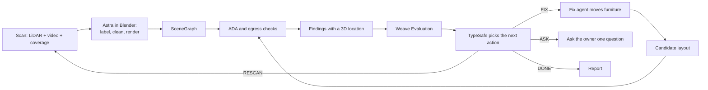

# Standard Physics

Every mom and pop store needs to be compliant with local building codes, zoning regulations, and ADA requirements. But for these local small business owners, juggling red tape compliance and designing the shop of their dreams is time consuming and often, prohibitively expensive. Legal regulations are incredibly hard to read and understand, and external consulting services can charge thousands of dollars to help.

Standard Physics makes compliance as easy as a walk around the store. Owners scan their shop with an iPhone, and our agents measure every aisle, doorway, and counter against ADA requirements and building codes. Each issue shows up on a 3D model of the shop, explained in plain English with the exact measurement and the rule it breaks. And when the fix is as simple as moving a table, the app finds a new layout that works with the furniture they already have.

Owners spend less on consultants and more time building the shop of their dreams. And every shop that gets fixed opens its doors to more customers with disabilities.

Built for CoreWeave Hacks: Agent Loops. Four people, submission due Sunday 1:00 PM.

---

## 1. The product

**Capture.** The owner opens the app and presses Record. They walk the shop for two to four minutes. LiDAR builds the measured room while the camera records video, both from the same pass. A small map at the bottom of the screen fills in as they go, and the app gives one instruction at a time: *"Point the phone at the back wall."* When the room is done, it says so clearly and the Record button becomes Done.

**Understand.** The scan uploads. Astra reads the geometry alongside the video frames and works out what each object actually is — that 3.2 m box against the wall with a register on it is the ordering counter, not a cabinet — and which pieces can be moved.

**Check.** Agents measure every path a customer takes: in the door, to the counter, to pickup, to a seat, back out. Each path gets checked against the ADA standards. Exit paths get checked against building code.

**See.** The owner opens their shop in 3D. Beside it sits a list in their language:

> **The path to the counter is too narrow**
> It's 31 inches at the tightest point. Wheelchairs need 36 inches.

Tapping it flies the camera to that exact gap, fades the rest of the shop back, highlights the two tables causing the pinch, and draws the measurement across it.

**Fix.** The owner drags a table and watches the finding go green in under a second. Or they ask for it in words — *"Move the seating to the back"* — and the fix agent finds an arrangement that keeps every piece of their furniture and passes every check. They see the before and after, then press Apply.

### Why LiDAR is required

Every alternative starts with a guess. Photos give you a shape with no size, and you spend the whole build asking the owner to measure things by hand. LiDAR gives measurements up front, so the agents spend their effort on judgment — which rule applies, what should move, what is this object — instead of on guessing at geometry.

RoomPlan returns a parametric, metric room: walls, doors, windows and openings as `Surface`, furniture as `Object`, each with real dimensions in meters, a transform, a category, a stable `UUID` and a confidence rating. `CapturedRoom` is `Codable`, so it serializes straight to JSON.

Photos and existing floor plans can be attached to a scan as extra evidence for relabeling and for the report. They never substitute for the scan, and they never overwrite a measured dimension.

**Required device:** iPhone 12 Pro or newer, or iPad Pro 2020 or newer. The app checks on launch and says so in one friendly line if the device can't scan.

---

## 2. How we write

Our user runs a small business, like a boba shop. They are not technical, and they have never had to read the ADA standards or a building code. Every word in the product follows these rules, and they are not suggestions — a confusing sentence in the capture flow costs us the demo.

**Short sentences. Ordinary words.** One idea per sentence. If a sentence needs a comma to hold two thoughts, make it two sentences.

**Say what to do, not what is happening inside.**

| Don't write | Write |
|---|---|
| Insufficient point density detected in region 3 | Point the phone at the back wall |
| Clearance violation at node 7f3a | The path to the counter is too narrow |
| Scan confidence: 0.62 | This corner needs another look |
| Processing pipeline stage 2 of 5 | Measuring your shop |
| No valid proposal found in bounded search | We couldn't find an arrangement that works. Try unlocking a table. |

**Numbers in inches.** Our user thinks in inches, and the ADA standards are written in inches. Show inches. Keep meters internally and convert once, at the display boundary.

**Only describe what is.** Write what we measured, what we found, and what to do next. Never write a sentence whose job is to deny, disclaim, or point at an absence — not under a finding, not on a button, not in a footer, not in the report.

This covers reassurance nobody asked for. "Everything stays on your device, so no outside vendor touches your data" invents a worry and then answers it; the reader wasn't wondering until we brought it up. If a sentence would only land with someone already suspicious, cut it.

It also covers softer forms: "we couldn't check the restroom", "this is not a legal certification", "results are estimates only". Each one describes a hole.

Scope lives in one place, and it is a list of what we did: **What we checked** at the end of the report names the paths measured, the rules checked, and who reviewed it. Next steps are written as actions that get something — "Send a photo of the front door handle and we'll check it" — phrased as the thing to do, never as the thing we lack.

**Name the thing, then give the number.** A finding's title says what's wrong in human terms. The line under it gives the measurement and what's needed. The fix says what to do.

**No jargon in the interface.** The words "node", "scene graph", "confidence", "evidence", "assessment", "revision" and "locus" appear in our code and never on a screen.

---

## 3. The scan

Person A owns `apps/ios/`. This is the critical path.

### One pass, two recordings

RoomPlan owns the `ARSession`, so we read from it rather than fighting it. Never start a competing camera session and never replace a framework-owned delegate.

Use `RoomCaptureView` for the guided interface. Its delegate gives raw data through `captureView(shouldPresent:error:)` and the processed room through `captureView(didPresent:error:)`. Live updates for the coverage map come from `captureSession(_:didUpdate:)`.

A `CADisplayLink` tap reads `captureSession.arSession.currentFrame` and produces both recordings from the same frames:

| Output | Rate | How |
|---|---|---|
| `walkthrough.mp4` | 15 fps, 1280x960 | `AVAssetWriter` with a pixel buffer adaptor, encoded on a background queue |
| `frames/*.jpg` + `poses.json` | 2 Hz, full resolution | Image plus `camera.transform`, `camera.intrinsics`, orientation and timestamp |

Skip frames whose tracking state is limited. Cap a session at four minutes. Watch thermals — sustained LiDAR plus H.264 encode heats a phone, so drop to 10 fps if `ProcessInfo.thermalState` reaches `.serious` rather than letting the session die.

### Coverage guidance

This is the feature that makes the scan work for someone who has never scanned anything. Two signals combine.

**What RoomPlan thinks.** Every live surface and object carries a `low`/`medium`/`high` confidence. Anything below high is a candidate for more attention.

**What we actually saw.** Keep a per-surface observation log. For each sampled camera pose, a wall area counts as observed when it falls inside the frustum, sits within 5 m, and is viewed at less than 60 degrees off the surface normal. Track the observed fraction per wall and per object, and require two viewpoints at least 1 m apart so a single glance from the doorway doesn't count as coverage.

A surface is **done** at 70% observed area, two separated viewpoints, and high confidence.

**What the owner sees.** A floor-plan minimap along the bottom edge. Walls fill in solid as they're covered; unfinished stretches stay hollow and pulse gently. An arrow in the AR view points toward the nearest unfinished area. One instruction sits above the minimap at a time:

> Point the phone at the back wall
> Walk closer to the counter
> Turn around slowly

When everything is done: **"You've got the whole shop."** The map goes solid, the arrow disappears, and Done becomes the primary button. Never show a percentage and never show the word confidence.

Nothing blocks finishing early. If the owner presses Done with gaps remaining, accept it, upload it, and handle the gaps as findings that ask for a short follow-up scan of one area.

### Screens

Start, then record with the coverage map, then review the room in 3D on device, then name and upload, then history with status, then results.

The results workspace is Person D's responsive web UI in an authenticated `WKWebView`, not a second native 3D editor. Person A owns session handoff and the native capture callbacks. Allowlist navigation and bridge messages, keep provider keys server-side, and never hand an upload token to arbitrary web content.

### Export

| Artifact | How |
|---|---|
| `room.usdz` + metadata mapping | `capturedRoom.export(to:metadataURL:exportOptions:)` |
| `room.json` | `JSONEncoder().encode(capturedRoom)` |
| `walkthrough.mp4` | AVAssetWriter output |
| `frames/*.jpg` + `poses.json` | Display-link tap |
| `coverage.json` | Per-surface observed fraction and viewpoint count |

The `metadataURL` mapping connects USDZ node names to `CapturedRoom` element UUIDs. Capture it — without it there is no reliable link from a mesh node back to the object a check reasons about, and every tap-to-locate feature depends on that link. If the importer loses it, generate display geometry directly from canonical node IDs instead.

### Upload

Create a session with `POST /api/scans`, upload each artifact with an idempotent `PUT /api/scans/{id}/artifacts/{artifact_id}` carrying its checksum, finalize with `POST /api/scans/{id}/complete`. Persist which artifacts completed so an interrupted upload resumes at artifact granularity. Assume the venue wifi is bad. A failed upload never loses a local capture.

Finalization idempotently queues the whole pipeline: reconstruct, validate, check, evaluate, propose. There is no separate "check my shop" button. The app polls and shows one of: **Uploading, Measuring your shop, Checking, Ready.**

### Provisioning

Free Apple ID signing gives a 7-day development build on a registered device, which covers the weekend. No paid account needed and no push notifications. Get a hello-world build onto the LiDAR phone **in the first 45 minutes** — provisioning is where iOS projects die, and discovering it at hour ten is fatal. Everyone else works against fixtures until a real scan lands.

---

## 4. The loop



Each pass is one Weave evaluation with retrievable per-check results. The loop stops when the targeted findings clear, after three failed proposals, when a pass shows no improvement, or on a service error.

**Invariants.** No agent writes a dimension — only ingest does. No agent moves a node whose `movable` flag is false. No agent changes a threshold or drops a check to improve a score. No agent shrinks an obstacle to make something pass. A candidate violating any of these is rejected before evaluation.

---

## 5. Architecture

| Layer | Stack | Owner |
|---|---|---|
| Capture | SwiftUI, RoomPlan, ARKit, AVFoundation | A |
| 3D pipeline | Python, Blender headless (`bpy`), Astra via OpenRouter | B |
| Agents and rules | Python, Pydantic, TypeSafe, Weave | C |
| API | FastAPI, SQLite, local artifact store | D |
| Web | Next.js, TypeScript, Tailwind, React Three Fiber | D |

```
apps/ios/            Xcode project
apps/web/            Next.js app, also embedded in the iOS shell
services/api/        FastAPI, SQLite, artifacts
packages/pipeline/   Blender scripts, Astra driver, coverage, GLB
packages/agents/     rule packs, checks, router, evaluations
packages/contracts/  Pydantic models, generated TypeScript
```

`packages/contracts` is the only source of truth. Pydantic generates JSON Schema, which generates `apps/web/src/types/contracts.ts`. Nobody hand-writes a TypeScript interface mirroring a Python model.

**Blender.** Version matters. 4.0.2 does **not** import USDZ. 5.2.1 LTS does — verified here by round-tripping a file through export and import. Install current Blender on every machine and pin the version in `packages/pipeline/README.md`.

Don't trust the `filter_glob` string; it reads `*.usd` on both versions. Run the actual round trip:

```bash
/Applications/Blender.app/Contents/MacOS/Blender --background --python-expr "
import bpy
p = '/tmp/t.usdz'
bpy.ops.wm.usd_export(filepath=p)
bpy.ops.wm.read_factory_settings(use_empty=True)
bpy.ops.wm.usd_import(filepath=p)
print('OK' if 'Cube' in bpy.data.objects else 'BROKEN')
"
```

`brew install --cask blender` will not upgrade a Blender that was installed by hand; it reports the cask as not installed and exits clean. Use `--force`.

### Model access

Every model call goes through [OpenRouter](https://openrouter.ai/openai/gpt-6-astra) using the OpenAI SDK: `base_url="https://openrouter.ai/api/v1"`, `OPENROUTER_API_KEY`, model `openai/gpt-6-astra`. That covers Astra's label, clean and frame jobs and the fix agent. The model advertises `tools`, `tool_choice` and `response_format`, which is what the patch interface needs.

Require [zero data retention](https://openrouter.ai/docs/guides/features/zdr) on the account and on each request, because scans of a real shop are private. Pin the provider to OpenAI with [provider routing](https://openrouter.ai/docs/docs/routing/provider-selection) so the demo runs on one backend, and store the provider and model OpenRouter reports on every response. Set a credit limit on the key before the first long Blender run.

Weave picks these up through its [OpenRouter integration](https://docs.wandb.ai/weave/guides/integrations/openrouter), so leave OpenRouter's Broadcast to Weave setting **off** or every call is traced twice and the evaluation numbers drift.

### Credentials

Every key lives in a gitignored `.env` on the API server, listed in `.env.example`. The iOS app, the web client, Git, prompts and Weave traces never see one.

| Variable | Used by |
|---|---|
| `OPENROUTER_API_KEY`, `OPENROUTER_MODEL` | Astra and every other model call |
| `WANDB_API_KEY`, `WANDB_ENTITY`, `WANDB_PROJECT` | Weave tracing and evaluation; ARIA uses the same team project |
| `TYPESAFE_API_KEY` | The router |
| `APP_SESSION_SECRET` | Signing app sessions and upload tokens, generated locally |
| `SHOPIFY_STORE_DOMAIN`, `SHOPIFY_STOREFRONT_PRIVATE_TOKEN` | The stretch catalog, only if it gets built |

A key that shows up in chat, an issue, a log or a commit counts as leaked. Rotate it before using it.

---

## 6. Contracts

Person D freezes these in hour one and owns every change.

**`Scan`** — the capture session: artifacts, device, duration, coverage summary, content hash.

**`SceneGraph`** — measured truth, derived from `room.json`, never from a mesh.

```python
class SceneNode(BaseModel):
    id: UUID                        # RoomPlan's identifier, preserved
    kind: Literal["wall", "door", "window", "opening", "floor", "object"]
    label: str                      # "ordering counter"
    raw_category: str               # what RoomPlan said, e.g. "storage"
    dimensions: Vec3                # meters
    transform: Mat4                 # meters, +Z up, right-handed
    quality: Literal["measured", "needs_another_look", "confirmed"]
    movable: bool
    labeled_by: Literal["roomplan", "astra", "owner"]
```

Units are meters and Z is up. RoomPlan hands back Y-up; `packages/pipeline/coords.py` converts once, on ingest, with a test. Display converts meters to inches once, at the UI boundary.

`quality` replaces the usual sprawling evidence state machine, because LiDAR makes it simple. **measured** is LiDAR at high confidence. **needs_another_look** is low coverage or low confidence, and produces a friendly request to rescan one area. **confirmed** is a number the owner or a professional entered by hand. A check whose inputs are all `measured` or `confirmed` returns a real result; anything resting on `needs_another_look` becomes a request instead of a red finding.

**`RulePack`** — versioned checks with authority, edition, section, threshold in original legal units, and applicability.

**`Finding`** — title, plain-English detail, measured value, required value, node IDs, citation, `Locus`, suggested fix.

**`Proposal`** — `{node_id, delta_translation, delta_rotation}` for movable nodes only, plus base graph hash and targeted findings.

**`Assessment`** — input hashes, findings, router decision, Weave run reference, pass number.

---

## 7. Astra and Blender

Person B owns `packages/pipeline/`.

Import the USDZ headless with `bpy.ops.wm.usd_import`. Measurements come from `room.json`, not from the mesh. Blender is three things: the workbench where agents run spatial queries, the renderer producing per-finding stills, and the GLB exporter for the web viewer.

### What Astra does

**Label.** Given each node's raw category, dimensions, position relative to walls and doors, and the two or three keyframes whose frustum contains it, decide what the object is and whether it can be moved. A 3.2 m by 0.7 m by 1.1 m box against the back wall, visible in a frame showing a register, is the ordering counter and it does not move. A 0.6 m square at 0.75 m tall in open floor is a cafe table and it does.

**Clean.** RoomPlan merges adjacent objects and misses thin ones. Split obviously-merged nodes, flag walls that should close but don't, and mark implausible detections for review.

**Frame.** For each finding, place a camera that shows the problem legibly and render a 1200x800 PNG for the report.

### What Astra may not do

Every Astra action is a structured patch validated against the contract before it applies. Astra never emits free-form geometry.

| Operation | Restriction |
|---|---|
| Relabel | Preserves `raw_category`; relabeling never removes a node from collision occupancy and never unlocks a fixture |
| Split a merged object | Children keep parent lineage and the parent's conservative occupied envelope; reclaiming the space between them needs confirmation |
| Flag a missing wall or obstacle | Becomes a question, never a reported violation |
| Hide a dubious detection | Its occupancy stays until removal is approved; low confidence alone never clears floor space |
| Move furniture | Translate and rotate approved movable nodes only — no resize, no fixture movement, no leaving the floor |

No tolerance, epsilon, or percentage allowance may shrink an obstacle until a check passes. Numerical tolerances in geometry tests are not measurement claims.

Corrections to the model and proposed changes to the shop are separate events in history. A correction creates a fresh baseline and invalidates earlier assessments, even when it reveals more problems. Keep the raw capture and every revision.

**Exports per revision:** `scene.glb` with stable node IDs under 8 MB, `scene_graph.json`, and `finding_<id>.png` per locatable finding. Compression must not break node selection. Reuse unchanged renders instead of blocking every preview on Blender.

**If Astra is unavailable on OpenRouter or credits run out,** route the same three jobs through any authorized model behind the same patch validator, with no broader permissions. Resolve runtime access in the first working hour.

---

## 8. Checks

Person C owns `packages/agents/`.

### Rule pack

Tier 1 ships first. Tier 2 lands once route measurement works. Tier 3 only if the loop is running end to end before Sunday's freeze. Every threshold is verified against primary source text by a human, and a second person checks the citation.

| Check | Threshold | Source |
|---|---|---|
| Route clear width | 36 in min; 32 in permitted for at most 24 in, between segments at least 48 in long and 36 in wide | ADA 2010 403.5.1 |
| Clear width at a 180 degree turn | Around an element under 48 in wide: 42 in approaching, 48 in at the turn, 42 in leaving; not required at 60 in or more | ADA 2010 403.5.2 |
| Passing space | On routes under 60 in wide: 60 by 60 in, or the specified T intersection | ADA 2010 403.5.3 |
| Turning space | Where required: 60 in circle or the specified T shape | ADA 2010 304.3 |
| Door clear width | 32 in min between face and stop at 90 degrees | ADA 2010 404.2.3 |
| Service counter | Parallel approach: 36 in accessible length, 36 in max height, adjacent clear floor space | ADA 2010 904.4.1 |
| Exit path | Path from each occupied area to an exit, unobstructed | CBC Chapter 10, sent to review |
| Door maneuvering clearance *(t2)* | Pull and push side clear floor space including latch side, by approach and door type | ADA 2010 404.2.4 |
| Protruding objects *(t2)* | Wall-mounted leading edges 27 to 80 in high project 4 in max; post-mounted 12 in max | ADA 2010 307 |
| Reach range *(t3)* | Forward and side reach limits with obstruction conditions | ADA 2010 308 |
| Dining surfaces *(t3)* | Accessible seating share, surface height, knee and toe clearance | ADA 2010 226.1, 902 |

Keep original legal units and convert once. A rounded display label never changes an acceptance threshold. Protruding objects need care: LiDAR misses thin wall-mounted items, so 307 passes only where coverage shows the wall was seen in that height band.

A few things a scan can't see. Each becomes a short question with a photo request rather than a finding: threshold height at the entrance (303), door hardware (404.2.7), door opening force (404.2.9), floor surface and mats (302), and the restroom (603, 604) when customers use it.

Zoning is a document review, not a measurement. It appears in the report as questions for a professional.

Sources: [U.S. Access Board ADA Standards](https://www.access-board.gov/ada/), [Palo Alto Building Division](https://www.paloalto.gov/Departments/Planning-Development-Services/Development-Services/Building-Division), [Municipal Code](https://codelibrary.amlegal.com/codes/paloalto/latest/overview).

### Route measurement

The one genuinely hard piece of geometry, and it stays deterministic.

Rasterize the floor to a 25 mm occupancy grid from the XY footprints of every node touching the floor. Compute the distance transform. To find the widest path between two stops, binary-search the clearance radius: keep only cells whose distance exceeds it, flood-fill for connectivity, bisect. The result is the path's bottleneck width, and the failing cell is the pinch point — exactly the coordinate the 3D callout needs.

Roughly 60 lines of NumPy and SciPy, deterministic, well under a second on a shop-sized room. Do not build a pose-and-heading search planner; the 180 degree turn rule covers the case that matters.

Legs: entrance to counter, counter to pickup, pickup to an accessible seat, seat to exit.

### TypeSafe as the router

TypeSafe picks the next action from a closed set and its structured output drives real control flow.

| Action | Effect |
|---|---|
| `FIX` | Run the fix agent against named findings |
| `RESCAN_AREA` | Ask for a short follow-up scan of one region |
| `ASK_OWNER` | One specific question with a photo request |
| `ESCALATE` | Queue for professional review |
| `DONE` | Stop and render the report |

Get credentials and the real quickstart in hour one. Test malformed, contradictory and truncated output — an invalid action fails closed and authorizes nothing. If TypeSafe isn't available by 3:00 PM Saturday, run a labeled local policy and drop the claim.

### Weave

**Tracing.** `weave.init()` at API startup, `@weave.op` on every agent call, Blender invocation and check. The whole loop reads as one trace tree.

**Evaluation.** A dataset of about 25 labeled cases: real scans plus synthetic `SceneGraph` fixtures spanning clean passes, real violations, ambiguous objects, thin coverage, and cases where the right answer is to ask rather than guess. Scorers: `finding_precision`, `finding_recall`, `measurement_error_in`, `label_accuracy`, `router_action_match`, `fix_resolves_finding`.

An evaluation runs on every pass, and a candidate is accepted only if its evaluation completes and strictly improves with no new failures and no lost coverage. Evaluation gating the loop is the difference between using Weave and using Weave well.

---

## 9. Findings pinned to the model

The feature the demo lives on.

```python
class Locus(BaseModel):
    point: Vec3                      # the pinch, the threshold, the gap
    bbox: tuple[Vec3, Vec3]
    node_ids: list[UUID]
    annotation: Annotation
    camera: CameraPose
    render_url: str | None
```

| Annotation | Drawn as | Used by |
|---|---|---|
| `dimension_line` | Arrowed line between two points with the measurement | Width, clearance, height |
| `region` | Translucent floor polygon, red where it fails | Turning and passing space |
| `path` | Polyline colored by local clearance | Route checks, before and after |

Selecting a finding does five things at once: the camera tweens to `camera` over 700 ms on an ease-out curve, everything outside `node_ids` drops to 15% opacity, the responsible objects get an outline, the annotation draws with its label facing the viewer, and the card expands to show the fix.

The measurement label is what sells this. **31 in** rendered legibly beside the actual gap it measures is the single image people remember. Project the 3D midpoint to screen space and position an HTML overlay — cheaper and far more readable than a 3D text mesh.

---

## 10. Rearranging

Same checker for dragging, for spoken requests, and for automatic fixes.

**Drag.** Movable nodes slide on the floor and rotate about Z. Fixed nodes don't move and dimensions never change. Each drop sends the base revision plus a monotonically increasing edit sequence; discard late responses so an old result can't recolor newer geometry. Target a response under a second, and show progress if it runs longer. Saving persists the layout and runs the full evaluation.

**Ask.** A text box takes *"Move the seating to the back"* and resolves it into a visible structured request showing what will move and what is locked. Hard constraints are walls, built-in counters, doors and their swing, floor boundary, confirmed sizes, owner locks, and the checks themselves. Soft preferences are position, grouping and number of moves.

**Keeping the owner's furniture is a hard default.** Placement is adjustable; inventory is not. Show the comparison plainly: `6 chairs -> 6 chairs`. If a bounded search finds nothing after three attempts, say *"We couldn't find an arrangement that works"* and offer a specific relaxation — *"Try it without these two chairs?"* — as a separate choice the owner approves. Never say impossible, and never quietly delete a chair.

**Fit.** *"Do I have space for a 97-inch couch?"* asks for the missing depth and height, then tests a fixed-size candidate against obstacles, door sweeps and every affected route. Show a placement that works, or the specific spot where it collides. Never shrink the requested item to make it fit.

Tests: stable per-chair IDs through Blender and GLB; keep-everything success; a locked partial-height divider; search exhaustion distinguished from genuine impossibility; unapproved removal rejected; a single-dimension couch producing a question; full-dimension fit, collision and route regression.

---

## 11. The app and the web workspace

One responsive React build, used inside the native shell and in a browser. Person D owns it.

**Spaces.** Each scan with a preview render, name, date and how many things need attention. Empty state: a single **Scan your shop** button.

**Shop detail.** The 3D viewer is the subject and everything else defers to it. Findings list at the right, grouped so real problems come first and questions come second. Each card leads with the plain sentence, then the measurement, then the fix.

**Rearrange.** Drag mode with the ask box. Locked items read as locked without a label — lower contrast, a small lock mark on hover.

**Before and after.** A scrub control, what moved, and whether every check passes.

**Report.** Print-ready. One block per finding with its render, the measurement, the fix and the citation. Then open questions as next steps. Then **What we checked** — the paths measured, the rules checked, who reviewed it and when.

Design follows the repo `CLAUDE.md`. Neutral surfaces, one calm accent, red reserved for failures only.

---

## 12. Prizes

| Prize | Claim | Who |
|---|---|---|
| **Best Loop Design** | Scan, model, check, fix, re-check, with evaluation gating each pass | Core |
| **Best Use of Weave** | Tracing plus evaluations that gate the loop on a labeled dataset | C |
| **Best Use of TypeSafe** | Structured router actions driving real control flow, tested against bad output | C |
| **Most Production-Ready** | Typed contracts end to end, CI, clean-clone startup, a real mobile client | Falls out |
| **Best Use of ARIA** | Point ARIA at the evaluation experiments, ship one improvement it found | D, Sunday |
| **Best Use of marimo** | Reactive notebook varying scenario inputs through the same evaluator | D, Sunday |
| **Best Social Media demo** | The scan-to-fix loop in one continuous take | Producer, Sunday |

Confirm current awards with organizers. Keep any threshold experiment separate from the locked rule pack. Astra is not a prize track; it stays because it's the right tool for labeling.

---

## 13. Who owns what

Tokens are free and merge conflicts are not, so the constraint is file ownership, not agent count. Run five or six agents per person: four writing in strictly separate trees, one researching, one reviewing diffs. Every assignment names its owner, deliverable, contract version, acceptance test and stopping condition.

**Person A — capture.** Owns `apps/ios/`. Provisioning, RoomPlan capture, the video and keyframe tap, the coverage engine and minimap, on-device review, resumable upload, the WebView shell and session handoff. Manual: scan the venue early, scan three more spaces for eval data, and hand the phone to someone unfamiliar to confirm the coverage guidance actually guides them.

**Person B — 3D.** Owns `packages/pipeline/`. Blender version check and install, USDZ import, the coordinate conversion with its test, `SceneGraph` derivation, the Astra label and clean drivers, the occupancy grid and widest-path measurement, GLB export, per-finding renders. Manual: tape-measure one doorway against the `SceneGraph` early. Five minutes, and it makes every downstream number defensible.

**Person C — agents.** Owns `packages/agents/`. Rule pack with verified citations, checks against B's measurement functions, the TypeSafe router, the fix agent under its movability constraints, Weave tracing, the labeled dataset and scorers. Manual: TypeSafe credentials in hour one, every threshold checked against source text, dataset built by hand. The dataset is unglamorous and it is what the Weave prize is judged on.

**Person D — everything else.** Owns `packages/contracts/`, `services/api/`, `apps/web/`, CI. Contracts frozen in hour one, then API, persistence, artifacts, polling, the four screens, the R3F viewer and callout system, the report. Manual: merge at every checkpoint, keep the demo machine stable, submit a working version by noon.

A fifth person produces: sponsor liaison, the social cut, the pitch, rehearsals.

---

## 14. Schedule

Venue closes 9:00 PM Saturday, reopens 9:00 AM Sunday, submissions due 1:00 PM.

| When | Outcome |
|---|---|
| Sat 11:15-12:00 | Contracts frozen. Current Blender installed and USDZ import verified on every machine. Hello-world on the LiDAR phone. TypeSafe credentials requested. W&B project live. |
| Sat 12:00-14:00 | RoomPlan capture running. USDZ importing headless. Contracts generating TypeScript. Rule pack drafted with citations. Web shell rendering a fixture GLB. |
| Sat 14:00-16:00 | **First real scan on the server.** `SceneGraph` derived and tape-verified. Coverage engine returning per-wall numbers. Viewer loading a real scan. Astra labeling. |
| Sat 16:00-18:00 | Route measurement returning a bottleneck and a pinch point. Three checks producing findings. Findings tappable with a working locus. Coverage minimap live on device. |
| Sat 18:00-21:00 | **Full loop end to end.** Scan, findings, router, fix, re-check. Weave traces readable. Drag-to-rearrange working. Ugly but complete. |
| Overnight | Remote. Eval dataset, copy pass over every user-facing string, report screen, viewer polish. Nobody debugs provisioning at 3 AM. |
| Sun 09:00-11:00 | Evaluation scored. ARIA and marimo. Report. Second scan of a different space to prove it generalizes. |
| Sun 11:00-12:00 | **Feature freeze.** Clean-clone startup. Three timed rehearsals. Social cut filmed. |
| Sun 12:00-12:30 | Submit a working version. |
| Sun 12:30-13:00 | Buffer. Verified fixes only. |

Integrate at 14:00, 16:00, 18:00, 21:00, then hourly Sunday. Each lane keeps `PROGRESS.json` with status, commits, blockers and next handoff.

---

## 15. Risks

| Risk | Known by | Response |
|---|---|---|
| iOS provisioning stalls | Sat 12:00 | A resolves it or swaps to another LiDAR phone; everyone else runs on fixtures |
| Frame tap fights RoomPlan's ARSession | Sat 13:00 | Drop to keyframes only at 2 Hz and build the walkthrough video server-side from frames |
| USDZ import broken after upgrade | Sat 13:00 | Skip Blender for measurement entirely — `room.json` already holds the geometry. Generate GLB from the parametric data and lose only the renders |
| Astra access unavailable | Sat 14:00 | Same jobs, any authorized model, same patch validator |
| TypeSafe unavailable | Sat 15:00 | Labeled local policy, drop the track |
| RoomPlan mislabels the counter | Expected | That is Astra's job. Only a problem if labeling also fails, in which case label the demo scan by hand |
| Coverage guidance annoys more than it helps | Sat 18:00 | Loosen to 50% and one viewpoint; never block Done |
| Route measurement wrong | Sat 18:00 | Straight-line clearance between fixed obstacles; drop the turn check |
| Venue wifi | Continuous | Everything runs on the demo machine. Cache sponsor API responses as a backstop |

Two rules over everything: **a working demo at noon beats a better demo at 12:58**, and **no number in the pitch that we haven't measured.**

---

## 16. Done means

| Area | Passes when |
|---|---|
| Capture | Someone who has never used the app scans an unfamiliar room and the coverage guidance gets them to full coverage without help |
| Upload | A scan appears in the web workspace within 60 seconds of pressing Done |
| Geometry | A tape-measured doorway matches within 3 cm; the coordinate conversion has a test |
| Checks | Every threshold traces to a cited section; a fixture with a known 31 in pinch produces exactly that finding |
| Locate | Every finding frames the right object from a legible angle with a readable measurement |
| Router | Real TypeSafe output changes behavior; malformed output authorizes nothing |
| Rearrange | Fixed items never move, inventory is preserved, a regression is rejected, an accepted fix clears its finding on re-check |
| Weave | Evaluation completes with retrievable per-case results and gates acceptance |
| Copy | Every user-facing string passes section 2. No jargon, no in-place disclaimers, inches everywhere |
| Web | Full flow works from the keyboard, the report prints, the viewer holds 60 fps |
| Release | Clean clone starts with one command; three rehearsals under three minutes |

---

## Stretch: buying a replacement

Only after everything above works, and cut without hesitation if it competes.

When no arrangement of the owner's furniture passes, the fix agent can propose a smaller table from a demo catalog. A Shopify development store holds 8 to 12 cafe tables and chairs with listed dimensions and prices, and Bogus Gateway handles test payment so no real money moves.

Products read through the Storefront API with a private access token held server-side. Footprint and height live in metafields, which need `access.storefront: PUBLIC_READ` or the API won't return them. Checks always use listed dimensions, never a mesh. Buy confirms the proposal is still current, runs `cartCreate`, and returns a `checkoutUrl`.

Development stores can't remove their password page and the `checkoutUrl` may redirect to it. If this is being built at all, place one test order by 4:00 PM Saturday so that surfaces early rather than on stage.
