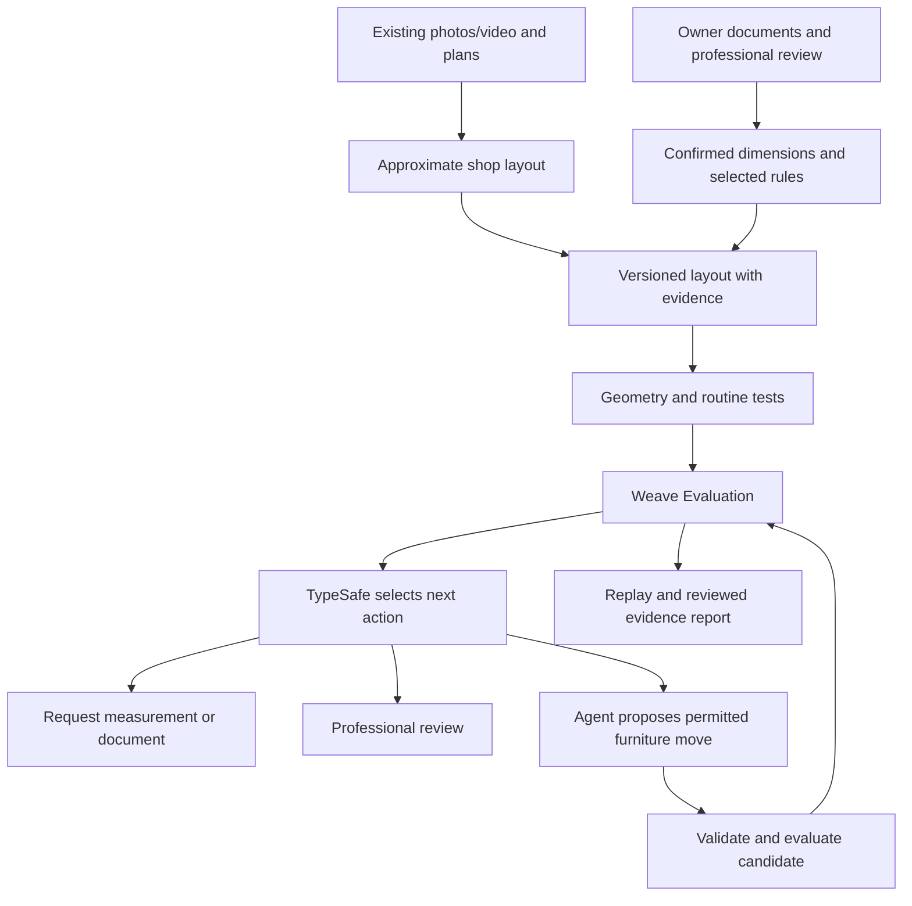

# Standard Physics: 24-hour build plan for four parallel teams

## 1. Confirmed product and demonstration

**Standard Physics helps small business owners turn shop photos and plans into a layout they can inspect, test, improve, and submit for professional review.**

Confirmed inputs:

- An anonymized Palo Alto boba shop.
- Existing photos/video, without immediate access to take measurements.
- An available accessibility/building professional.
- Four computers, multiple coding agents, and approximately 24 hours.
- Primary targets: Best Loop Design, Best Use of Weave, and Best Use of TypeSafe.

The capture limitation changes the first release: **build photo/video-assisted reconstruction and measurement confirmation.** Native phone scanning is a later input adapter.

The professional becomes part of development immediately: they help select checks, identify missing dimensions, and review findings before submission.

### What ships

1. Upload existing photos/video and any available floor plans.
2. Reconstruct an editable approximate shop layout.
3. Identify which dimensions require confirmation.
4. Accept documented dimensions supplied by the owner or reviewer.
5. Screen selected accessibility, building, and zoning requirements.
6. Test customer routines against the supported geometry.
7. Propose permitted furniture rearrangements.
8. Reevaluate changes through real Weave Evaluations.
9. Produce a versioned report with professional review.

The scene must distinguish **estimated geometry** from **confirmed measurements**. A convincing rendering does not make a dimension reliable.

### Demonstration decision at hour 4

| Evidence available | Demonstration |
|---|---|
| Sufficient documented dimensions | Run measured checks and repair on the reconstructed shop |
| Only some dimensions confirmed | Test that measured area; keep other checks unresolved |
| No reliable dimensions | Show the real shop's reconstruction and measurement requests, then demonstrate repair on a clearly labeled dimensioned test layout |

The final fallback still demonstrates the complete system honestly. Do not present a synthetic layout's results as findings about the real shop.

The central routine remains:

> Enter the shop, approach ordering/payment, collect a drink, and exit.

Inventory is limited to the furniture/object list. Damage detection, insurance, deposits, live crowds, and a custom scanning app are outside this submission.

## 2. Architecture and shared contracts

### Implementation choices

- React, TypeScript, Vite, and React Three Fiber for the interface.
- Python 3.11, FastAPI, Pydantic, and Shapely for the backend.
- SQLite for projects, revisions, runs, and reviews.
- Canonical measured JSON for evaluation; GLB for visualization.
- Blender for reconstruction/conversion where useful. It is already installed on the current computer.
- Actual `weave.Evaluation` runs with named scorers and retrievable individual results.
- pytest, TypeScript typechecking, and Playwright for verification.
- A designated integration computer serves the application for the demo. Hosting is secondary.

Preserve the existing LoopForge example. Build Standard Physics separately; its existing Markdown-scoring loop is unsuitable for these evaluations.

### Person D owns the shared contracts

| Contract | Minimum content |
|---|---|
| `EvidenceRecord` | Source, date, private artifact reference, measurement provenance, verification status, supported tolerance |
| `Layout` | Revision, floor geometry, fixed/movable objects, doors, stations, and evidence references |
| `ProjectFacts` | Parcel/use/permit facts, owner constraints, and explicit unknowns |
| `RulePack` | Authority, edition, section, citation, applicability, required inputs, check parameters |
| `Routine` | Ordered destinations, mobility footprint, maneuver and door-state assumptions |
| `Assessment` | Input hashes, per-check outcomes, route evidence, measurements, and actual Weave references |
| `ActionDecision` | Validated TypeSafe action, provider provenance, supporting findings |
| `LayoutProposal` | Base hash, permitted object transformations, rationale, originating assessment |
| `ReviewReport` | Assessment versions, reviewer identity/qualifications/scope, findings, notes, status |

Freeze these contracts during hour 1. Generate frontend types from the backend schema.

Conventions:

- Meters; XY floor plane; Z height; explicit renderer conversion.
- Stable object IDs.
- Every relevant dimension is marked estimated, documented, or professionally confirmed.
- Unknown measurements remain unknown.
- Fixed walls, doors, counters, and equipment cannot be changed by automatic repair.
- Automatic proposals only translate/rotate permitted movable objects.
- Changes to geometry, facts, rules, or profiles invalidate previous assessments.
- Relevant changes also invalidate previous professional review.

### API

Implement project creation, evidence import, layout revision creation, assessment creation, run polling, repair creation, report retrieval, and human review recording under `/api/projects` and `/api/runs`.

Use polling for progress. SQLite transactions prevent overlapping repair jobs from overwriting the same project revision. Persist interrupted runs explicitly.

### Evaluation and repair behavior

1. Import/edit creates a draft.
2. Assessment evaluates the exact geometry, facts, rules, and profiles.
3. Missing evidence creates measurement/document requests.
4. A completed current Weave Evaluation is required before automatic repair.
5. TypeSafe selects an eligible action.
6. The model reads the findings and proposes a restricted patch.
7. The backend validates and evaluates a separate candidate.
8. Accept only a strict improvement without new checked failures, lost coverage, or violated owner constraints.
9. Stop after three proposals, success on the selected target, no improvement, or service failure.

Model-generated dimensions cannot become verified evidence. The model cannot change thresholds or scenarios to improve its score.

## 3. Four owners, agent assignments, and manual work

Use these provider-independent effort tiers:

- **Low, Luna-like:** extraction, narrow UI components, fixtures, documentation.
- **Medium, Opus-like:** implementation, integrations, substantial tests.
- **High, Fable-like:** shared architecture, difficult geometry correctness, policy review, repair invariants.

Run approximately three useful agents per computer: two writers with separate ownership plus one researcher/reviewer. Queue the assignments below as dependencies become ready.

If there are five people including the project lead, the fifth acts as producer and coordinates the owner, professional, sponsors, and presentation.

### Person A: interface and report

Owns frontend code, frontend dependencies, UI tests, and report presentation.

| Agent | Tier | Deliverable |
|---|---|---|
| A1 | Medium | Upload → reconstruct → confirm dimensions → assess → compare → review workflow |
| A2 | Medium | 3D viewer, dimension overlays, object selection, and route replay |
| A3 | Low | Findings, citations, missing-data requests, and evidence-status labels |
| A4 | Medium | Permitted-object editor; immutable revision save; stale-result indicator |
| A5 | Medium | Printable report and scoped professional-review interface |
| A6 | Low | Playwright workflow, keyboard controls, loading/error states, demo readability |

**Manual work**

- Ask the owner which furniture can move and what seating must remain.
- Test the interface with someone unfamiliar with the project.
- Ensure estimated and confirmed geometry are visually unmistakable.
- Prepare capture/reconstruction footage and presentation.
- Check the reviewer's report experience.

**Checkpoints:** fixture-driven workflow by hour 8; real backend workflow by hour 14.

### Person B: reconstruction and geometry

Owns evidence-to-layout processing, geometric measurements, route planning, and geometry fixtures.

| Agent | Tier | Deliverable |
|---|---|---|
| B1 | Medium | Extract useful video frames, organize photo evidence, and attach source references |
| B2 | Medium | Approximate editable reconstruction; import documented dimensions; record uncertainty |
| B3 | High | Orientation-aware, bounded route planner with collision evidence |
| B4 | Medium | Door, clearance, approach-area, and path measurement functions |
| B5 | Medium | Adversarial geometry fixtures and evidence-status tests |
| B6 | Low | GLB optimization, coordinate conversion verification, and performance checks |

**Manual work**

- Inventory existing media, floor plans, lease drawings, and inspection documents.
- Ask the owner for already-known dimensions or existing measured plans.
- Meet the professional to identify the minimum dimensions needed for useful findings.
- Validate inferred object identities and fixed/movable status.
- Mark all unconfirmed dimensions rather than filling gaps with guesses.
- At hour 4, select the appropriate demonstration evidence path.

**Checkpoints:** approximate reconstruction plus missing-measurement list by hour 4; selected measured/test layout by hour 6; geometry tests passing by hour 10.

### Person C: rules, professional collaboration, and TypeSafe

Owns regulatory sources, rule packs, applicability, TypeSafe integration, and policy tests.

| Agent | Tier | Deliverable |
|---|---|---|
| C1 | Low | Selected accessibility criteria with exact sources, conditions, and required measurements |
| C2 | Low | Palo Alto building/zoning evidence and permit/use questions |
| C3 | Medium | Versioned rule pack connected to B's measurement functions |
| C4 | Medium | Genuine TypeSafe adapter and validated action outputs |
| C5 | High | Critique of applicability, exceptions, code editions, and unsupported conclusions |
| C6 | Low | Labeled decision cases and measured TypeSafe benchmark results |

**Manual work**

- Obtain TypeSafe's actual quickstart, credentials, output contract, and usage limits.
- Privately obtain the shop's address/APN, suite boundary, and available permit/use records.
- Confirm the professional's qualifications and scope. Accessibility/building expertise does not automatically cover zoning.
- Schedule three short professional sessions:
  - **Hour 1–2:** select useful checks and identify missing evidence.
  - **Hour 8–10:** inspect initial findings and challenge the reconstruction.
  - **Hour 16–18:** review the final evidence/report version.
- Verify every numeric threshold against its source.
- Record actual review scope and unresolved items.

**Checkpoints:** TypeSafe access resolved by hour 4; curated rule pack and action adapter by hour 8; final professional review before feature freeze.

### Person D: backend, evaluations, and integration

Owns contracts, Python dependencies, API, persistence, runtime, CI, integration, and submission.

| Agent | Tier | Deliverable |
|---|---|---|
| D1 | High | Shared contracts, fixture examples, hashes, interfaces, and ownership freeze |
| D2 | Medium | FastAPI, persistence, artifact storage, job exclusion, and run polling |
| D3 | Medium | Real Weave evaluations, scorer results, references, and sanitized public example |
| D4 | High | Restricted model proposals, evaluation requirement, acceptance/rejection, stopping rules |
| D5 | Medium | Timeboxed secondary sponsor integrations |
| D6 | Medium | Integration tests, stale-evidence rejection, failure handling, clean-clone startup |

**Manual work**

- Confirm submission deadline and eligibility requirements.
- Establish W&B project access and public demonstration visibility.
- Verify runtime model access and set approved spending limits.
- Merge reviewed changes at checkpoints.
- Keep the demo machine available and stable.
- Submit and verify the working submission early.

**Checkpoints:** real public Weave example by hour 2; complete assess → repair → reassess flow by hour 12.

## 4. Technical scope and sponsor use

### Geometry

Support two supplied mobility profiles and three routine segments:

1. Entrance → ordering/payment.
2. Ordering/payment → pickup.
3. Pickup → exit.

Use planar footprints plus relevant heights and explicit door-state assumptions.

The route planner searches position and orientation, initially using 5 cm cells and 16 headings. Check conservative swept footprints along motion primitives. A collision-free endpoint does not establish a collision-free movement.

Keep mobility-device geometry separate from regulatory width criteria. Bound search effort and use deterministic ordering.

- Successful checked path: report the modeled route result.
- Collision: identify the tested pose/movement and intersecting objects.
- Search exhaustion: "no route found under these assumptions."
- Timeout, uncertain geometry, or unsupported movement: `NOT_VERIFIED`.

By hour 10, downgrade to clearance screening and fixed-maneuver replay if orientation-aware planning is unreliable. Remove unsupported turning claims.

### Rules and professional review

Cover a small set in every requested category:

| Category | Implemented scope |
|---|---|
| Accessibility | Selected route, entrance-door, service-counter, and applicable dining-space checks |
| Building | Identified exit-path obstruction; exit-door evidence; occupancy/exit-count review inputs |
| Zoning | Parcel district/use evidence, relevant use provisions, permit-history consistency, unresolved approvals |

Palo Alto's [Building Division](https://www.paloalto.gov/Departments/Planning-Development-Services/Development-Services/Building-Division) confirms adoption of the 2025 California codes effective January 1, 2026. Applicability to the existing shop still depends on its history and proposed work.

Use the [official Municipal Code](https://codelibrary.amlegal.com/codes/paloalto/latest/overview) and [Permit View](https://www.paloalto.gov/Departments/Planning-Development-Services/Development-Services/Palo-Alto-Permit-View).

Outcomes are:

- Meets checked criterion.
- Finding.
- Needs measurement/review.
- Not assessed.

The professional reviews evidence and applicability within their expertise. Their review does not turn a limited prototype assessment into a comprehensive official certification.

### TypeSafe

Obtain and implement the sponsor's actual API. Its internal action contract is:

| Action | Executed behavior |
|---|---|
| `TRY_LAYOUT_CHANGE` | Start a permitted furniture proposal when required evidence exists |
| `REQUEST_MEASUREMENT` | Identify a missing/uncertain dimension and suspend dependent action |
| `REQUEST_DOCUMENT` | Request parcel, use, permit, or governing-source evidence |
| `PROFESSIONAL_REVIEW` | Add the supported finding/question to the review queue |
| `NO_FURTHER_ACTION_FOR_CHECK` | Close the specific supported check after deterministic validation |

The available photos create a meaningful sponsor demonstration: uncertain measurements should route to a request; confirmed, repairable geometry should route to a layout trial.

TypeSafe cannot override geometric failures or manufacture legal certainty. Show actual provider provenance and test malformed, contradictory, and incomplete outputs.

### Sponsor access and cutoffs

| Technology | Access needed | Responsible person | Cutoff/fallback |
|---|---|---|---|
| Weave | W&B project and backend credential | D | Working real evaluation by hour 2; essential to Weave target |
| TypeSafe | Event credential and official quickstart | C | Hour 4; if unavailable, use labeled local policy and drop TypeSafe claims |
| W&B Inference | Enabled credits and supported model | D | Hour 2; alternate authorized runtime if unavailable |
| Astra/Fable runtime | Verified account or API entitlement appropriate to usage | B/D | Hour 2; use a supported model without unsupported exclusivity claims |
| Sandboxes | Organization preview access | D | Prove by hour 4; otherwise local evaluator |
| ARIA | Eligible team project and enabled features | D | Verify by hour 4; otherwise omit |
| marimo | Local Python installation | D5 | Add only after the core loop works |
| AGI House | Actual mentor feedback | Producer/A | Human collaboration; no invented API role |

A coding subscription does not automatically supply application API access. Keep keys out of frontend code, Git, prompts, and public traces.

Secondary integrations:

- Sandboxes executes the fixed evaluator on versioned inputs.
- marimo provides a reactive scenario comparison lab using the production evaluator.
- ARIA analyzes actual evaluation experiments and contributes a demonstrated improvement.
- W&B Inference supplies the proposer when enabled.
- AGI House supplies genuine business/demo feedback.

Stop adding sponsor work at hour 16.

### Technical references

- [Weave evaluations](https://docs.wandb.ai/weave/guides/core-types/evaluations)
- [Evaluation result export](https://docs.wandb.ai/weave/guides/evaluation/export_eval)
- [W&B Inference](https://docs.wandb.ai/inference)
- [W&B Sandboxes](https://docs.wandb.ai/sandboxes)
- [ARIA](https://docs.wandb.ai/aria/overview)
- [marimo reactivity](https://docs.marimo.io/guides/reactivity/)
- [TypeSafe](https://typesafe.ai/)
- [Apple RoomPlan](https://developer.apple.com/augmented-reality/roomplan/) for the later metric-scan adapter

## 5. Schedule, coordination, and release criteria

### Timeline

| Time | Required outcome |
|---|---|
| 0–1h | Ownership/contracts frozen; media inventory; reviewer session scheduled; sponsor onboarding |
| 1–2h | Real Weave evaluation; TypeSafe access attempt; professional selects checks and evidence needs |
| 2–4h | Independent UI, reconstruction, policy, and backend fixtures; evidence-path decision |
| 4–6h | Selected layout visible in UI; measurement provenance preserved |
| 6–8h | Real assessment pipeline; citations and TypeSafe routing connected |
| 8–10h | Professional challenges findings; geometry tests and algorithm cutoff |
| 10–12h | Complete assess → propose → reassess workflow |
| 12–16h | Integration hardening, report, bounded sponsor additions, usability review |
| 16–18h | Final professional review; source/claim audit; feature freeze |
| 18–20h | Clean-clone startup, public-link checks, three timed rehearsals |
| 20–22h | Submit and verify working version |
| 22–24h | Submission buffer and verified fixes only |

### Agent and Git rules

- Each writing agent uses its own branch/worktree and bounded file ownership.
- D owns `codex/integration`, shared schemas, and Python dependency changes.
- A owns frontend dependencies.
- Integrate at hours 2, 4, 6, 8, and 12, then regularly.
- Each lane maintains its own `PROGRESS.json` with task status, commit references, tests, blockers, and next handoff.
- Agents preserve others' changes and request cross-owner edits.
- Preserve existing repository artifacts.
- Reviewers may work concurrently on sources, contracts, fixtures, and completed slices.

Every agent assignment must specify ownership, deliverable, contract version, acceptance tests, and stopping conditions.

### Required tests

| Area | Acceptance |
|---|---|
| Evidence | Estimated dimensions never become confirmed implicitly; incomplete evidence cannot pass dependent checks |
| Geometry | Correct units/axes; narrow-turn and swept-collision fixtures; timeout distinct from obstruction |
| Rules | Source-backed parameters; missing applicability and conflicting facts produce review |
| TypeSafe | Real output changes software behavior; invalid output cannot authorize action |
| Repair | Fixed-object/stale-base changes rejected; owner constraints preserved; regressions rejected |
| Weave | Completed individual results retrievable; missing/stale/mismatched evaluation blocks repair |
| Review | Actual professional scope recorded; input changes make review stale |
| UI | Complete workflow, keyboard access, understandable uncertainty, printable report |
| Privacy | Private shop evidence and credentials excluded from public artifacts |
| Release | Clean-clone startup, working public links, three-minute rehearsal |

Use approximately 20 labeled cases spanning clear, obstructed, uncertain, contradictory, and stale inputs. Record actual results.

### Demo sequence

1. Owner's problem and existing shop photos.
2. Reconstruction with estimated versus confirmed measurements.
3. Professional-selected check and customer routine.
4. TypeSafe requests missing evidence or authorizes a supported layout trial.
5. Agent proposes a furniture move.
6. Fresh Weave Evaluation verifies the candidate.
7. Before/after replay and professionally reviewed report.

If the real shop lacks sufficient dimensions, explicitly switch to the dimensioned demonstration layout for the repair segment.

### Final task-to-tier allocation

| Owner | Low-effort agents | Medium-effort agents | High-effort agents | Manual priority |
|---|---|---|---|---|
| A: interface | A3, A6 | A1, A2, A4, A5 | — | Merchant usability and presentation |
| B: reconstruction/geometry | B6 | B1, B2, B4, B5 | B3 | Evidence quality and missing measurements |
| C: rules/TypeSafe | C1, C2, C6 | C3, C4 | C5 | Professional collaboration and sponsor access |
| D: backend/integration | — | D2, D3, D5, D6 | D1, D4 | Integration, budget, release, submission |
