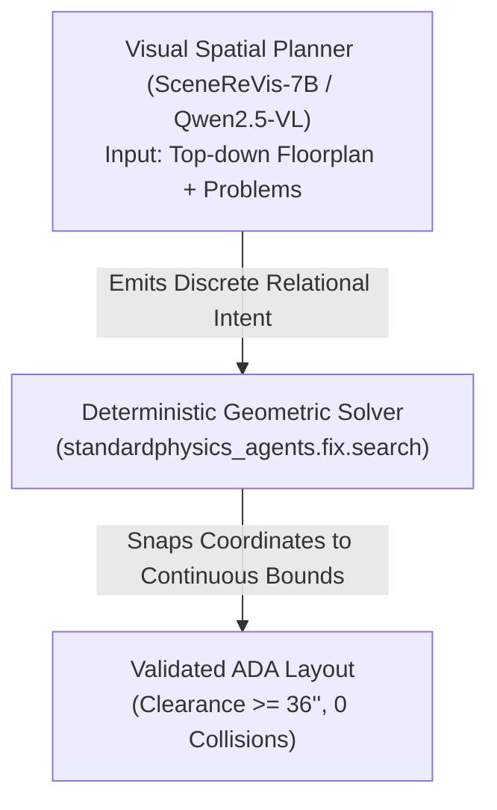

# Handover: AI Room Rearranger Model & Architecture Pivot

**Context**: Standard Physics AI room rearranger fine-tuning.  
**Target Audience**: Claude / AI Engineers in `.claude/worktrees/multiroom-data` (and related branches).  
**Goal**: Pivot from failing from-scratch RL / continuous-float text generation on Qwen 3.8 27B to a viable, grounded pretrained architecture runnable locally on Apple Silicon (M5 Pro 48 GB) or Fireworks AI, powered by commercial shop/restaurant/supermarket datasets.

---

## 1. Executive Summary & Why Current RL Training Failed

### The Setup That Was Attempted
- **Model**: `accounts/fireworks/models/qwen3p8-27b` via Fireworks Serverless Training SDK (`scripts/finetune/serverless_train.py`).
- **Pipeline**: LoRA SFT on heuristic search completions $\to$ Reinforcement Learning (RL) with `standardphysics_agents.training.reward` as an in-process reward function $\to$ adapter promotion and download.
- **Action Space**: Raw JSON emitting continuous 2D/3D float moves:
  ```json
  {"moves": [{"node_id": "<uuid>", "dx": -0.34, "dy": 0.3, "rotation_degrees": -45.0}]}
  ```

### Empirical Results from `runs/finetune/room6/orchestrator.log`
| Phase | Samples | Parse Rate | Hard Constraint Pass | Gate Acceptance | All Fixable Cleared | Mean Reward |
|---|---|---|---|---|---|---|
| **Base Model** | 40 | 100.0% | 25.0% | 15.0% | **0.0%** | 0.0327 |
| **After SFT** | 40 | 100.0% | 52.5% | 25.0% | **0.0%** | 0.0524 |
| **After 24 RL Steps** | 40 | 100.0% | 40.0% | 22.5% | **0.0%** | 0.0428 |

Across 1,152 RL rollouts and 24 policy iterations, **`all_fixable_cleared_rate` remained exactly 0.0%**, and hard constraint violations (wall intersections, furniture collisions) remained over 50%. The download step also terminated with `HTTP Error 400: Bad Request`.

### The Fundamental Flaw
1. **Continuous Metric Inequalities vs. Tokenized Probabilities**:
   ADA compliance is not an aesthetic or stylistic task; it is governed by hard geometric inequalities:
   - Aisle width $\ge 36.0\text{ inches}$ ($0.9144\text{ m}$)
   - Passing space $\ge 60.0\text{ inches}$ ($1.524\text{ m}$)
   - Door approach clearance $\ge 60 \times 60\text{ inches}$
   - Zero bounding box overlap with walls or other furniture.
   An ungrounded text LLM generating string tokens for floating-point meters (`0.34`) has no spatial coordinate awareness. An error of $2\text{ cm}$ either penetrates a chair bounding box or falls short at $35.8\text{ inches}$, triggering an immediate rejection.
2. **Sparse Reward RL Collapse**:
   In continuous multi-body space with 8–15 rigid furniture items, the probability of random continuous coordinate exploration finding a configuration where *zero* collisions occur AND all corridor bottlenecks are simultaneously resolved is practically zero. The policy collapsed into trivial micro-movements.
3. **Inventory Preservation**:
   Standard Physics rearranges an owner's *existing* furniture inventory. You cannot add, delete, or re-scale furniture; every bounding box must be preserved.

---

## 2. Pretrained Hugging Face Models to Pivot To

Do not train 3D scene generative models from scratch. Use one of these established open-source models:

### Option 1: Vision-Language Spatial Planners (Top Recommendation)

#### A. `runder1/SceneReVis-7B` (Hugging Face)
- **Base**: `Qwen2.5-VL-7B-Instruct`
- **What it does**: Specifically fine-tuned on **iterative 3D indoor scene conflict resolution and layout editing** using a two-stage SFT (`SceneChain-12k`) and Agentic RL recipe with voxel physics rewards.
- **Why it fits**: It is already trained to perform "diagnose-and-act" loops on spatial conflicts (collisions, blocked routes, misalignments) rather than one-pass ungrounded generation.
- **Hugging Face**: [`runder1/SceneReVis-7B`](https://huggingface.co/runder1/SceneReVis-7B)

#### B. `Qwen/Qwen2.5-VL-7B-Instruct` / `Qwen2.5-VL-3B-Instruct` (Hugging Face / Fireworks)
- **Capabilities**: Native 2D/3D spatial grounding, visual coordinates, and bounding box tokens.
- **How to use**: Feed a **top-down 2D orthographic raster map** of the room (rendered from the `SceneGraph` bounding boxes and walls) as the visual input, alongside the JSON specification. Humans solve floorplan layouts visually; giving the model a top-down floorplan unlocks visual reasoning.
- **Hugging Face**: [`Qwen/Qwen2.5-VL-7B-Instruct`](https://huggingface.co/Qwen/Qwen2.5-VL-7B-Instruct), [`Qwen/Qwen2.5-VL-3B-Instruct`](https://huggingface.co/Qwen/Qwen2.5-VL-3B-Instruct)

#### C. `google/paligemma2-3b-pt-448` / `paligemma2-10b-pt-448`
- **Capabilities**: Discrete spatial location tokens (`[loc0000]` to `[loc1023]`).
- **Why it fits**: Fast, lightweight, and purpose-built for predicting discrete 2D spatial coordinates directly on floorplan images.
- **Hugging Face**: [`google/paligemma2-3b-pt-448`](https://huggingface.co/google/paligemma2-3b-pt-448)

---

### Option 2: Structured 3D Scene Code Models

#### `projectaria/aria-synthetic-environments` + `SceneScript` (Meta Project Aria)
- **What it does**: Formulates 3D indoor scenes as structured language commands (e.g. `room(...)`, `door(...)`, `table(...)`) rather than raw bounding boxes or point clouds. Pretrained on 100k synthetic indoor scenes (ASE).
- **GitHub**: [`facebookresearch/scenescript`](https://github.com/facebookresearch/scenescript)
- **Hugging Face**: [`projectaria/aria-synthetic-environments`](https://huggingface.co/datasets/projectaria/aria-synthetic-environments)

---

## 3. Commercial Shop, Supermarket & Restaurant Datasets & Generators

To train models that understand actual stores, boba shops, supermarkets, and restaurants (rather than residential bedrooms), leverage these specialized Hugging Face datasets and procedural generators:

### A. Supermarket & Grocery Store Datasets & Generators
*   **[`HXX/MarketGen`](https://huggingface.co/HXX/MarketGen)** *(Top Recommendation for Retail / Supermarkets)*:
    *   **What it is**: An embodied simulation platform designed specifically for **supermarket environments** with an agent-based **Procedural Content Generation (PCG)** framework.
    *   **Assets**: Library of **1,100+ 3D supermarket assets** (gondola shelving, endcaps, refrigerated display islands, checkout counters).
    *   **Value for ADA**: Generates dense multi-aisle grocery layouts with parameterized corridor widths and cashier checkout bottlenecks.
*   **[`behavior-1k`](https://huggingface.co/behavior-1k) & RoboBenchMart** (Stanford / Hugging Face):
    *   **What it is**: Stanford's BEHAVIOR-1K and OmniGibson environment hosted on Hugging Face.
    *   **Assets**: Full interactive 3D commercial environments, including dark-store retail and grocery layouts (`RoboBenchMart`) with object bounding boxes and physical collision meshes.
*   **[`cyberagent/in-store-visual-localization`](https://huggingface.co/datasets/cyberagent/in-store-visual-localization)** (Hugging Face):
    *   Real-world retail store scans with **COLMAP 3D reconstructions**, aisle pathways, and camera trajectories.

### B. Restaurants, Cafes, Boba Shops & Dining Layouts
*   **[`nepfaff/steerable-scene-generation`](https://huggingface.co/datasets/nepfaff/steerable-scene-generation-restaurant-low-clutter)** (MIT / Hugging Face):
    *   Dedicated dining layout datasets:
        *   `nepfaff/steerable-scene-generation-restaurant-low-clutter`
        *   `nepfaff/steerable-scene-generation-restaurant-high-clutter`
        *   `nepfaff/steerable-scene-generation-dimsum-table`
    *   Contains 3D object arrangements for restaurant dining tables, chairs, service stations, and circulation paths.
*   **[`Pointcept/hm3d-compressed`](https://huggingface.co/datasets/Pointcept/hm3d-compressed) (Habitat-Matterport 3D)** (Hugging Face):
    *   1,000 building-scale 3D scans with a dedicated **commercial subset**: cafes, bakeries, coffee shops, boutiques, and restaurants.
*   **ScanNet++ Commercial Subsets**:
    *   High-fidelity sub-millimeter laser scans of commercial dining spaces, coffee bars, and retail shops with CAD-aligned furniture annotations.

### C. Procedural Store & Boba Shop Generators
1.  **MarketGen PCG Engine** ([GitHub / Hugging Face](https://huggingface.co/HXX/MarketGen)):
    *   Agent-based procedural synthesis of retail aisle grids, cash-wraps, and shelf aisles with configurable clearance widths.
2.  **Holodeck / Holodeck 2.0** ([AI2-THOR](https://github.com/allenai/Holodeck)):
    *   Language-driven procedural generation of commercial spaces (e.g. `"a busy boba cafe with counter, register, and 2-top dining tables"`).
3.  **Parametric Boba Shop Generator in Standard Physics**:
    *   Expand `create_sample_boba_shop_room()` in [`scripts/import_research_dataset.py`](file:///Users/yanzihao/Documents/standardphysics/scripts/import_research_dataset.py) into a synthetic generator:
        ```python
        def generate_random_boba_shop(
            room_width: float = random.uniform(5.0, 9.0),
            room_depth: float = random.uniform(6.0, 12.0),
            counter_type: str = random.choice(["straight", "L-shape"]),
            table_count: int = random.randint(3, 8),
            bottleneck_clearance_inches: float = random.uniform(24.0, 40.0) # Synthesize ADA violations
        ) -> SceneGraph:
        ```
    *   Pipe generated scenes through [`scripts/audit_rooms.py`](file:///Users/yanzihao/Documents/standardphysics/scripts/audit_rooms.py) to automatically ensure commercial typology validity and non-trivial circulation bottlenecks.

---

## 4. The Necessary Architectural Pivot: Neuro-Symbolic Hybrid

In production systems (e.g. SceneWeaver, SceneCraft, LayoutGPT), the neural model is **never** asked to calculate millimeter-level continuous coordinates without a solver.



Your codebase already has this deterministic solver in [`packages/agents/standardphysics_agents/fix/search.py`](file:///Users/yanzihao/Documents/standardphysics/packages/agents/standardphysics_agents/fix/search.py) and [`strategies.py`](file:///Users/yanzihao/Documents/standardphysics/packages/agents/standardphysics_agents/fix/strategies.py) (`split_the_gap`, `pinch_from`, `violations`).

### Reforming the Action Space
Instead of continuous floats (`dx: -0.34, dy: 0.3`), use **Discrete Relational Actions**:
```json
{
  "strategy": "clear_pinch_aisle",
  "bottleneck_id": "route_clear_width_counter",
  "moves": [
    {
      "node_id": "28174dfd-4d44-5b8d-a292-38eeff2b8392",
      "action": "align_to_wall",
      "target_wall_id": "33ac2542-fcd7-452c-869f-00cc6fc82dc6",
      "rotation": "quarter_turn"
    }
  ]
}
```
The solver takes this intent and applies exact mathematical projection.

---

## 5. Execution Platform Options

### Platform A: Local Fine-Tuning on This Machine
- **Specs**: Apple M5 Pro, **48 GB Unified Memory**, macOS.
- **Hardware Acceleration**: `torch.backends.mps.is_available() == True`.
- **Recommended Stack**:
  1. **MLX (`mlx-lm`)**: Native to Apple Silicon, zero overhead, saturates unified memory bandwidth.
     - Can run 4-bit / 8-bit QLoRA on a 7B model using only 8–12 GB RAM, leaving 36 GB free.
     - Installation: `pip install mlx mlx-lm`
     - Fine-tuning command:
       ```bash
       python -m mlx_lm.lora \
         --model Qwen/Qwen2.5-VL-7B-Instruct \
         --data runs/finetune/room6/data \
         --train \
         --batch-size 4 \
         --lora-layers 16 \
         --iters 1000
       ```
  2. **PyTorch MPS + Hugging Face `peft` / `trl`**: Standard `SFTTrainer` with LoRA on device `"mps"`.

### Platform B: Fireworks AI Serverless Fine-Tuning
- **Current Script**: `scripts/finetune/serverless_train.py`
- **Supported Base Models for LoRA on Fireworks**:
  - `accounts/fireworks/models/qwen2p5-7b-instruct`
  - `accounts/fireworks/models/qwen2p5-14b-instruct`
  - `accounts/fireworks/models/llama-v3p1-8b-instruct`
  - `accounts/fireworks/models/qwen3p8-27b`
- **Changes Needed**:
  1. Switch task from continuous float generation to discrete macro-actions.
  2. Run SFT first on verified synthetic pairs before turning on RL.
  3. Fix the `download_adapter.py` HTTP 400 error by setting proper `Authorization: Bearer $FIREWORKS_API_KEY` headers in `_get()`.

---

## 6. Actionable Roadmap for Claude

1. **Halt `run_room6.sh`** with the continuous float action space.
2. **Ingest / Procedurally Generate Store Data**:
   - Integrate **MarketGen** (`HXX/MarketGen`) for supermarket retail aisles and **nepfaff/restaurant** for dining layouts.
   - Parameterize `create_sample_boba_shop_room()` in [`scripts/import_research_dataset.py`](file:///Users/yanzihao/Documents/standardphysics/scripts/import_research_dataset.py) to generate synthetic boba shops with controlled ADA clearance bottlenecks.
3. **Render a 2D Top-Down Floorplan Raster**:
   - Write a helper that renders `SceneGraph` bounding boxes and walls to a $512 \times 512$ orthographic top-down image.
4. **Format Training Data for Visual-Spatial Prompting**:
   - In `room6_dataset.py`, pair the top-down floorplan image with the structured problem list.
   - Target output: Discrete strategic moves (`move_aside`, `split_gap`, `align_to_wall`).
5. **Fine-Tune `Qwen2.5-VL-7B` or `SceneReVis-7B`**:
   - Use MLX locally on this M5 Pro Mac or PyTorch MPS.
6. **Route Proposals Through `standardphysics_agents.fix.search`**:
   - Connect model output to `standardphysics_agents.fix.search.apply_moves()` and `violations()`.
